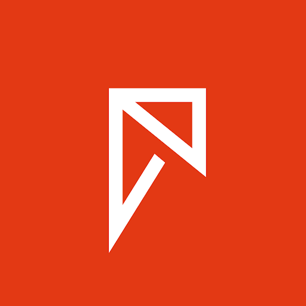
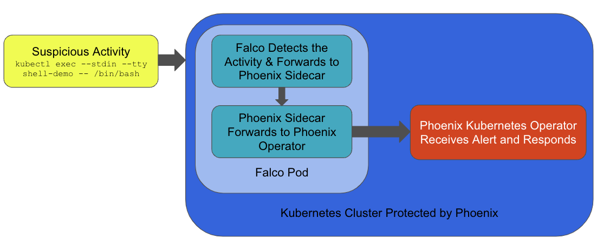



  

    
R6 Security Leverages Falco to Enhance Their Moving Threat Detection Platform, Phoenix





## Company Information

[R6](https://r6security.com) security was founded in 2020 to address the unique challenges of securing modern computing environments. Realizing that traditional security offerings based on static signatures were insufficient in today's cloud native world, R6 created Phoenix to offer a more proactive approach to address the ever-changing security challenges around Kubernetes and containers.

R6's flagship product, Phoenix, leverages Falco's threat detection capabilities. Phoenix is a security solution for Kubernetes that takes protection to a higher level by introducing the Moving Target Defense (MTD) paradigm. MTD ensures the monitored system is constantly changing and evolving, helping to render hacker's efforts ineffective. MTD does this by killing and relabeling pods on fixed or random time intervals, automatic reconfiguration and other complex obfuscation actions.

## Building on Falco

While building Phoenix R6, we received customer feedback that real-time threat detection across various scenarios was a  mandatory feature. The R6 team was familiar with Falco through connections to the wider Falco community and previous experience with the tool. Additionally, the team had previous experience with commercial security offerings, and they evaluated other open source projects as well.

However, they ultimately settled on Falco for three key reasons:

* Its powerful threat detection capabilities
* The strength of the Falco community
* A proven track record of success with other users

Falco serves as the underlying detection mechanism for Phoenix. When Falco detects suspicious activity, Phoenix's automated remediation processes kicks off. Phoenix's custom Kubernetes operator handles the remediation process.

As an example, let's say someone executes a shell into a running container. Falco running as part of the Phoenix platform, would detect that activity in real time and then forward that event to a Phoenix sidecar running inside the Falco pod. From there the Phoenix Kubernetes operator would receive the event from the sidecar, and perform some sort of remediation. That remediation could include tagging the container as compromised and deactivating it (but not deleting it), so it could be examined later as part of any forensics activities.





  





This workflow happens even if the tool receives a false positive.  Companies spend a lot of time investigating false positives, then deciding if they need to take action. So, rather than trying to investigate these false positive indicators, the system simply performs the automated remediation, keeping users up and running while reducing the time operators need to spend investigating.

The combination of Falco's threat detection capabilities and Phoenix's mitigation features helps effectively address security issues that might evade other security offerings.

The addition of real-time alerting via Falco allows Phoenix to adjust the cluster's configuration as soon as suspicious activity is detected instead of waiting for the next random update interval.

During the development process R6 discovered they needed a way to forward Falco events to their Kubernetes operator.  To achieve this they added a sidecar to the Falco pod that receives events from Falco, and then forwards them to their operator. These changes were submitted as a [PR](https://github.com/falcosecurity/evolution/pull/116) and eventually merged into Falco.

Falco has proven to be very accurate in detecting threats, catching around 80-85% of attacks based on red teaming and real-life scenarios. Reaching this level of detection required a multi-pronged approach. There was, of course, fine tuning of the Falco rules, but also the addition of static application security testing. And, it's important to note, that there is an amount of overhead associated with using Falco and performing the automated remediation. Estimates put this at approximately 1-8% additional CPU or memory. Of course, this varies by workload, and you should plan on doing your own testing.

## Conclusion

Today, R6's Phoenix product is leveraging to help customers deal with attacks that might otherwise have gone undetected. Although there were some challenges integrating the two technologies, the R6 team ultimately found Falco's real-time detection capabilities and the strength of the Falco community to be invaluable.


