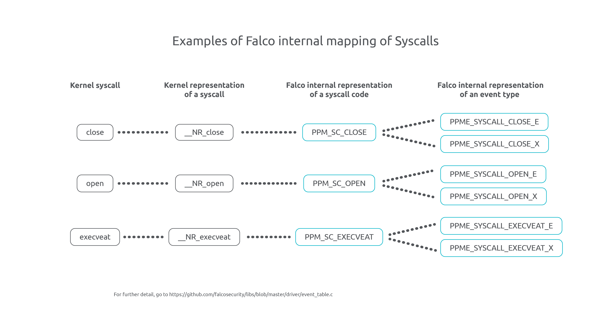

The release of Falco 0.35.0 is a significant milestone, introducing a groundbreaking feature: the ability to select which syscalls to monitor. This empowers users with granular control, optimizing system performance by reducing CPU load through selective syscall monitoring. 

Why stop at just the one groundbreaking feature, such as selecting which syscalls to monitor? Previously, Falco was limited to monitoring a narrower set of syscalls, which was a drawback since its underlying libraries and kernel drivers were capable of monitoring a wider range of syscalls. We addressed this gap, and Falco now has the enhanced capability to monitor every [syscall supported](https://github.com/falcosecurity/libs/blob/master/docs/report.md) by its libraries. This milestone, allowing access to a notable range of syscalls, represents another significant advancement in threat detection.

{}

Kudos to the remarkable teamwork of Jason Dellaluce, Federico Di Pierro, Andrea Terzolo, and Melissa Kilby for making the adaptive syscalls selection feature a reality. We would also like to express our gratitude to Stanley Chan for providing invaluable feedback to ensure a clear and user-friendly experience.

{}

## Key Terms

First, let's define key terms that are crucial for understanding the complexity and high-level nature of the refactoring that has been performed.

- `syscall`: In Linux, system calls serve as the interface for requesting permission from the kernel to interact with hardware resources, such as accessing memory or reading files. These system calls are defined in the Linux headers, and each syscall is associated with a specific number, such as `__NR_close`. Falco, being designed to support multiple architectures internally, employs a mapping mechanism to track each system call using a custom invented code called `PPM_SC_*`. This mapping allows Falco's libraries to uniquely identify and handle each supported syscall in a uniform manner. (e.g. `PPM_SC_CLOSE` represents the close syscall).

- `event`: Syscalls consist of an enter event and an exit event. This is why Falco introduces an additional mapping from the `PPM_SC_*` code to another enumeration called `PPME_*`, which is specific to Falco's libraries. This mapping is crucial for organizing the parsing process and ensuring a structured approach, especially because Falco not only handles syscall events but also deals with non-syscall events. For syscalls, specific codes are assigned to events like the enter event of the syscall (e.g. `PPME_SYSCALL_CLOSE_E`) and the exit event (e.g. `PPME_SYSCALL_CLOSE_X`). However, not every syscall has its own `PPME_*` code. Falco introduces the concept of generic syscalls, which brings the advantage of a shared schema and parsing mechanism for multiple syscalls using a generic extractor, optimizing efficiency by avoiding the need for separate parsers in those cases.

<br><a target="_blank" href="images/adaptive-syscalls-selection-01.png">
  
  </img>
</a><br><br>

- `monitoring`/`tracing`: Refers to passively observing and analyzing events within the Linux kernel by hooking into tracepoints and subsequently serving information up as structured Falco alerts. Falco's monitoring process does not influence or modify any syscalls.

- `processing`/`parsing`: Extracting meaningful information from the events captured by Falco and converting them into a structured format. We extract data fields in the kernel and perform the necessary parsing in userspace.

- `filtering`: Refers to stopping the processing / parsing or ignoring events. No modifications are made to the kernel during this process.

- `rules matching`: Refers to evaluating an event in userspace against the Abstract Syntax Tree (AST) generated from a Falco rule.

## Background

Before the 0.35.0 release, Falco would monitor a predefined set of commonly used syscalls in its kernel driver for threat detection, regardless of the specific rules being applied. However, this approach had limitations as it would monitor a large number of syscalls. In certain user configurations, Falco would needlessly monitor syscalls not relevant to the loaded rules, consuming system resources without effectively contributing to the intended purpose of threat detection.

You may ask yourself why Falco has been monitoring a predetermined set of commonly used syscalls until now. Falco relies on a set of syscalls to establish and maintain its state in userspace. For example, when a new process is spawned or a network connection is created, multiple syscalls are involved. Additionally, Falco maintains a process cache table in userspace, which requires tracking certain syscalls to ensure the accuracy and currency of the cache table. The process table is crucial for retrieving real-time process tree lineages and other functions. 

Initially, tracing a predefined set of syscalls provided a solid foundation for Falco's functionality. However, with the growing computational workload on servers and systems, it became necessary to adopt a new and more efficient approach to optimize performance.

## Adaptive Syscall Selection

Adaptive syscall selection is a new feature that adds the ability to select which syscalls to monitor. This empowers users with granular control, optimizing system performance by reducing CPU load through selective syscall monitoring. Adaptive syscall selection was added to Falco on version 0.35, and, by default, it doesn't change Falco behavior from a high-level view. In other words, by default, Falco continues to operate as usual.

The changes primarily impact the handling of syscall events and the selection of specific syscalls to be monitored and analyzed. The current changes only affect live syscall events. The sycall selection is now done as follows:
  1. Falco determines a base set of syscalls to monitor. This can be either the default minimum set known as the "sinsp state set" (automatically determined by the underlying libsinsp library to maintain state consistency and stability), or a customized set of syscalls defined by the user via the new `base_syscalls` configuration (discussed later).
  2. The final set of syscalls selected by Falco is determined as the union of two components: the base set of syscalls computed in the previous step, and the syscalls specified in the loaded rules.
  3. If the `-A` flag is not enabled, performance-heavy syscalls, such as I/O-intensive syscalls, are excluded from the set of syscalls, and a warning is shown to the user.
  4. Falco configures the kernel driver with the chosen set of syscalls and only monitors syscalls that match the selected syscalls on the kernel side.

{}

Adaptive syscall selection does not apply to capture files and only affects the behavior of live capture.

{}

<br><a target="_blank" href="images/adaptive-syscalls-selection-02.png">
  
  </img>
</a><br><br>
        
 
<br><a target="_blank" href="images/adaptive-syscalls-selection-03.png">
  
  </img>
</a><br><br>       

## New Configuration Options

As discussed above, Falco 0.35 allows users to define a customized base set of syscalls to monitor. This is done via the `base_syscalls` setting, which provides two configuration options:

- The `custom_set` option enables users to define a custom list of syscalls to monitor in Falco in addition to the syscalls from each Falco rule. It supports both positive notation, where a syscall is specified to be activated, and negative notation, indicated by `!` followed by the syscall name, to deactivate a syscall even if it is used in the ruleset. This flexibility allows users to have precise control over which syscalls are included or excluded in the `sys_enter` and `sys_exit` tracepoints, ensuring a tailored configuration that aligns with their specific requirements, use cases and cost budget.

  To maintain a streamlined and efficient configuration, it is recommended to remove unwanted syscalls directly from the Falco rules instead of excluding them in the `custom_set` configuration. This approach ensures that the rules accurately reflect the desired behavior and reduces unnecessary complexity in the configuration.

- When the `repair` option is set to `true`, it automatically adjusts the custom syscall set to ensure the accurate creation of its state engine, including necessary syscalls such as `close` or `procexit`. However, it is designed to be the most system resource-friendly by activating the least number of additional syscalls (outside of those enabled for enabled rules) as alternative to Falco's default libsinsp state engine enforcement. It dynamically selects necessary syscalls based on the active rules, making it truly adaptive and efficient. The `repair_state` feature helps mitigate issues that may arise from incorrect usage of `custom_set`.

Here are some helpful suggestions:

1. For **process-related rules** include syscalls such as `clone`, `clone3`, `fork`, `vfork`, `execve`, `execveat`, and `close` in the `base_syscalls.custom_set`; these syscalls are essential for retrieving process information and managing file descriptors.

2. For **networking-related rules** include syscalls like `socket`, `bind`, and `getsockopt` in the `base_syscalls.custom_set`; these syscalls ensure that network-related events are properly logged, including IP tuples and relevant information.

3. For **tracking process information accurately** consider adding syscalls such as `setresuid`, `setsid`, `setuid`, `setgid`, `setpgid`, `setresgid`, `setsid`, `capset`, `chdir`, `chroot`, `prctl` and `fchdir`; these syscalls help track the correct UID, GID, SID, and PGID etc of a process when it interacts with files or makes network connections.

The provided suggestions serve as a starting point for configuring the `base_syscalls.custom_set` according to users' specific monitoring needs. It is crucial to assess these suggestions within the context of individual use cases and make appropriate adjustments.

By adhering to these recommendations and carefully fine-tuning the syscall selection, users can achieve optimal performance, minimize resource utilization and possible kernel side event drops, and maintain precise monitoring and detection of potential security threats with Falco. Tailoring the syscall selection aligns Falco with the unique requirements of the environment, enhancing its effectiveness in threat detection.

<br><a target="_blank" href="images/adaptive-syscalls-selection-04.png">
  
  </img>
</a><br><br>

For further information, please refer to the Falco configuration file and navigate to the new `base_syscalls` option: https://github.com/falcosecurity/falco/blob/master/falco.yaml

{}

If all of this sounds confusing or unclear, the best way to gain a deeper understanding of this new feature is through hands-on experimentation. By actively exploring and testing the feature, you can observe firsthand how it can enhance the performance of your deployment.

{}

Also, you can test it live in this interactive environment that we have prepared for you. 

Click on it to start playing with it 🎮

<a target="_blank" href="https://play.instruqt.com/embed/sysdig/tracks/falco-adaptive-syscalls?token=em_ng2XK3hUZCl4VnTm"></a>

If you wish to examine the final set of syscalls that will be used by Falco on your own envinronment, you can print them to the STDOUT by including the `-o "log_level=debug" -o "log_stderr=true" --dry-run` args during a dry run of Falco. By utilizing this option, you can gain valuable insights into the selected syscalls, aiding in troubleshooting and verifying the configuration.

```
❯ falco -o "log_level=debug" -o "log_stderr=true" --dry-run
Tue May 30 14:01:27 2023: Falco version: 0.35.0-alpha5 (x86_64)
Tue May 30 14:01:27 2023: CLI args: falco -o log_level=debug -o log_stderr=true --dry-run
Tue May 30 14:01:27 2023: Falco initialized with configuration file: /etc/falco/falco.yaml
Tue May 30 14:01:27 2023: Configured rules filenames:
Tue May 30 14:01:27 2023:    /etc/falco/falco_rules.yaml
Tue May 30 14:01:27 2023:    /etc/falco/falco_rules.local.yaml
Tue May 30 14:01:27 2023:    /etc/falco/rules.d
Tue May 30 14:01:27 2023: Loading rules from file /etc/falco/falco_rules.yaml
Tue May 30 14:01:27 2023: Loading rules from file /etc/falco/falco_rules.local.yaml
Tue May 30 14:01:27 2023: Skipping daemonizing in dry-run
Tue May 30 14:01:27 2023: Skipping signal handlers creation in dry-run
Tue May 30 14:01:27 2023: Skipping daemonizing in dry-run
Tue May 30 14:01:27 2023: Setting metadata download max size to 100 MB
Tue May 30 14:01:27 2023: Setting metadata download chunk wait time to 1000 μs
Tue May 30 14:01:27 2023: Setting metadata download watch frequency to 1 seconds
Tue May 30 14:01:27 2023: Skipping clients initialization in dry-run
Tue May 30 14:01:27 2023: (32) syscalls in rules: accept, accept4, connect, creat, dup, dup2, dup3, execve, execveat, link, linkat, listen, mkdir, mkdirat, open, openat, openat2, ptrace, recvfrom, rename, renameat, renameat2, rmdir, sendmsg, sendto, setuid, socket, symlink, symlinkat, unlink, unlinkat, userfaultfd
Tue May 30 14:01:27 2023: +(40) syscalls (Falco's state engine set of syscalls): bind, capset, chdir, chroot, clone, clone3, close, epoll_create, epoll_create1, eventfd, eventfd2, fchdir, fcntl, fork, getsockopt, inotify_init, inotify_init1, io_uring_setup, mount, open_by_handle_at, pipe, pipe2, prctl, prlimit, procexit, recvmsg, setgid, setpgid, setresgid, setresuid, setrlimit, setsid, shutdown, signalfd, signalfd4, socketpair, timerfd_create, umount, umount2, vfork
Tue May 30 14:01:27 2023: (72) syscalls selected in total (final set): accept, accept4, bind, capset, chdir, chroot, clone, clone3, close, connect, creat, dup, dup2, dup3, epoll_create, epoll_create1, eventfd, eventfd2, execve, execveat, fchdir, fcntl, fork, getsockopt, inotify_init, inotify_init1, io_uring_setup, link, linkat, listen, mkdir, mkdirat, mount, open, open_by_handle_at, openat, openat2, pipe, pipe2, prctl, prlimit, procexit, ptrace, recvfrom, recvmsg, rename, renameat, renameat2, rmdir, sendmsg, sendto, setgid, setpgid, setresgid, setresuid, setrlimit, setsid, setuid, shutdown, signalfd, signalfd4, socket, socketpair, symlink, symlinkat, timerfd_create, umount, umount2, unlink, unlinkat, userfaultfd, vfork
Tue May 30 14:01:27 2023: The chosen syscall buffer dimension is: 8388608 bytes (8 MBs)
Tue May 30 14:01:27 2023: Skipping starting webserver in dry-run
Tue May 30 14:01:27 2023: Skipping event processing in dry-run
Tue May 30 14:01:27 2023: Skipping unregistering signal handlers in dry-run
Tue May 30 14:01:27 2023: Skipping stopping webserver in dry-run

```

## Refactors Involved

This section provides an overview of the underlying refactors that have enabled the implementation of the innovative adaptive syscall selection mechanisms in Falco.

### Falco's ppm sc API

- A new event set class has been introduced to support efficient set operations natively in the `ppm sc API` in Falco's `libs`. 

- Additional refinements in the `ppm sc API`  have resulted in robust mechanisms to accurately map syscall and other event strings from the loaded Falco rules to the `PPM_SC_*` or `PPME_*` enumerations.  
  This enhancement was essential to overcome the challenges inherited from previous mapping processes and improve the efficiency and structure of event parsing.

- The initial separate enumeration for kernel tracepoints has been merged with the `PPM_SC_*` codes (`sc` now reflecting `scap codes` instead of `syscall codes` only), resulting in a single enumeration.
  
  This consolidation sets the groundwork for integrating future LSM (Linux Security Modules) hooks into Falco. By combining these codes, Falco achieves a seamless integration of tracepoint activations and syscall event handling within a unified framework.

### Syscall Event Type Extraction from Falco's Rules Expression Language

- In order to extract the corresponding event types, Falco traverses the filter Abstract Syntax Tree (AST) of each rule. The traversal process has been improved for robustness and integrated with the modernized `ppm sc API` by moving it to the underlying Falco `libs`. 
- Additionally, traversals now include support for mapping the rules event strings to both the `PPM_SC_*` and `PPME_*` codes. These changes have allowed for the resolution of technical debt concerning the mapping of event strings to their respective syscall codes.

- Just to emphasize this once more: Falco now has the capability to support any syscall that is supported by its underlying libraries. This expansion of support allows Falco to monitor and analyze a wider range of syscalls for threat detection purposes (see Falco's [supported syscalls](https://github.com/falcosecurity/libs/blob/master/docs/report.md)).

### Driver Syscall Push Down Filters

- After mapping the event strings from the rules to their corresponding syscall IDs, we utilize a dedicated eBPF map (in the case of `*bpf*` drivers) or an internal bitmask using the ioctl API (in the case of kernel module) to inject this information into the `sys_enter` and `sys_exit` tracepoints within the driver.

- Due to the triggering of the `sys_enter` and `sys_exit` kernel tracepoints for every syscall, our pushdown filter is designed to efficiently ignore unnecessary syscalls before any data field extraction takes place in our kernel drivers. Once again, Falco operates as a passive monitor of syscalls and does not exert any influence or modify the behavior of the syscalls being monitored.

- Furthermore, the objective of kernel-side filtering is to minimize the number of events that need to be transferred to userspace via the buffer between kernel and userspace, as well as reduce the number of events that are processed and evaluated against Falco rules in userspace.  
  This filtering allows us to achieve these efficiencies without sacrificing visibility, as the ignored syscalls are not utilized in Falco rules.

  _Spoiler alert:_ Imagine a monitoring experience where Falco adapts in real-time, intelligently adjusting its capabilities as needed. The `ppm sc API` already allows you to dynamically enable or disable syscalls and tracepoints at runtime.  
This opens up exciting possibilities for the future of Falco. One day, we envision a truly adaptive monitoring system where Falco can supervise itself and automatically adjust the level of logging verbosity on the fly based on the system's needs.


### Userspace libsinsp State Engine

- By efficiently extracting syscall codes from Falco rules strings, we no longer need a large hard-coded predetermined set of syscalls.

- As mentioned previously, the remaining task involved enabling all the syscalls required for the libsinsp state that were not explicitly included in the Falco rules. This is where the new `base_syscalls` configuration comes into play, providing end users with complete control over this process. 

- With the `base_syscalls` configuration, users can define and activate the necessary syscalls for the libsinsp state, ensuring comprehensive monitoring and threat detection capabilities.

## Action Items and Recommendations for Adopters

1. Review the updated `falco.yaml` file for performance tuning configurations.
2. Assess if performance optimizations are needed based on your threat model and budget. Adjust the `base_syscalls` configuration accordingly.
3. Gradually tailor the `base_syscalls` configuration as needed, aiming to optimize resource utilization without compromising threat detection, if feasible.
4. Experiment and measure changes in resource usage by utilizing the native Falco `metrics` option.
5. Enhance Falco rules with specific syscalls for increased robustness [see note 1].
6. Official [syscall string names](https://github.com/falcosecurity/libs/blob/master/docs/report.md) in rules are now required.
7. Explore new threat detection approaches with Falco's expanded syscall support.
8. Stay updated on future releases for enhanced kernel monitoring capabilities.

{}

One concrete example is the rule named "Linux Kernel Module Injection Detected." Previously, this rule relied on monitoring spawned processes. However, with the broader syscall coverage, it is now possible to enhance the rule by focusing on specific syscalls such as `init_module` and `finit_module`, which are directly related to kernel module injection.

{}

