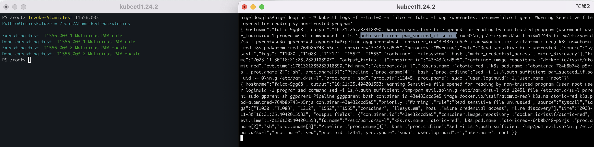

title: Install and Test Atomic Red in Kubernetes
description: Detect Atomic Red tests in Real Time with Falco
date: 2023-12-12
author: Nigel Douglas
slug: falco-atomic-red
images:
  - /blog/atomic-red-falco/images/falco-atomic-featured.png
tags: ["security-concept"]
---


In cloud-native environments, where applications scale up and down much faster than traditional monolithic application architectures, the ability to proactively identify and respond to threats in real time is paramount. As more organizations embrace cloud-native architectures for application delivery, more robust security measures need to be introduced. In this blog post, we delve into the dynamic realm of Kubernetes threat detection by exploring how open source Falco can seamlessly detect Atomic Red Team tests in real time within Kubernetes environments.

Atomic Red Team is a powerful framework designed to simulate real-world attacks, providing organizations with a controlled environment to validate the effectiveness of their security measures. We take this a step further by deploying Atomic Red to Kubernetes with a single command, creating a realistic testing ground for evaluating the responsiveness of Falco.

Our journey begins with the effortless deployment of Atomic Red to Kubernetes, showcasing the simplicity and efficiency of orchestrating security testing within containerized environments. Once deployed, we invoke specific Atomic Red Team tests, simulating a range of threat scenarios. The true test lies in Falco's ability to detect these threats in line with the MITRE ATT&CK framework, a globally-recognized matrix mapping adversary techniques to defensive tactics.

This exploration is not just about identifying threats; it's a collaborative effort to enhance Falco's coverage. Should we identify any gaps in detection, we dive deeper, revising the executed techniques and crafting custom rules. This iterative process aims to extend our MITRE ATT&CK coverage, aligning Falco with the industry's best practices for threat detection and mitigation.


## Deploying Atomic Red Team

To avoid any potential service disruption in production environments, we recommend installing Atomic Red in a test lab environment, or at least a staging environment of Kubernetes. We have a step-by-step video for installing Atomic Red on [Youtube](https://www.youtube.com/watch?v=5QjGnHGnxxo)

Before we start the deployment, remember to create the atomic-red network namespace.

```
kubectl create ns atomic-red
```

A single pod will be deployed with privileged set to true. 
Atomic Red requires admin-level securityContext to perform certain actions that require elevated permissions. 


```yaml
kubectl apply -f - <<EOF
apiVersion: apps/v1
kind: Deployment
metadata:
  name: atomicred
  namespace: atomic-red
  labels:
    app: atomicred
spec:
  replicas: 1
  selector:
    matchLabels:
      app: atomicred
  template:
    metadata:
      labels:
        app: atomicred
    spec:
      containers:
      - name: atomicred
        image: issif/atomic-red:latest
        imagePullPolicy: "IfNotPresent"
        command: ["sleep", "3560d"]
        securityContext:
          privileged: true
      nodeSelector:
        kubernetes.io/os: linux
EOF
```

Note: This creates a pod called 'atomicred' in the 'atomic-red' network namespace.
You can check on the state of the installation with the below command:
```
kubectl get pods -n atomic-red
```
If you ever want to remove the Atomic Red project from your Kubernetes cluster, simply run:
```
kubectl delete deployment atomicred -n atomic-red
```


## Familiarize Yourself with Atomic Red Tests

Once deployed, you will need to shell into the Atomic Red pod to perform the following test scenarios.
This might seem a little confusing, but Atomic Red was developed with PowerShell in mind, so the below instructions ask the user to shell into a container, and once they are in the running pod, they must run Powershell to import and invoke the various Atomic Test Scenarios. 

Once you are familiar with this logic, you’ll find Atomic Red is a truly simple security simulation tool.

```
kubectl exec -it -n atomic-red deploy/atomicred -- bash
```

As mentioned, you need to run Powershell once you are in the Atomic Red pod:
```
pwsh
```
Now, you can finally load the Atomic Red Team module:
```
Import-Module "~/AtomicRedTeam/invoke-atomicredteam/Invoke-AtomicRedTeam.psd1" -Force
```


Check the details of the TTPs:
```
Invoke-AtomicTest T1070.004 -ShowDetails
```


Check the prerequisites to ensure the test conditions are right:
```
Invoke-AtomicTest T1070.004 -GetPreReqs
```
You can see in the below screenshot, there are no prerequisites required to perform these tests. 
As a result, we can invoke the bulk file deletion test scenario.


Remove the feature flags to execute the test simulation.
```
Invoke-AtomicTest T1070.004
```

This test will attempt to delete individual files or individual directories. When we have Falco installed, this Atomic test should trigger the 'Warning bulk data removed from disk' rule by default. Next, we discuss Falco’s installation. 


Congrats! Now that we know how Atomic Red works, let’s install Falco and run it side-by-side against Atomic Red to prove it detects these tests in real time. We will need to open two terminal windows to see the real-time response detections.


## Installing & Testing Falco

For this lab guide, we can install Falco via Helm on a fixed version prior to the segregation of rules into different rules feeds, such as 'incubating', 'sandbox' and 'stable'. The reason we are doing this is to ensure all Falco rules are accessible in our lab scenario. To use the latest version of Falco, simply remove the '--version'  feature flag from the Helm install script.

```
helm install falco falcosecurity/falco --namespace falco \
  --create-namespace \
  --set tty=true \
  --version 3.3.0
```


Just like the Atomic Red deployment, we need to monitor the progress of the Falco installation. The pods will change state a few times during the installation, but should eventually all be in a 'RUNNING' status after about a minute or so. 

Please use the below command to check on the status change of Falco pods:
```
kubectl get pods -n falco -w
```
Once Falco is installed, we can track the events as they are generated using the following command in the second terminal window.
```
kubectl logs -f --tail=0 -n falco -c falco -l app.kubernetes.io/name=falco
```

Jump back into the first terminal window and re-run the bulk file deletion Atomic Test - 'T1070.004':
```
Invoke-AtomicTest T1070.004
```


You’re going to identify certain noise in the detection rules. For example, all Atomic Tests are run under the 'Root' user, therefore, we will always get a detection for scripts running under root. To ignore this noise, let’s instead just check for the specific Falco rule we are looking to detect:
```
kubectl logs -f --tail=0 -n falco -c falco -l app.kubernetes.io/name=falco | grep 'Bulk data has been removed from disk'
```


Hurrah! We see the exact detection matching the context of the Atomic Red test scenario.
Let’s move on to the next Atomic Test to invoke. There are a bunch of test scenarios for Linux that you can test out today. 

Check out the list on the official [Atomic Red Team Github project](https://github.com/redcanaryco/atomic-red-team/blob/master/atomics/Indexes/Indexes-Markdown/linux-index.md).

## T1556.003 Modify Authentication Process
In this scenario, Atomic Red generates three Pluggable Authentication Modules (PAM): two malicious PAM rules for Linux and FreeBSD, as well as a malicious PAM module for Linux. These programs can be used to open and read sensitive file content, and we can agree that they are non-trusted programs. Again, we have an [out-of-the-box rule](https://thomas.labarussias.fr/falco-rules-explorer/?source=syscalls&hash=5116b3ca0c5fad246cc41ca67938a315) for these activities:


```
kubectl logs -f --tail=0 -n falco -c falco -l app.kubernetes.io/name=falco | grep 'Sensitive file opened for reading by non-trusted program'
```
Now, it's time to simulate our threat:
```
Invoke-AtomicTest T1556.003
```


## T1036.005 Masquerading: Match Legitimate Name or Location

This test scenario executes a process from a directory masquerading as the current parent directory.
```
kubectl logs -f --tail=0 -n falco -c falco -l app.kubernetes.io/name=falco | grep 'Executing binary not part of base'
```

Now, it's time to simulate our threat.
```
Invoke-AtomicTest T1036.005
```

You can see that in the left terminal window, there is an echo message in the terminal saying '”Hello from the Atomic Red Team.”' Any string output in the command line can also be detected in Falco’s outputs.


## T1070.002 Indicator Removal on Host
Adversaries may clear system logs to hide evidence of an intrusion. macOS and Linux both keep track of system or user-initiated actions via system logs. The majority of native system logging is stored under the '/var/log/' directory.
```
kubectl logs -f --tail=0 -n falco -c falco -l app.kubernetes.io/name=falco | grep 'Log files were tampered'
```
Now, it's time to simulate our threat:
```
Invoke-AtomicTest T1070.002
```


## T1070.003 Clear Command History
In addition to clearing system logs, an adversary may clear the command history of a compromised account to conceal the actions undertaken during an intrusion. Various command interpreters keep track of the commands users type in their terminals so that users can retrace what they've done.
```
kubectl logs -f --tail=0 -n falco -c falco -l app.kubernetes.io/name=falco | grep 'Shell history had been deleted or renamed'
```
Now, it's time to simulate our threat:
```
Invoke-AtomicTest T1070.003
```


You can see from the below screenshot that four different operations were performed. Therefore, four unique Falco detections were triggered on those individual attempts to clear the command line history.


## T1014 Loadable Kernel Module Based Rootkit

Adversaries may use Rootkits to hide the presence of programs, files, network connections, services, drivers, and other system components. Rootkits are programs that hide the existence of malware by intercepting/hooking and modifying operating system API calls that supply system information.

Rootkits may reside at the user or kernel level in the operating system or lower, to include a hypervisor, Master Boot Record, or System Firmware. As such, it’s critical that Falco detects Rootkits in real time.
```
kubectl logs -f --tail=0 -n falco -c falco -l app.kubernetes.io/name=falco | grep 'Linux Kernel Module injection from container detected'
```
Now, it's time to simulate our threat:
```
Invoke-AtomicTest T1014
```
Falco is detecting the Linux kernel module injection attempt, whether it was a successful execution or not. 


## T1037.004 [CUSTOM RULE] Boot Initialization - RC Scripts
Adversaries may establish persistence by modifying RC scripts that are executed during a Unix-like system’s startup. These files allow system administrators to map and start custom services at startup for different run levels. RC scripts require root privileges to modify.

Command to simulate the 'T1037.004' test:
```
Invoke-AtomicTest T1037.004
```

You’ll notice that this is the first test where we don’t get a useful Falco detection related to the threat. As a result, we need to create a 'custom-rules.yaml' file with the custom Falco rule for detecting boot initialization scripts.

```
cat > custom-rules.yaml <<EOF
customRules:
  custom_rules.yaml: |-
    - rule: Base64-encoded Python Script Execution
      desc: >
        This rule detects base64-encoded Python scripts on command line arguments.
      condition: >
        spawned_process and (
          ((proc.cmdline contains "python -c" or proc.cmdline contains "python3 -c" or proc.cmdline contains "python2 -c") and (proc.cmdline contains "echo" or proc.cmdline icontains "base64")) or ((proc.cmdline contains "import" and proc.cmdline contains "base64" and proc.cmdline contains "decode")))
      output: >
        Potentially malicious Python script encoded on command line
        (proc.cmdline=%proc.cmdline user.name=%user.name proc.name=%proc.name
        proc.pname=%proc.pname evt.type=%evt.type gparent=%proc.aname[2]
        ggparent=%proc.aname[3] gggparent=%proc.aname[4] evt.res=%evt.res
        container.id=%container.id container.name=%container.name file=%fd.name)
      priority: warning
      tags:
        - T1037.004
        - MITRE_Defense_Evasion
      source: syscall
EOF
```

Adversaries can establish persistence by adding a malicious binary path or shell commands to 'rc.local', 'rc.common', and other RC scripts specific to the Unix-like distribution. Upon reboot, the system executes the script's contents as root, resulting in persistence. 

Let’s try upgrading Falco to reflect the 'custom-rules.yaml' file:

```
helm upgrade falco falcosecurity/falco \
  -n falco \
  --set tty=true \
  --version 3.3.0 \
  --reuse-values \
  -f custom-rules.yaml
```

Granted, there’s no obvious formatting issues when creating the 'custom-rules.yaml' manifest, you should be able to successfully upgrade Falco and the pods should be in a 'RUNNING' state. If there was an issue with the custom rules file, the Falco pod state will likely change to 'CrashLoopBackOff'.


Let’s see if we detect the Atomic test after upgrading Falco with the newly-created custom rule.
Remember to have Falco running in a second terminal window with the following command:

```
kubectl logs -f --tail=0 -n falco -c falco -l app.kubernetes.io/name=falco | grep 'Potentially malicious Python script'
```


We can simulate the technique ID 'T1037.004' one last time:
```
Invoke-AtomicTest T1037.004
```


Hurrah! We detected the boot initialization scripts with the above command. To recap, adversaries looking to abuse those RC scripts are especially effective for lightweight Unix-like distributions using the root user as default, such as IoT or embedded systems. If you are wondering why the Falco rule was specifically looking at Base64-encoded Python scripts, well, we need to look back at the details associated with the Atomic test simulation.

```
Invoke-AtomicTest T1037.004 -ShowDetails
```


We can see from the command that it is using the 'python3' command to run Python scripts. However, the script itself is executed as a base64-encoded string to evade some traditional detection tools.


## Conclusion

In conclusion, this article serves as a comprehensive guide aimed at enhancing knowledge in cloud-native threat simulation and detection. Its primary audience includes security practitioners, DevOps teams, and anyone involved in securing Kubernetes environments. The focal point is the utilization of Atomic Red for deploying test simulations aligned with the MITRE ATT&CK framework and leveraging Falco to detect these threats in real time.

The article not only illustrates how Atomic Red can be instrumental in improving the rules shipped with Falco, but also emphasizes its role in identifying potential gaps in coverage. By doing so, it offers a valuable resource for customers seeking alternative methods to validate the effectiveness of their Falco rules and, consequently, fortify the security posture of their Kubernetes deployments.

The notion of creating a realistic testing ground for evaluating the responsiveness of Falco is particularly beneficial for DevOps teams. This facet addresses the need for hands-on experience in threat simulation, adversarial approaches, and understanding the intricacies of the MITRE ATT&CK framework. In providing this practical testing environment, the article empowers DevOps teams to proactively enhance their security measures, ensuring robust coverage and responsiveness in the dynamic landscape of Kubernetes threat detection.

