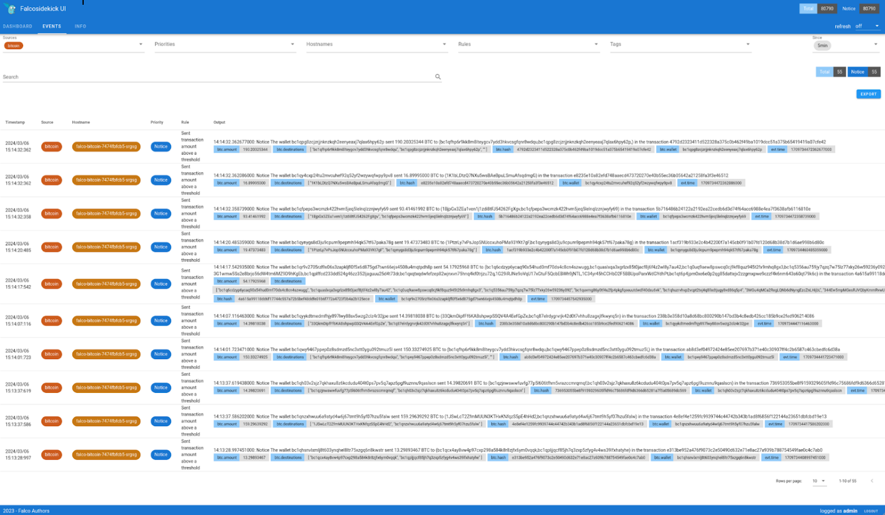

The number of plugins available for Falco continues to grow thanks to our wonderful community. Thank you all for your help!  

You can find the list of available plugins [here](https://github.com/falcosecurity/plugins?tab=readme-ov-file#registered-plugins).

The vast majority of plugins developed allow Falco to ingest logs from different sources and raise alerts when suspicious elements are identified by its rules. In order to show that any event stream can be a source if you have the right plugin, and to have something fun to show users during my talks, I  developed a Falco plugin to track Bitcoin transactions.

## How does it work?

I discovered  the site https://www.blockchain.com/ exposes a public flux, accessible via a [websocket](https://www.blockchain.com/fr/explorer/api/api_websocket), by subscribing to it you can retrieve transactions carried out on the blockchain in real time. This is perfect for a Falco plugin as it allows you to test the ingestion of events via a websocket, and serve as a basis for other plugins.

I am not going to describe the internal workings of the plugin here, nor how it was developed. If you are interested, you can look at  the code [here](https://github.com/Issif/bitcoin-plugin). 

Alternatively, read our documentation explaining how to create a plugin from A to Z: https://falco.org/docs/concepts/plugins/developers-guide/how-to-develop/.

## Default rules

The plugin comes with its default set of rules, we will use them  as a working example. 
You are free to play with it for your own needs, such as monitoring suspicious movements of your wallet.

You can find the Falco rules file provided [here](https://github.com/Issif/bitcoin-plugin/tree/main/rules).


## Installation of the plugin

We will see the 3 classic ways to install the plugin:
* via sources
* with falcoctl
* in kubernetes via Helm

### Via sources

The prerequisites are:
	
* Golang >= 1.19
* make
* Falco >= 0.36
* Git

We will start by installing download the sources, build and install the plugin:

```shell
git clone https://github.com/Issif/bitcoin-plugin.git
cd bitcoin-plugin
sudo make install
```

We will create a `falco.yaml` file containing:

```yaml
plugins:
  - name: bitcoin
	library_path: /usr/share/falco/plugins/libbitcoin.so
	init_config: ''
	open_params: ''

load_plugins: [bitcoin]

stdout_output:
  enabled: true
```

The plugin comes with a default set of rules which will be sufficient for testing. All that remains is to start Falco with this command:

```shell
sudo falco -c falco.yaml -r rules/bitcoin_rules.yaml
```
```shell
14:44:21.721357000: Notice The wallet bc1qfpeps3wcmzk422hvm5jeq5lelnqlzznjwyfy69 sent 96.78318104 BTC to (bc1q4hwcl377ereljtyn2t7ljdrh9umyxz5uuyl3qn,bc1qfpeps3wcmzk422hvm5jeq5lelnqlzznjwyfy69) in the transaction aab62fd0b529cd9da163508ba879d488ff64cce4c130caf6c8bd21ab1701ed46
14:44:27.020379000: Notice The wallet bc1qwk9hqnckv0ryhsnsdefcsmlpn3zx7uq3agdsw9 sent 68.68462728 BTC to (bc1qg0nkd5nckxvwlslf6lznukgat2vukrnrrcwjcv) in the transaction 734526413f6e3eefdf4adc4258e01375ccc145b9d02b7e0ab45517be0f57e7d9
14:44:29.393013000: Notice The wallet bc1qm34lsc65zpw79lxes69zkqmk6ee3ewf0j77s3h sent 14.94446421 BTC to (3F9e4JvPryCxC5A6TS4VHeT2EJSK2ivjBV,bc1qm34lsc65zpw79lxes69zkqmk6ee3ewf0j77s3h,bc1qaeq3z2edsuspt82qw7uflg0k860clxs7qjhrh0,bc1qnvhjvpa6gaglrg9lxg7w68ye8jdjcj2nk08y20,bc1q22hp7n28whk5h94z93vm05hfx2zxs8ca9gglk7,bc1qe9yxu2myqvt3kegknzj45u704dhtapwy7lxhnv,bc1qye5rp8pcqt4ej3nsz70c3lngacmew2fc4tfljd,bc1qcfqke8as8y08mkclcun9r3hlq4xl5za2vz3n2p,bc1qtqkjq4wq234netyucg247sm6nge9qu7m2fd28g,12Q4AHgzFmKWmY1Z2LEohMoxLVhvCAKsNV,3EyJiePQX4BUt8XXaAG3JmfhwB7cQ8ggp6,bc1q36ary7yaf2eeg6006h4m33drsgw4xa3pu6yvnn,13ybpB8kTgk8bCsnRrpyemNZdE2PJSHMEs,135dx8ncZzWSjhre8ecGG1yenmLwvNZPz4,3Nzr6LAJXstT8ET2CAGMH6h5vfgrh7Q94g,bc1qjhrhwpyc0z8zh6v22vhf5arzf6vcr47tgtkj5a,bc1qpxlsyrcmwuf2rk52emvfe0dvugphzzkxlyzvxv,bc1qf23j9ls2axtl6shpry40l4qat5c695x40vpfm8,bc1qsxsdunam68jkeuu7c3mplza4h74nrjhhu9w7dl,32e54ctKqWXfzKpdNKcCBBdsRoFHKoLijH,bc1qw2gafqcg2267xm2t0r4gfzu7ff392e2vl6s3zc,bc1qc0dwh27y56yajhz0k039j5p7xkwfjprhz7rfkq,3D493LGN6PchbRPtnJQo6dSUTLB8u5vN3i,3DhzjabzhAXTBU9vksNdBZFhZzMYzK7vix,18ex2LKyiLpjaSQStY1CLNbLbSToRkJAy6,bc1q3jvuvkvpukp0mnksfmpvnqq in the transaction 40c33db54610869c75b101431690e73b584b8cc77802eea76fa2d41bbb615852
14:44:29.395043000: Notice The wallet 3Hi5VHVgmYZYfAPc9aNvQoNXyEv5rYvJQN sent 50.00000000 BTC to (bc1q582qfqtlvfv038jf6k6s6xvd30we7x66katshx,bc1q6j3gxn68m5pkzhtytn3h464kgjnvce79x8nmwq,bc1qmxaaz6g07re55ekmtlmtrc5kj0kpj3lngy5y60,1CPjdsfkqiW6LB2ZNTDYczjKCzPpiJZ4Ci,1JtUKazSgYN6hCM7HPkvzL7JLVXwkL4stN,3GzfFtGVte95ZMFfQsrz3FFgFDHU8Zw6gS,bc1qcyl4sxkczex6gxldrfmfdctr2qsun4cgpufz8j,bc1q0realpv9h4zp3yhdwjeg78njqg97f9sm6ex3xrw8mkrz8g6qamsqua6tcw) in the transaction 3025c4566dc6cd6452c0c9ae6dc8cff9583df4530326b29e38e0a5e763a6c1c9
14:44:32.577196000: Notice The wallet bc1qfpeps3wcmzk422hvm5jeq5lelnqlzznjwyfy69 sent 96.43310490 BTC to (bc1qzrzhnlaru0pqmcxwm80vvvsqpdll9g6t39y686,bc1qfpeps3wcmzk422hvm5jeq5lelnqlzznjwyfy69) in the transaction 1083e02c554454db4dcff02f7418198aae5b563c4ec286b4c3ae4d30e649e8d5
14:44:32.577917000: Notice The wallet bc1qvruk6nhq5rz7whvx9cz6peqrp3nrutae59d63q sent 13.48137244 BTC to (1EtV3erwXxeKLhCvXq1BwKit7pMcB5BDvV,bc1qxgepulgdkjju7s8el6932m57svej5uzfvx7207) in the transaction 3e000a5745d7d5b6d2791bff75b9045696c2bea497363e845593ac249cc194b5
```

We can clearly see transactions (sending and receiving) for amounts exceeding 1 BTC appearing in real time.

### With falcoctl

The prerequisites are:
* Falco >= 0.36
* Falcoctl >= 0.6
* Git

Falcoctl is the CLI tool that we developed to facilitate the installation of artifacts around Falco, such as rules and plugins. To find out more, [here]( https://falco.org/blog/falcoctl-install-manage-rules-plugins/) is a blog article about it.

```shell
sudo falcoctl index add bitcoin https://raw.githubusercontent.com/Issif/bitcoin-plugin/main/index.yaml
sudo falcoctl artifact install bitcoin-rules:latest
```

Both the plugin and the rules will be downloaded thanks to the dependency:

```shell
 INFO  Reading all configured index files from "/root/.config/falcoctl/indexes.yaml"
 INFO  Resolving dependencies ...
 INFO  Installing the following artifacts: [ghcr.io/issif/bitcoin-plugin/ruleset/bitcoin:latest bitcoin:0.2.0]
 INFO  Preparing to pull "ghcr.io/issif/bitcoin-plugin/ruleset/bitcoin:latest"
 INFO  Pulling 8758e31efdff: ############################################# 100%
 INFO  Pulling 326b3ec82baf: ############################################# 100%
 INFO  Pulling 8aec149e9934: ############################################# 100%
 INFO  Artifact successfully installed in "/etc/falco"                                                                                                                                                        	 
 INFO  Preparing to pull "ghcr.io/issif/bitcoin-plugin/plugin/bitcoin:0.2.0"
 INFO  Pulling e7f990e1e4e6: ############################################# 100%
 INFO  Pulling 0dfca1bb2434: ############################################# 100%
 INFO  Pulling f269eb62cbf6: ############################################# 100%
 INFO  Artifact successfully installed in "/usr/share/falco/plugins" 
```

As with the installation via sources, the falco.org file should look like:

```yaml
plugins:
  - name: bitcoin
	library_path: /usr/share/falco/plugins/libbitcoin.so
	init_config: ''
	open_params: ''

load_plugins: [bitcoin]

stdout_output:
  enabled: true
```

And Falco will be started by the command:

```shell
sudo falco -c falco.yaml -r /etc/falco/bitcoin_rules.yaml
``` 

### In Kubernetes via Helm

The prerequisites are:
* Helm

The installation will consist of just adapting the values ​​in the values.yaml file. Everything will be automatically managed by the templates:

```yaml
tty: true
kubernetes: false

falco:
  rules_files:
	- /etc/falco/bitcoin_rules.yaml
  plugins:
  - name: bitcoin
	library_path: libbitcoin.so
  load_plugins: [bitcoin]

falcosidekick:
  enabled: true
  webui:
    enabled: true
    
driver:
  enabled: false
collectors:
  enabled: false

controller:
  kind: deployment
  deployment:
	replicas: 1

falcoctl:
  config:
	indexes:
  	- name: bitcoin
    	url: https://raw.githubusercontent.com/Issif/bitcoin-plugin/main/index.yaml
	artifact:
  	install:
    	refs: ["bitcoin:0"]
  	follow:
    	refs: ["bitcoin-rules:0"]
```

And the classic Helm command for installation:

```shell
helm install falco-bitcoin -n falco falcosecurity/falco -f values.yaml --create-namespace
```

After a few seconds, you should have the pod running:

```shell
❯ kubectl get pods -n falco -l app.kubernetes.io/instance=falco-bitcoin
NAME                         	READY   STATUS	RESTARTS    	AGE
falco-bitcoin-7474fbfcb5-srgsg   2/2 	Running   110 (17m ago)   10d
```

And new events in falcosidekick-ui:



## Conclusion

This plugin has no great purpose other than to dismantle the almost infinite possibilities that open up to Falco thanks to its plugin system. If you wish to be alerted on Telegram of a strange outgoing movement from your wallet, it is now possible with Falco!

Falco is no longer limited to securing Cloud environments. SaaS or others can also be used in a unified way. The Falco rules  syntax has proven to benefit security practitioners in  an ecosystem rich with  numerous potential integration points.


