## TLDR;

* Falco users prefer deploying on AWS and adopting it for security threat detection, auditing and compliance, and sandbox testing.
* Security and DevOps teams are the most common users of Falco.
* The official Helm chart and official container images are the preferred deployment methods.
* Respondents reported kernel module/eBPF probes installations, rule management, and integration with third parties as the main challenges.
* The most commonly used Falcosidekick integrations include Slack, PagerDuty, CloudWatch, and Elasticsearch.
* Suggestions for improving documentation include more examples, use cases, and platform compatibility information.
* Community support received a high satisfaction rating of 4.2 out of 5.
* One-third of respondents were active contributors, while the majority were not interested in sharing their Falco adoption story.
* Review the full [report](https://survey.typeform.com/report/JseepIQh/uuuvE53CWnIsmqFX).

---

Diving into the Falco community survey, this report unveils the fascinating world of Falco adoption and usage. As an open-source cloud-native runtime security project, Falco has captured the attention of a diverse audience. This survey reached out to community members across various channels, including Slack, mailing lists, and social media platforms. 

Delving into various aspects of Falco adoption, this report uncovers insights on user roles, cloud providers, adoption motivations, deployment strategies, rule sets, challenges, and integrations. It also highlights areas that need improvement, like documentation and support, to enhance the overall experience for newcomers. These valuable insights will help guide the evolution of Falco, making it an even more robust and user-friendly cloud-native runtime security solution.

--- 

## Respondents' Roles

Of the 24 individuals who participated in the survey, 22 shared their professional roles. These participants showcased a vibrant mix of positions, such as Software Engineers, DevOps practitioners, Cloud Architects, Security Engineers, Solutions Architects, Product Managers, CEOs, and even ambitious Student Developers. This colorful blend of roles demonstrates that Falco has captured the attention of a wide array of professionals from various fields and levels of expertise.

**1. What is your role?**

* Total respondents: 22 (out of 24 answered).
* Roles included: Director of DevOps and Cybersecurity, Software Engineer, Founder/Cloud Architect, Product, DevOps, Senior Solutions Architect, Security Engineer, CEO, Principal MTS, Cloud Architect, Senior DevOps, Solutions Architect, and Student Developer.

## Reasons for Adopting Falco

Security threat detection tops the list as the driving force behind Falco adoption, followed closely by auditing and compliance. Sandbox testing and incident response are also cited as compelling reasons to embrace Falco. Notably, one participant isn't using Falco, while a couple of others leverage its libraries and policy language within their unique open-source projects. These findings highlight Falco's versatility in catering to diverse security requirements across numerous domains.

**2. Why are you adopting Falco?**

* Majority adopted Falco for security threat detection (58.3%).
* Auditing and compliance were common reasons (45.8% each).
* Sandbox testing and incident response also mentioned.
* Unique use cases: integrating Falco libraries into projects.
* Growing popularity as versatile security solution across fields.

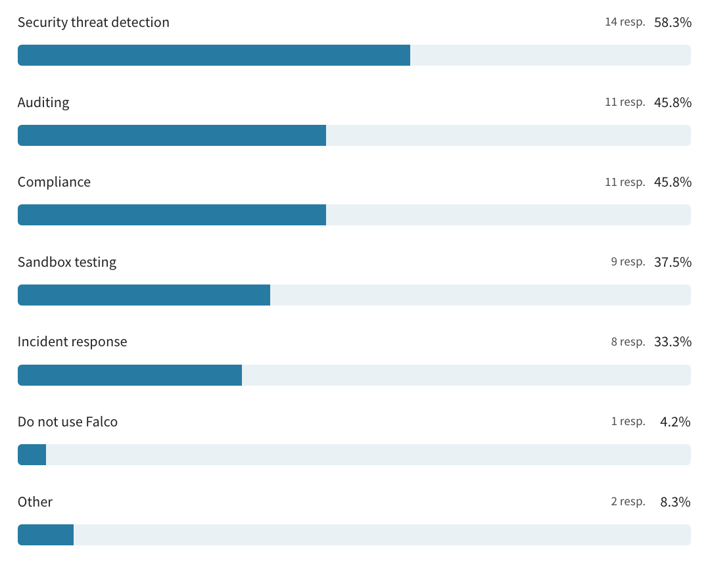

## Teams Using Falco

Falco predominantly finds a home within security teams, though DevOps squads are also known to harness its capabilities. Other adopters include platform engineering units, R&D departments, agent developers, and solution architects in the early stages of adoption. Interestingly, some survey participants don't use Falco at all, while others opt for its libraries directly, bypassing the full solution to meet their unique needs.

**3. Which teams use Falco at your company?**

* Security teams most common users (45.8%).
* DevOps teams also prominent (41.7%).
* Platform engineering, R&D, agent developers, and early-adopting solution architects mentioned.
* 25% reported no Falco usage in their company.
* Some teams utilize Falco libraries directly.

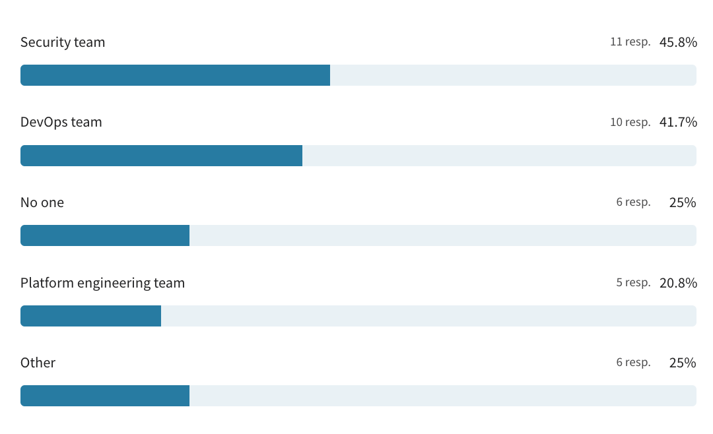

## Falco Deployment Methods

Most Falco enthusiasts opt for the official Helm chart when it comes to deployment, but the Falco community is nothing if not creative. Some users prefer official container images, bespoke manifest files, or even official packages like .deb, .rpm, and .tar.gz. Meanwhile, others have ventured off the beaten path, experimenting with custom shell script wrappers atop Helm, homegrown repositories for source compilation, tailor-made Helm charts combined with custom-built container images, or integrating Falco libraries directly into their agent and kernel modules. The sky's the limit when it comes to deploying Falco!

**4. How are you deploying Falco?**

* Majority using official Helm chart (62.5%).
* Official container images (20.8%).
* Custom manifest files (16.7%).
* Official packages (.deb/.rpm/.tar.gz) (12.5%).
* Various alternative methods (16.7%).

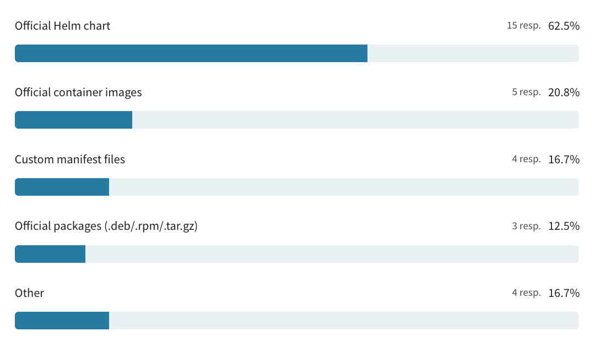

## Rulesets

Most users rely on the default ruleset when using Falco, while a significant number of users prefer to maintain their own ruleset to tailor it to their specific needs. Others choose to take advantage of the new ruleset feature to further enhance their security. The flexibility and adaptability of Falco's ruleset options provide users with a customized and comprehensive approach to their security needs.

**5. What ruleset do you use with Falco?**

* Default ruleset used by 54.2%.
* 50% maintain their own ruleset.
* New ruleset feature utilized by 29.2%.
* Other methods account for 4.2%.

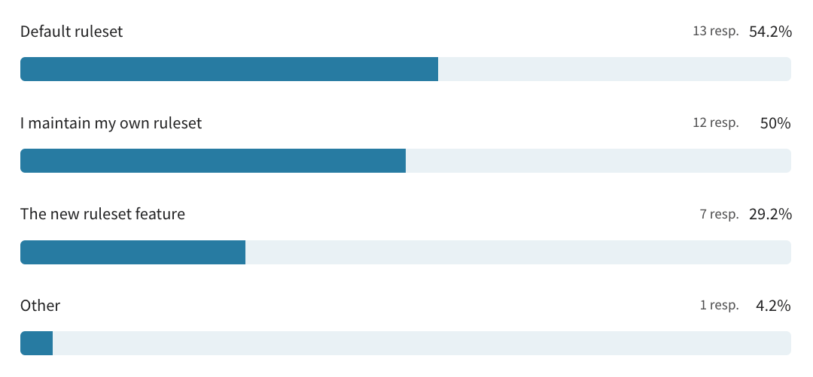

## Challenges adopting Falco

The survey revealed some of the key challenges encountered when adopting Falco. Top among them were kernel module and eBPF probes installations, and management of rules. Other difficulties included integrations with third-party tools, tuning, plugin management, and deployment. A few respondents indicated that they did not use Falco or faced other challenges. Additionally, a couple of participants mentioned their struggle with integrating Falco's security event logs with AWS CloudWatch, while others reported difficulties integrating with AWS FireLens and FluentBit log event forwarding. These challenges demonstrate the importance of ongoing development and improvement of Falco's features and documentation to make it a more seamless and user-friendly security solution.

**6. What challenges have you faced with adopting Falco?**

* The top two challenges faced by adopters of Falco were kernel module/eBPF probe installations (41.7%) and management of rules (41.7%).
* Integrations with third parties were also identified as a challenge by 37.5% of the respondents.
* Tuning, management of plugins, and performance were also mentioned as challenges by a significant number of participants (33.3%, 29.2%, and 16.7%, respectively).
* Some respondents (12.5%) indicated that they do not use Falco, while others mentioned other challenges, such as integrating Falco security event logs with AWS CloudWatch and using AWS FireLens and Fluent Bit log event forwarding.

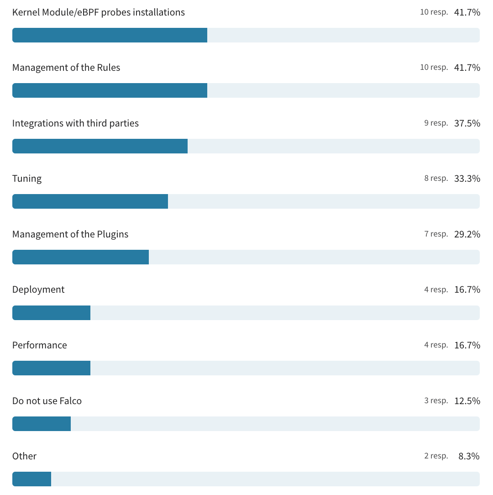

## Falcosidekick integrations

The survey sought to identify Falcosidekick integrations in use and what new integrations the community would like to see. Out of the 24 participants, 13 answered this question, with Slack, PagerDuty, and CloudWatch being the most commonly used integrations. Elasticsearch, AWS Lambda, and custom integrations were also mentioned, while one respondent highlighted that they use a fluentbit sidecar container instead of Falcosidekick to populate additional cloud metadata about each node.

On the other hand, when asked about integrations they would like to see, some participants expressed interest in Falcosidekick being usable by other threat detection systems like Tetragon. Others mentioned a desire for direct integrations with CloudWatch and/or Container Insights, as well as more cloud outputs. These results highlight the diverse integrations already in use, while identifying areas where the Falcosidekick community would like to see further development and expansion.

**7. What integrations with Falcosidekick are you using? What would you like to see?**

* Slack, PagerDuty, and CloudWatch are the most commonly used integrations with Falcosidekick, among the 13 participants who answered this question.
* Some respondents expressed interest in additional integrations, such as Elastic search, AWS Lambda, custom ones, and falco-exporter.
* One participant mentioned they would like Falcosidekick to be usable by other threat detection systems like Tetragon.
* Others expressed interest in direct integrations with CloudWatch and/or Container Insights, as well as more cloud outputs.
* A few respondents mentioned that they do not use Falcosidekick and instead push events directly to things like S3 or Elastic.

## Plugins

Out of 24 respondents, 12 answered the question on their usage and desired integrations of Falco plugins. The k8s_audit plugin was the most commonly used, followed by Cloudtrail and k8saudit. Some respondents also mentioned using plugins for audit logging and GitHub. However, a notable number of participants did not use any Falco plugins.

Regarding desired integrations, a few respondents expressed interest in more diverse plugins, such as EKS Kubernetes kernel monitoring, which could enhance the monitoring of their Kubernetes infrastructure. Other respondents suggested new plugins for monitoring and analyzing different system events, such as DNS resolution or SSL handshake failures. The results suggest that there is a desire for more plugins that can address diverse security issues in different system components.

**8. Which plugin(s) are you using? What would you like to see?**
* k8s_audit and Cloudtrail are the most commonly used plugins among the respondents.
* Several participants mentioned using a combination of plugins such as K8saudit, Cloudtrail, and JSON.
* Some respondents do not use any plugins or did not provide a response.
* One participant mentioned using EKS Kubernetes kernel monitoring, while another used audit logging.
* Github integration was also mentioned by a couple of respondents.
* There were no clear requests for new plugins or features, although some participants did not provide a response to this question.

## Documentation

The survey asked participants to rate Falco's documentation on a scale from 1 to 5, with 5 being "very helpful" and 1 being "not helpful." All 24 participants responded to this question, and the average rating for Falco's documentation was 3.7. While this is a solid rating, it indicates that there is room for improvement. Some participants rated Falco's documentation as highly helpful (with ratings of 4 or 5), while others found it to be less helpful (with ratings of 1 or 2). The survey data highlights the importance of clear and concise documentation to assist users in getting the most out of Falco.

**9. On a scale of 1 - 5, how would you rate Falco’s documentation?**

* The average rating was 3.7.
* 41.7% of respondents rated the documentation 2 out of 5.
* 29.2% of respondents rated the documentation 3 out of 5.
* 25% of respondents rated the documentation 4 out of 5.
* 4.2% of respondents rated the documentation 1 out of 5.

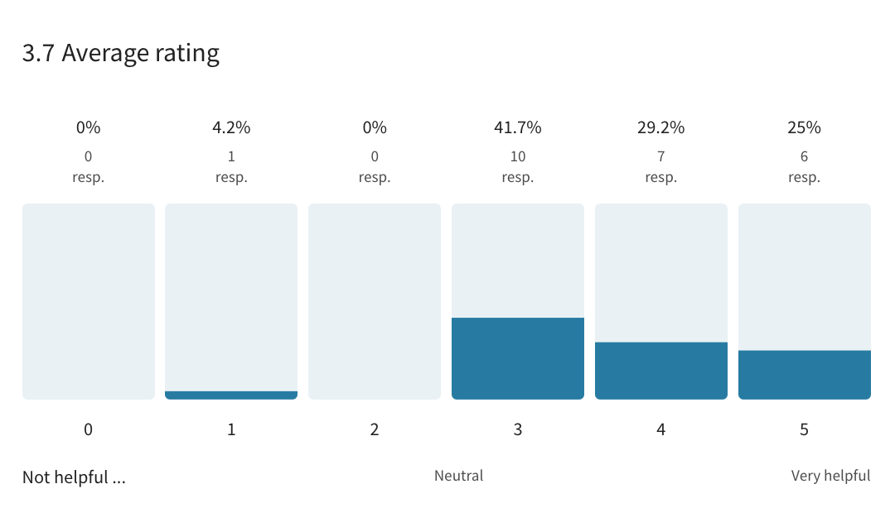

## Onboarding and getting started

The survey asked respondents about their opinions on the type of documentation and support that would improve the onboarding and getting started experience for new community members. Out of 24 participants, 16 provided their valuable feedback. The respondents highlighted the need for more examples, tutorials, and step-by-step guides, especially around rule configuration and integration with cloud providers' services like AWS CloudWatch. Other requests included more detailed information on what Falco can and cannot do, more manuals, and more working samples of integrations with AWS Services and different ways to aggregate and route security events.

One participant suggested the need for documentation around the probes, which includes information on when to use one probe over the other, what platforms each probe works with, and insights into typical reasons why a module fails when it does. Additionally, they highlighted the importance of clarifying which platforms are supported, as there were unclear requests around things like k3.

Other recommendations included a contributing guide and templates, end-to-end tutorials from Hello World to complex use cases, and more use cases on public cloud offerings. Respondents emphasized the importance of having up-to-date documentation that keeps pace with the fast-moving nature of Falco. Overall, the survey results provide valuable insights for the Falco community to improve the onboarding and getting started experience for new members, ultimately creating a more user-friendly and accessible cloud-native runtime security project.

**10. What type of documentation and support do you believe is needed to improve the onboarding and getting started experience for new community members?**

* Improving documentation and support can enhance the onboarding and getting started experience for new members of the Falco community.
* Respondents suggest more examples, tutorials, use case implementation tutorials, and specific examples of custom security monitoring with rules configuration and integration with cloud providers' services.
* Respondents also suggest more working samples of integrations with AWS services, more information on probes, documentation recency, and freshness, and more analysis of performance impact across different workload types.

## Community support

The survey measured the quality of community support for Falco on a scale of 1-5, with an average rating of 4.2, indicating that the majority of respondents found it very helpful. This positive feedback reflects the strength of the Falco community's willingness to provide support to new members, highlighting the essential role of community support in the success of open-source projects. A small number of respondents rated Falco's community support as not helpful, with others rating it as somewhat helpful or neutral. Overall, the survey results suggest that the Falco community is a valuable resource for those seeking support and guidance.

**11. On a scale of 1 - 5, how would you rate Falco’s community support?**

* All 24 respondents rated Falco's community support on a scale of 1-5, with an average rating of 4.2.
* Over 45% of respondents rated the community support as "Very helpful" (5), while 37.5% rated it as "Helpful" (4).
* Only one respondent rated the community support as "Not helpful" (1).
* The results indicate that Falco has a strong and supportive community, with the majority of respondents finding the support helpful or very helpful.

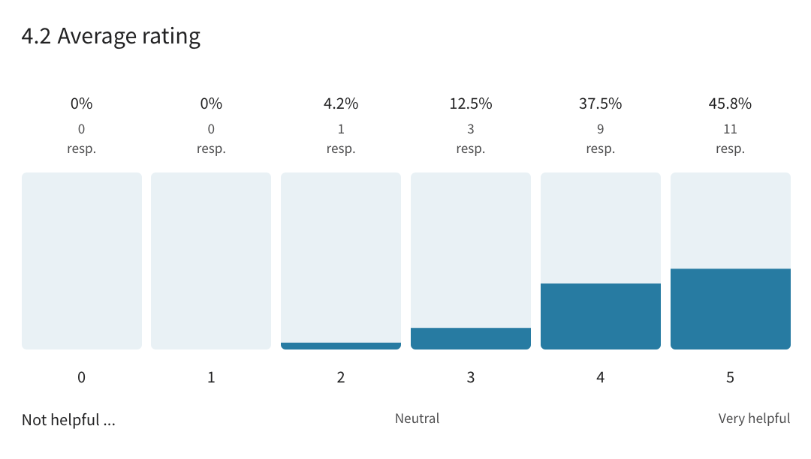

## Contributing to Falco

The results highlight a mix of engagement levels within the community and potential for increased involvement from those who would like to contribute.

**12. Are you an active contributor to the project?**

* Out of 24 respondents, 33.3% were active contributors to the Falco project.
* An equal percentage of respondents (33.3%) expressed interest in becoming contributors in the future.
* 33.3% of respondents were not active contributors to the project.

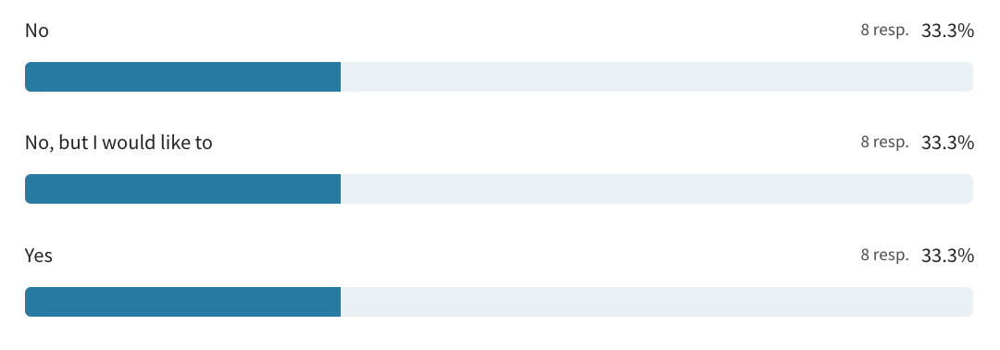

## Community communication

When it comes to effective communication, Falco is hitting the mark according to a survey that asked users to rate their satisfaction on a scale of 1-5. With an average rating of 4.2 out of 5, most respondents rated Falco's communication as satisfactory or even highly satisfactory. Only a few rated it as not satisfactory, with the rest expressing neutrality or some level of satisfaction. These results suggest that while Falco is doing well in communicating with its community, there is still potential to further enhance communication to meet the diverse needs of its users.

**13. On a scale of 1 - 5, how satisfied are you with the communication of the Falco project?**

* The survey asked participants to rate their satisfaction with the communication of the Falco project on a scale of 1-5.
* The average rating of the Falco project's communication was 4.2.
* A majority of respondents rated Falco's communication as either highly satisfactory (37.5%) or satisfactory (50%).
* Only a small percentage of respondents were either neutral or not satisfied with Falco's communication (8.3% and 4.2% respectively).
* These results demonstrate that overall, respondents are satisfied with the communication of the Falco project.

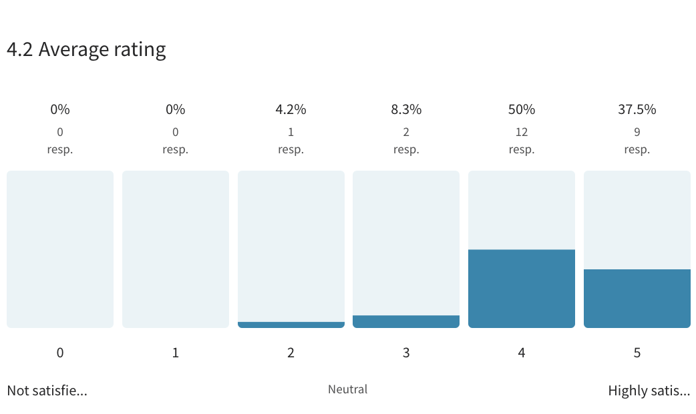

## Weekly community calls

Falco's community calls are an essential part of its communication strategy, allowing users to connect and collaborate with other members of the community. The survey asked participants whether they attend these calls, with 24 out of 24 respondents answering. The results showed that a majority of respondents do not attend the weekly community calls, with an almost equal number of respondents indicating they are planning to attend in the future. A smaller number of respondents attend the calls from time to time, and only a few respondents attend almost every week. These results highlight the importance of ensuring that community calls are accessible and convenient for all members, and that alternative ways of communication are available for those unable to attend.

**14. Do you attend the weekly community calls?**

* 29.2% of respondents do not attend the calls.
* Another 29.2% are not attending, but plan to in the future.
* Another 29.2% attend the calls from time to time.
* Only 12.5% of respondents attend the weekly community calls almost every week.

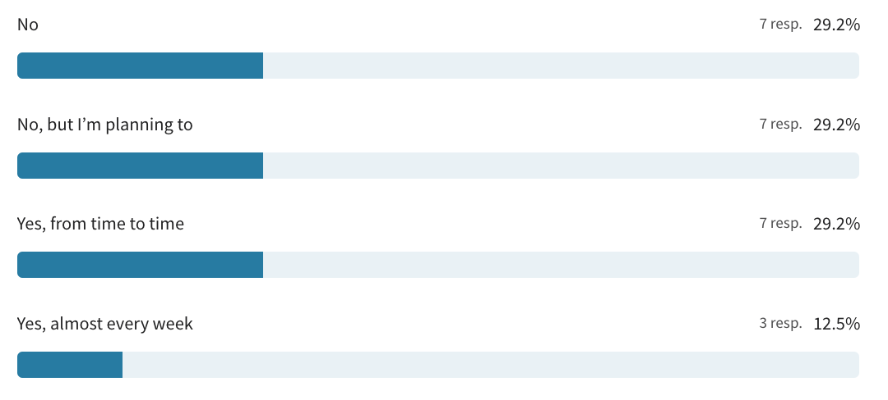

## Sharing your adoptiong journey

Falco's adopters are a proud community, and the project provides opportunities to share their success stories. In a survey of 24 participants, the question of whether they were interested in sharing their Falco adoption story and publishing their company's name in Falco's adopters file was asked. Over half of the respondents (54.2%) preferred not to share their story, while 25% of the respondents were interested in sharing it privately with the maintainers. Meanwhile, 20.8% were enthusiastic about sharing it publicly. These results demonstrate that while many companies may not want to publicize their use of Falco, some are excited to share their adoption story with the larger community.

**15. Are you interested in sharing your Falco adoption story and publishing the your company's name in Falco's adopters file?**

* 54.2% of respondents were not interested in sharing their Falco adoption story, and preferred that it not be shared at all.
* 25% of respondents were willing to share their story, but only privately with the maintainers.
* 20.8% of respondents were willing to share their story publicly.
* All 24 respondents answered this question.

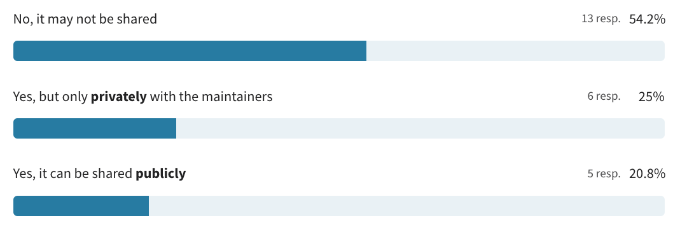

## Conclusion

The Falco community survey provides valuable insights into the experiences and opinions of users in the community. Overall, the survey results demonstrate a high level of satisfaction with Falco, with users praising its effectiveness, ease of use, and flexibility. However, there are areas where the community would like to see further development and expansion, particularly in documentation, integrations, and communication. 

Additionally, the survey shows that the Falco community is a diverse group of users from various industries and backgrounds, with different levels of expertise and use cases. It is clear that the Falco project has a strong and supportive community, and its continued growth and success rely on the continued engagement and contributions of its users.
