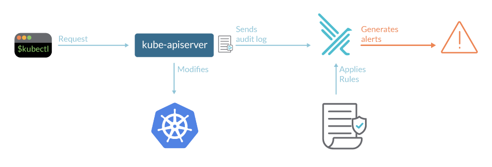

Detecting threats in a Kubernetes cluster can be challenging, we generally don't know where and how to start.
The good news is that we have an amount of valuable logs that can help us to know what is happened in the cluster. Indeed, each actions, requested or done by a user or an app, in a cluster, are recorded in Audit Logs.
Kubernetes events are key to understand the behavior of a cluster.

We already provide plugins that let you parse Audit Logs and use Falco to detect threats from GKE, EKS and AKS clusters. With our latest plugin, you'll now have the same powerful threat detection capabilities for your OVHcloud MKS clusters 🎉.

## What is Falco?

Falco is an Open Source cloud-native runtime security tool. It provides near real-time threat detection for cloud, container, and Kubernetes workloads by leveraging runtime insights. Falco can monitor events from various sources, including the Linux kernel, and enrich them with metadata from the Kubernetes API server, container runtime, and more.

Falco can receive **Events**, compare them to a set of **Rules** to determine the actions to perform and generate **Alerts** to different endpoints. 

## What is the OVH MKS Audit Logs plugin?

The OVH audit logs plugin (k8saudit-ovh) extends Falco's capabilities to OVHcloud Managed Kubernetes Service (MKS) clusters, providing you with the same security insights and threat detection Falco already offers for GKE, EKS and AKS environments.

With this plugin, you can seamlessly integrate MKS Audit Logs into Falco's event processing pipeline, enabling it to identify anomalies, suspicious activities, and policy violations within your MKS-based workloads.

Concretely, when an user will execute some **kubectl** commands in an OVHcloud MKS cluster, Audit Logs will be generated. Falco is listening from them and depending on the configured rules to follow, it will generate some alerts.



## Using OVH MKS Audit Logs plugin

In order to use the OVH MKS Audit Logs plugin, you must follow several steps:
* deploy an OVHcloud LDP (Logs Data Platform)
* create a data stream into this LDP
* connect an OVHcloud MKS cluster to the data stream (to send Audit Logs into it)

To be able to access to our Kubernetes clusters Audit Logs, you need to deploy a [LDP](https://www.ovhcloud.com/en/identity-security-operations/logs-data-platform/). LDP is the managed platform for collecting, processing, analyzing and storing your logs of the OVHcloud products. Deploy a LDP (Bare Metal Cloud universe) with the wathever plan you want.

OVHcloud Kubernetes Audit Logs will be stored in a data stream. The OVHcloud Audit Logs Falco plugin receive the audit logs through Websocket so you need to enable **Websocket broadcasting** when you create the data stream on LDP.

Retrieve the Websocket URL, follow [the guide](https://help.ovhcloud.com/csm/en-ie-logs-data-platform-ldp-tail?id=kb_article_view&sysparm_article=KB0055757#retrieve-your-websocket-address) to do so.
The Websocket address have this kind of format: **wss://gra<xxx>.logs.ovh.com/tail/?tk=<xxxxxxxx-xxxx-xxxx-xxxx-xxxxxxxxxx>**

Finally, you have to [connect a MKS cluster to the LDP data stream](https://help.ovhcloud.com/csm/en-public-cloud-kubernetes-forwarding-audit-logs?id=kb_article_view&sysparm_article=KB0062285#enabling-audit-log-forwarding-using-the-ovhcloud-control-panel).

## Configuring Falco to use OVH Audit Logs plugin

### Running locally 

If you have a Falco running locally, using [falcoctl](https://github.com/falcosecurity/falcoctl), add the **falcosecurity index** (if it's not already the case) and install the k8saudit-ovh Falco plugin:

```yaml
# Add falcosecurity index
sudo falcoctl index add falcosecurity https://falcosecurity.github.io/falcoctl/index.yaml
# Install k8saudit-ovh Falco plugin
sudo falcoctl artifact install k8saudit-ovh
```

Fill your **falco.yaml** file in order to add the plugin configuration:

```yaml
plugins:
  - name: k8saudit-ovh
    library_path: /usr/share/falco/plugins/libk8saudit-ovh.so
    open_params: "<OVH LDP WEBSOCKET URL>" # gra<x>.logs.ovh.com/tail/?tk=<ID>
  - name: json
    library_path: libjson.so
    init_config: ""
load_plugins: [k8saudit-ovh, json]

stdout_output:
  enabled: true
```

### Running in a Kubernetes cluster

If you have a Falco running in a Kubernetes cluster (on OVHcloud MKS or on another cluster), deployed with Helm, create a **values.yaml** file with the following content:

```yaml
tty: true
kubernetes: false

# Just a Deployment with 1 replica (instead of a Daemonset) to have only one Pod that pulls the MKS Audit Logs from a OVHcloud LDP
controller:
  kind: deployment
  deployment:
    replicas: 1

falco:
  rule_matching: all
  rules_files:
    - /etc/falco/k8s_audit_rules.yaml
    - /etc/falco/rules.d
  plugins:
    - name: k8saudit-ovh
      library_path: libk8saudit-ovh.so
      open_params: "gra<x>.logs.ovh.com/tail/?tk=<ID>" # Replace with your LDP Websocket URL
    - name: json
      library_path: libjson.so
      init_config: ""
  # Plugins that Falco will load. Note: the same plugins are installed by the falcoctl-artifact-install init container.
  load_plugins: [k8saudit-ovh, json]

driver:
  enabled: false
collectors:
  enabled: false

# use falcoctl to install automatically the plugin and the rules
falcoctl:
  artifact:
    install:
      enabled: true
    follow:
      enabled: true
  config:
    indexes:
    - name: falcosecurity
      url: https://falcosecurity.github.io/falcoctl/index.yaml
    artifact:
      allowedTypes:
        - plugin
        - rulesfile
      install:
        resolveDeps: false
        refs: [k8saudit-rules:0, k8saudit-ovh:0.1, json:0]
      follow:
        refs: [k8saudit-rules:0]
```

This **values.yaml** file will install Falco with the **k8saudit-ovh** and the **json** plugins. 

Install the latest version of Falco with **helm install** command:

```bash
$ helm install falco --create-namespace --namespace falco --values=values.yaml falcosecurity/falco
```

This command will install the latest version of Falco, with the k8saudit-ovh and json plugins, and create a new falco namespace.

Or if you already have Falco deployed in a Kubernetes cluster, you can use the **helm update** command instead:

```bash
$ helm update falco --create-namespace --namespace falco --values=values.yaml falcosecurity/falco
```

Once the Falco pod is ready, run the following command to see the logs:

```bash
kubectl logs -l app.kubernetes.io/name=falco -n falco -c falco
```

You should see logs like that:

```bash
$ kubectl logs -l app.kubernetes.io/name=falco -n falco -c falco

Mon Feb 10 09:15:35 2025:    /etc/falco/k8s_audit_rules.yaml | schema validation: ok
Mon Feb 10 09:15:35 2025: Hostname value has been overridden via environment variable to: my-pool-1-node-921b61
Mon Feb 10 09:15:35 2025: The chosen syscall buffer dimension is: 8388608 bytes (8 MBs)
Mon Feb 10 09:15:35 2025: Starting health webserver with threadiness 2, listening on 0.0.0.0:8765
Mon Feb 10 09:15:35 2025: Loaded event sources: syscall, k8s_audit
Mon Feb 10 09:15:35 2025: Enabled event sources: k8s_audit
Mon Feb 10 09:15:35 2025: Opening 'k8s_audit' source with plugin 'k8saudit-ovh'
{"hostname":"my-pool-1-node-921b61","output":"09:15:40.698757000: Warning K8s Operation performed by user not in allowed list of users (user=csi-cinder-controller target=csi-6afb06dce281b86b7bab718b5d966dc261b2b1554941ae449519a128cb2e3fb3/volumeattachments verb=patch uri=/apis/storage.k8s.io/v1/volumeattachments/csi-6afb06dce281b86b7bab718b5d966dc261b2b1554941ae449519a128cb2e3fb3/status resp=200)","output_fields":{"evt.time":1739178940698757000,"ka.response.code":"200","ka.target.name":"csi-6afb06dce281b86b7bab718b5d966dc261b2b1554941ae449519a128cb2e3fb3","ka.target.resource":"volumeattachments","ka.uri":"/apis/storage.k8s.io/v1/volumeattachments/csi-6afb06dce281b86b7bab718b5d966dc261b2b1554941ae449519a128cb2e3fb3/status","ka.user.name":"csi-cinder-controller","ka.verb":"patch"},"priority":"Warning","rule":"Disallowed K8s User","source":"k8s_audit","tags":["k8s"],"time":"2025-02-10T09:15:40.698757000Z"}
{"hostname":"my-pool-1-node-921b61","output":"09:15:57.508657000: Warning K8s Operation performed by user not in allowed list of users (user=yacht target=my-pool-1.18051c0a88716868/events verb=patch uri=/api/v1/namespaces/default/events/my-pool-1.18051c0a88716868 resp=403)","output_fields":{"evt.time":1739178957508657000,"ka.response.code":"403","ka.target.name":"my-pool-1.18051c0a88716868","ka.target.resource":"events","ka.uri":"/api/v1/namespaces/default/events/my-pool-1.18051c0a88716868","ka.user.name":"yacht","ka.verb":"patch"},"priority":"Warning","rule":"Disallowed K8s User","source":"k8s_audit","tags":["k8s"],"time":"2025-02-10T09:15:57.508657000Z"}
{"hostname":"my-pool-1-node-921b61","output":"09:15:57.807013000: Warning K8s Operation performed by user not in allowed list of users (user=yacht target=my-pool-1/nodepools verb=update uri=/apis/kube.cloud.ovh.com/v1alpha1/nodepools/my-pool-1/status resp=200)","output_fields":{"evt.time":1739178957807013000,"ka.response.code":"200","ka.target.name":"my-pool-1","ka.target.resource":"nodepools","ka.uri":"/apis/kube.cloud.ovh.com/v1alpha1/nodepools/my-pool-1/status","ka.user.name":"yacht","ka.verb":"update"},"priority":"Warning","rule":"Disallowed K8s User","source":"k8s_audit","tags":["k8s"],"time":"2025-02-10T09:15:57.807013000Z"}
```

## Let's test it!

In order to test Falco we need to know which rules are installed by default. In our case, as we defined it in the **values.yaml** file, the k8saudit-ovh plugin follow the [k8s_audit_rules.yaml](https://github.com/falcosecurity/plugins/blob/main/plugins/k8saudit/rules/k8s_audit_rules.yaml) file. You can take a look at them in order to know them.

In this blog post we will test one of well-known default k8s audit rules:

```yaml
- rule: Attach/Exec Pod
  desc: >
    Detect any attempt to attach/exec to a pod
  condition: kevt_started and pod_subresource and (kcreate or kget) and ka.target.subresource in (exec,attach) and not user_known_exec_pod_activities
  output: Attach/Exec to pod (user=%ka.user.name pod=%ka.target.name resource=%ka.target.resource ns=%ka.target.namespace action=%ka.target.subresource command=%ka.uri.param[command])
  priority: NOTICE
  source: k8s_audit
  tags: [k8s]
```

This rule is interesting because an event will be generated if/when an user execute commands in a pod.

Let’s test the rule!

In a tab of your terminal, watch the coming logs:

```bash
$ kubectl logs -l app.kubernetes.io/name=falco -n falco -c falco -f
```

In an another tab of your terminal, create a Nginx pod and execute a command into it:

```bash
$ kubectl run nginx --image=nginx

$ kubectl exec -it nginx -n hello-app -- cat /etc/shadow
```

Several seconds laters, in the logs you should see this you will see this Attach/Exec to pod logs:

```bash
...
{"hostname":"my-pool-1-node-921b61","output":"09:29:46.302906000: Notice Attach/Exec to pod (user=kubernetes-admin pod=nginx-676b6c5bbc-4xc6t resource=pods ns=hello-app action=exec command=cat)","output_fields":{"evt.time":1739179786302906000,"ka.target.name":"nginx-676b6c5bbc-4xc6t","ka.target.namespace":"hello-app","ka.target.resource":"pods","ka.target.subresource":"exec","ka.uri.param[command]":"cat","ka.user.name":"kubernetes-admin"},"priority":"Notice","rule":"Attach/Exec Pod","source":"k8s_audit","tags":["k8s"],"time":"2025-02-10T09:29:46.302906000Z"}
...
```

💪

## Let's meet!

If you have planned to go to the KubeCon + CloudNative Con EU 2025 at London, don't hesitate to stop at the Falco booth in the Project Pavillon!

As always, we meet every week in our [community calls](https://github.com/falcosecurity/community),
if you want to know the latest and the greatest you should join us there!

If you have any questions

 - Join the #falco channel on the [Kubernetes Slack](https://slack.k8s.io)
 - [Join the Falco mailing list](https://lists.cncf.io/g/cncf-falco-dev)

Enjoy 😎,

_Aurélie_