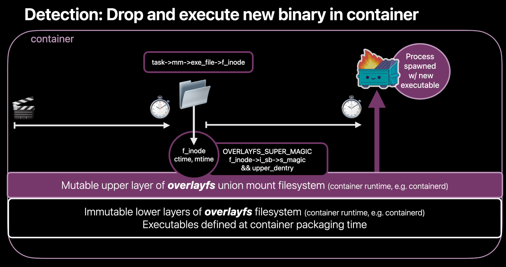

Dear community, today we are delighted to announce the release of Falco 0.34.0  🎉!

A big thank you to the community for helping get the latest release out. The Falco community is thrilled about this release and cannot wait to share the latest goodies. Check out the newest features from this most recent launch to learn more ⬇️. To read a more detailed account of the release, see [v0.34.0 in the changelog](https://github.com/falcosecurity/falco/blob/master/CHANGELOG.md#v0340).

## What’s new? 🆕
In this release we saw more than 190 pull requests across the repos of Falco and its libraries. Thank you to our maintainers and contributors, as this would not happen without your support, dedication, and contribution.

## Updates - TL;DR 🩳
In release v0.34.0 the community focused on addressing the following key features: 
- Downloading and dynamically updating Falco rules at runtime
- Shipping the brand new experimental modern eBPF probe
- Designing more ways to catch suspicious executions

## Automatic rules update 🔄
A few questions that often come up when using Falco is how can we update rules once Falco is installed in the cluster and, how do we get updated rules from the Falco organization without having to wait for the next release? This is the first release to include [falcoctl](https://github.com/falcosecurity/falcoctl) with an out of the box solution to do exactly that!

When using the new Falco Helm Chart 3.0.0 rules will automatically be updated from the official repository. To learn more about this feature and how to configure it read [the Helm chart documentation](https://github.com/falcosecurity/charts/blob/master/falco/README.md#about-falco-artifacts). Likewise, when using a SystemD based install you can [configure Falco](https://falco.org/docs/getting-started/installation/#falco-packages) to automatically update rules.

Want to upgrade to the new Helm chart? Read [all you need to know](https://github.com/falcosecurity/charts/blob/master/falco/BREAKING-CHANGES.md#300) before you do so!

## Modern eBPF probe 👨‍🚀
Last quarter, Andrea published the blog, “[Getting started with modern BPF probe in Falco](https://falco.org/blog/falco-modern-bpf/),” and announced that the new experimental eBPF probe had landed among us bringing with it a few key features: [CO-RE paradigm](https://falco.org/blog/falco-modern-bpf/#co-re-paradigm), [BPF Ring Buffer map](https://falco.org/blog/falco-modern-bpf/#bpf-ring-buffer-map), [BTF-enabled program](https://falco.org/blog/falco-modern-bpf/#btf-enabled-program), [BPF global variables](https://falco.org/blog/falco-modern-bpf/#bpf-global-variables), [BPF skeleton](https://falco.org/blog/falco-modern-bpf/#btf-enabled-program), and finally [Multi-arch support](https://falco.org/blog/falco-modern-bpf/#multi-arch-support). 

### Why a new probe? 👽
The old probe supported old kernels (>=4.14) that can not take advantage of the new shiny eBPF features. While it would be great to have only one probe that works for every kernel version, recent features change (and simplify!) the way we write, maintain and deploy the code so deeply that a new fresh probe is the most reasonable solution. In order to leverage these recent eBPF improvements and use the new probe you will need a kernel version >= 5.8.

### Modern eBPF in action 🎬
[Try it now](https://falco.org/docs/event-sources/drivers/#modern-ebpf-probe-experimental)!

### Shiny new eBPF features ✨
Why are Falco maintainers and community members excited about the modern eBPF probe? There are quite a few features that you might be interested in! Some of our favorites are:

- [CO-RE paradigm](https://falco.org/blog/falco-modern-bpf/#co-re-paradigm) - stands for "Compile-once-run-everywhere", so as you may imagine, this paradigm allows compiling the eBPF probe just once for all kernels! You understood well: NO MORE MISSING DRIVERS, and no more painful local builds requiring the much-loved **KERNEL HEADERS**.

- [Multi-arch support](https://falco.org/blog/falco-modern-bpf/#multi-arch-support) - the modern BPF probe also supports multiple architectures by design. The actual targets for Falco are x86_64 and arm64 but new ones can be added at any time. If you have a project that needs BPF instrumentation for one of these architectures you could simply link the Falco libraries (libsinsp, libscap) to obtain a working solution out of the box.

- **Performance Improvements** - the modern eBPF probe leverages features recently introduced in the Linux kernel such as BPF global variables and ring buffers to be faster and more efficient than the traditional eBPF probe!

## Even more ways of catching suspicious executions 🕵️‍♀️

Detecting when a suspicious new executable is spawned is often considered a crucial baseline detection. Generally speaking, detecting this kind of behavior and understanding when it is malicious is not an easy task. For this reason Falco has not one, but several features that can help defenders craft appropriate rules for their workflows.

Thanks to great contributions from Lorenzo Susini and Melissa Kilby (thanks for both the code contributions and the image above!) we have two more ways to check for suspicious executions in our Falco rules as we have the following new fields tied to process spawn (execve) events:
- **proc.is_exe_upper_layer**: which is true if the process’ executable is in the upper layer of the overlayfs. In practice, that means that the executable that is being launched has been introduced or modified in the container after it was started. While some applications might do this legitimately, in many cases it is a thing to watch out for because it might be signaling an attack in progress! Note that you can use this only on kernel versions greater or equal than 3.18.0, since overlayfs did not exist before then, and of course with container runtimes that make use of it as a union mount filesystem 😉. This flag complements proc.is_exe_writable, which is similar but only checks if the executable file is also writable by the same user that spawned it.

Don’t think this is enough? Do you think you need more flags to get more accurate detections? Here’s the second group of fields:
- **proc.exe_ino.ctime** and **proc.exe_ino.mtime**: they show the last change time and modification time of the process’ executable file, respectively.
- **proc.exe_ino.ctime_duration_proc_start** and **proc.exe_ino.ctime_duration_pidns_start**: demonstrates the time difference, in nanoseconds, between the process ctime and when the process was actually spawned or when the PID namespace was created, respectively. I’m sure you can see why you could be interested in that. Launching executables that were just created could be something that you want to know about 😁.

While the above signals won't replace the need to monitor file operation events, they can help reduce the search space for tracking spawned processes where for example chmod +x was run against the executable file on disk prior to execution (this causes ctime of inode to change, but we don't know if it was chmod related or a different status change operation). In addition, users could use these fields for selected rules to augment information available for incident response.

## Artifact distribution 📜
Automatic rules updates and other upcoming features would not be possible without a proposal aimed to create a unified management of the distribution of artifacts. The overall goals for this are: 

- Allow users to consume artifacts in a consistent way
- Define official artifacts
- Unify distribution mechanism, infrastructure, and tooling
- Provide generic guidelines applicable to any artifact that is distributed

The officially supported artifacts are a set of artifacts published by Falcosecurity and now are part of Falco and its ecosystem. Prior to release 0.34.0 the Falcosecurity organization distributed several kinds of artifacts in the form of files or container images, which included: 
- Installation packages
- Helm charts
- Drivers (eg, kmod, eBPF)
- Rule files
- Plugins
- Other kinds may be added in the future.

Now, the new distribution channels include HTTP Distribution and **OCI Distribution**.

### What we accomplished ✅

#### Falco rules have their own repo now 🏠
The benefits of having rules living in their repository are:
- Dedicated versioning
- Rules release will not be tied anymore to a Falco release (e.g., no need to wait for the scheduled Falco release to publish a new rule aiming to detect the latest published CVE)
- Consistent installation and update mechanism for other rulesets (plugins rules are already published in their repository and can be consumed by falcoctl)
- Rules are published as plain files as well as OCI artifacts at each release

Check it out: [https://github.com/falcosecurity/rules](https://github.com/falcosecurity/rules)

#### Falcoctl is official 😎
The falcoctl project was promoted to "Official" status, and its repository is now part of the [core](https://github.com/falcosecurity/evolution/blob/main/GOVERNANCE.md#core-repositories).

## What's Next? 🔮

It’s time to try out the new release! Here are some pointers for getting started with Falco:

* [Container Images](/docs/getting-started/running/#docker)
  * `falco` ([DockerHub](https://hub.docker.com/r/falcosecurity/falco), [AWS ECR Gallery](https://gallery.ecr.aws/falcosecurity/falco))
  * `falco-no-driver` ([DockerHub](https://hub.docker.com/r/falcosecurity/falco-no-driver), [AWS ECR Gallery](https://gallery.ecr.aws/falcosecurity/falco-no-driver))
  * `falco-driver-loader` ([DockerHub](https://hub.docker.com/r/falcosecurity/falco-driver-loader), [AWS ECR Gallery](https://gallery.ecr.aws/falcosecurity/falco-driver-loader))
* [CentOS/Amazon Linux](/docs/getting-started/installation/#centos-rhel)
* [Debian/Ubuntu](/docs/getting-started/installation/#debian)
* [openSUSE](/docs/getting-started/installation/#suse)
* [Linux binary package](/docs/getting-started/installation/#linux-binary)

The community is active on many things and there is no shortage of great ideas for next releases!

Thanks to all the people who wrote and tried plugins, we have great feedback for the next version. If you are a plugin developer or user, stay tuned for more APIs and functionality!

The modern eBPF probe is awesome and we want to keep improving it to get it out of the experimental stage 🚀

Falco maintainers also care a lot about the project’s own security. We’re exploring security-related considerations in the Falco Supply Chain Security Working Group. [Join us](https://hackmd.io/FwSPVkdHT0i8T4Q8JdfOaw) if you can't wait to know more about this.

## Stay Tuned 🤗

**Join us** in our communication channels and in our weekly community calls! It’s always great to have new members in the community and we’re looking forward to having your feedback and hearing your ideas.

You can find all the most up to date information at https://falco.org/community/.

Till the next release! 👋

_Luca, Andrea, Teryl and Jacque_
