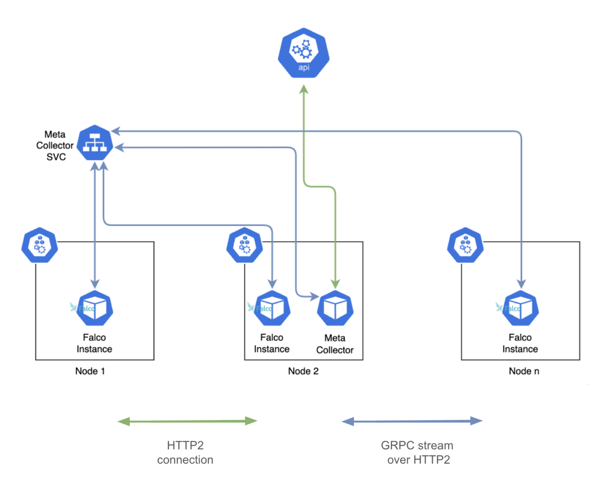

Dear Falco Community, today we are happy to announce the release of Falco 0.37.0!

This release brings an improved installation experience, a new way to modify Falco rules, and some great UX improvements. There are, as to be expected, a handful of breaking changes. But, rest assured, we've done all we can to help you with any changes you might need to make.

During this release cycle, we merged more than 100 PRs on Falco and more than 160 PRs for libs and drivers, version 0.14.2 and version 7.0.0 respectively. Thank you to our maintainers and contributors, as this would not happen without your support and dedication!

To learn all about these changes, read on!

## What’s new? TL;DR

*Key features:*

* A new way to [enrich syscalls with Kubernetes metadata](#a-new-way-to-enrich-syscalls-with-k8s-metadata), replacing the old Kubernetes collector.
* New capabilities in [`falcoctl`](#new-falcoctl-capabilities) to download and build our kernel drivers, replacing the old `falco-driver-loader` script.
* [Support for 32-bit syscall emulation](#32-bit-syscall-emulation) on x86_64 in all kernel drivers (`modern_ebpf`, `ebpf`, `kernel module`).
* A new [override key](#new-override-key) to easily modify rules, lists, and macros.

*Key UX improvements:*

* Introduction of a new `engine` key in `falco.yaml` to replace all other methods for opening engines such as `FALCO_BPF_PROBE`, `--modern-bpf`, `-g`, and `-e`.
* Expansion of environment variables in `falco.yaml` even when they are part of a string.

This release also comes with [breaking changes](#breaking-changes), we'd suggest to read them before upgrading. If you use helm, make sure to read the [Helm chart breaking changes](https://github.com/falcosecurity/charts/blob/master/charts/falco/BREAKING-CHANGES.md#400) page as well.

## Major features and improvements

The 0.37.0 release contains a number of feature and UX improvements, here are list of some of the key new capabilities.

### A new way to enrich syscalls with K8s metadata

Falco 0.37.0 introduces a new method to enrich syscalls with Kubernetes metadata to help address scalability and other issues with the old collector. Falco always had Kubernetes support, but sometimes we need new approaches to keep up with the bigger and bigger scale that we see in production clusters today. You can find more technical details [here](https://github.com/falcosecurity/falco/issues/2973).

While the collector was previously integrated into Falco, this feature uses a new architecture which leverages a plugin (`k8smeta`) and a remote collector (`k8s-metacollector`).



The plugin gathers details about Kubernetes resources from the remote collector. It stores this information and provides access to Falco upon request. The plugin specifically acquires data for the node where the associated Falco instance is deployed, resulting in node-level granularity. In contrast, the collector runs at the cluster level.

Within a given cluster there may be multiple k8smeta plugins (one per node), but only one collector exists per cluster.

More technical details about the architecture and design choices are [here](https://github.com/falcosecurity/falco/issues/2973).

It’s important to note that both new components are considered **experimental**, which means although they are functional and tested, they are currently in active development. They may undergo changes in behavior as necessary without prioritizing backward compatibility.

#### Fields supported by the new `k8smeta` plugin

This section provides details on:

* Kubernetes fields that are supported out-of-the-box by Falco through container runtime enrichment.
* Fields the new `k8smeta` plugin supports
* Fields have been deprecated.

The following fields are automatically populated with data from the container runtime, making them compatible with Falco without needing the old k8s collector or the new k8smeta plugin. These fields will continue to [function as before](https://falco.org/docs/reference/rules/supported-fields/#field-class-k8s), and no changes have been made:

* `k8s.pod.name`
* `k8s.pod.id/k8s.pod.uid`
* `k8s.pod.sandbox_id`
* `k8s.pod.full_sandbox_id`
* `k8s.pod.label`
* `k8s.pod.labels`
* `k8s.pod.ip`
* `k8s.pod.cni.json`
* `k8s.ns.name`

All other fields with the `k8s.*` prefix previously supported by the old collector (e.g., `k8s.deployment.name`) are now deprecated and will return `<NA>` if used in rules.

These fields are now provided by the new plugin under the `k8smeta.*` prefix. A complete list of these fields can be found [here](https://github.com/falcosecurity/plugins/tree/master/plugins/k8smeta#supported-fields)

The new fields introduced by the `k8smeta` plugin are additive. They do not replace the fields provided by the container runtime. This means you can use both `k8s.pod.name` and `k8smeta.pod.name` simultaneously. While they may return the same value, the data is collected from different sources (container runtime for `k8s` fields, the Kubernetes API server for `k8smeta`). As a result, their availability and reliability may differ during the lifecycle of an application. While it may seem redundant, this approach should offer flexibility to users.

To wrap up:

* If `k8s.pod.*` and `k8s.ns.name` fields meet your needs, you can use Falco without plugins. The default container runtime information in Falco should be enough.
* If `k8s.pod.*` and `k8s.ns.name` fields are insufficient, you should evaluate the new `k8smeta` plugin.
* The old `k8s.*` fields (excluding `k8s.pod.*` and `k8s.ns.name`) are now deprecated, and if used in Falco rules, they return `<NA>`

If you’d like to read more about this new feature check out the documentation for the [`k8smeta` plugin](https://github.com/falcosecurity/plugins/blob/master/plugins/k8smeta/README.md)and the [`k8s-metacollector`](https://github.com/falcosecurity/k8s-metacollector/blob/main/README.md), while if you want to deploy this solution with our helm chart check out the [dedicated section](https://github.com/falcosecurity/charts/blob/falco-4.0.0/charts/falco/README.md#enabling-the-k8s-metacollector).

### New Falcoctl capabilities

Since [`falcoctl`](https://github.com/falcosecurity/falcoctl) 0.7.0, users have been able to quickly download and compile Falco drivers using the `falcoctl driver` command. Starting with Falco 0.37.0 the `falcoctl driver` command will be used by the Falco installation process in place of the old `falco-driver-loader` script.  

For example, to install the kernel module:.

* Specify which driver we want to use

```bash
falcoctl driver config --type kmod
```

* Install the driver

```bash
falcoctl driver install
```

By default, the `falcoctl driver install` command tries to download a prebuilt driver from [the official Falco download s3 bucket](https://download.falco.org/?prefix=driver/). If a driver is found, then it is inserted into `${HOME}/.falco/`. Otherwise, the script tries to compile the driver locally.

You can find more details on installing each driver type in [our docs](https://github.com/falcosecurity/falco-website/pull/1240).

Finally, while the `falcoctl driver` command replaces the old `falco-driver-loader` script it’s important to note that, even though there is no change in terms of usage, the Docker images `falco-driver-loader` and `falco-driver-loader-legacy` no longer utilize the old `falco-driver-loader` script; instead, they now use `falcoctl`.

### 32-bit syscall emulation

The support for 32-bit syscalls has consistently been a highly requested feature for a long time. Until now, this support was only available in the kernel module, but starting from Falco 0.37.0, we have finally extended this support to the `ebpf` and `modern_ebpf` drivers. This feature is crucial as it addresses a security gap that has existed for some time.

It’s important to note that this feature is specifically for 32-bits syscalls emulated on the x86_64 architecture. Falco does not support pure 32-bit architectures.

Follow these steps to try out this new feature:

* Create a C program `ia32.c`

```c
#include <stdio.h>
#include <unistd.h>
#include <sys/syscall.h>
#include <sys/types.h>

int main() {
    syscall(__NR_close, -1);
    return 0;
}
```

* Compile it
    `gcc ia32.c -o ia32 -m32`

* Start Falco with the following rule
    `evt.type = close and proc.name contains ia32`

* Execute the binary

    `./ia32`

You should see the rule triggered

### New override key

Falco 0.37.0 replaces the `append: true` key-value pair with a new override section. The override section allows you to either replace or append keys to a rule, macro, or list value . It’s important to note that you cannot append and replace the same key; you must choose one or the other. Choosing both will result in an error.

The keys that can be modified vary according to the rules component being overridden. See the [override documentation](https://falco.org/docs/rules/overriding/) for the full list of keys that can be modified.

The override section can either be in a custom rules file or can be in the same file as the component being overridden. In either case, the override section needs to be specified after the rule that is being modified. When the override is in the same file, the override section needs to be below the original rule, list, or macro definition. If the override is in another file, that file needs to be loaded after the original rules file.

 A quick example from the documentation illustrates how this new feature works.

In this example, the original rule is in `falco_rules.yaml` and the override is specified in `falco_rules.local.yaml`.

**`/etc/falco/falco_rules.yaml`**

```yaml
- rule: program_accesses_file
desc: track whenever a set of programs opens a file
condition: proc.name in (cat, ls) and evt.type=open
output: a tracked program opened a file (user=%user.name command=%proc.cmdline file=%fd.name)
priority: INFO
```

**`/etc/falco/falco_rules.local.yaml`**

```yaml
- rule: program_accesses_file
condition: and not user.name=root
output: A file (user=%user.name command=%proc.cmdline file=%fd.name) was opened by a monitored program
override: 
    condition: append
    output: replace
```

The modified `program_accesses_file`rule would trigger when `ls` or `cat` use `open` on a file, unless they were run by `root`.

The new output message would be `A file (user=%user.name command=%proc.cmdline file=%fd.name) was opened by a monitored program`

A final note, the old `append: true` method of modifying values has been deprecated and will be removed in Falco 1.0.0.

### Additional UX improvements

* Introduce a new unique `engine` key in `falco.yaml` to replace all the other methods of opening engines (`FALCO_BPF_PROBE`, `--modern-bpf`, `-g`, `-e)`. See the [deprecated features](#deprecated-features) section  for more info.

* Falco now expands environment variables in `falco.yaml` even when they are part of a string. It is now possible to use syntax similar to this:

```yaml
ebpf:
    probe: ${HOME}/.falco/falco-bpf.o
```

* Our gVisor integration has also been improved by adding support for more events, including `write`, `socketpair`, `timerfd_create` and an updated configuration generator. In addition, we added support for any gVisor container ID format, making Falco more robust and compatible with gVisor sandboxed containers beyond Docker and Kubernetes.

## Breaking changes

This is a list of breaking changes introduced in Falco 0.37.0

* The [Rate-limiter mechanism](https://github.com/falcosecurity/falco/pull/2841) was removed as it is no longer used.

* [`--userspace CLI option`](https://github.com/falcosecurity/falco/pull/2839) was removed as it’s no longer used.

* The `falco-driver-loader` script is removed and [embedded into falcoctl](https://github.com/falcosecurity/falco/pull/2905)

* The Helm chart 4.0.0 contains several modifications to work with the new k8s metadata collector. Please read its [breaking change](https://github.com/falcosecurity/charts/blob/master/charts/falco/BREAKING-CHANGES.md#400) file for more information.

* The new `falcoctl driver` implementation will drop:
  * [`--source-only`](https://github.com/falcosecurity/falco/blob/master/scripts/falco-driver-loader#L685)
  * [`BPF_USE_LOCAL_KERNEL_SOURCES`](https://github.com/falcosecurity/falco/blob/master/scripts/falco-driver-loader#L559)
  * [`DRIVER_CURL_OPTIONS`](https://github.com/falcosecurity/falco/blob/master/scripts/falco-driver-loader#L692)
  * The [`FALCO_BPF_PROBE`](https://github.com/falcosecurity/falco/blob/1b62b5ccd1c64cd972ef0252262075cbf42a130c/scripts/falco-driver-loader#L738C9-L738) environment variable won't be used by the new `falcoctl driver` loader as it is already deprecated and scheduled to be removed in the next major version.

* Various environment variables have been replaced as part of the new `falcoctl driver` feature:
  * [`DRIVERS_REPO`](https://github.com/falcosecurity/falco/blob/1b62b5ccd1c64cd972ef0252262075cbf42a130c/scripts/falco-driver-loader#L690) has been replaced by `FALCOCTL_DRIVER_NAME`  or the `--name` command line argument.
  * [`DRIVERS_NAME`](https://github.com/falcosecurity/falco/blob/1b62b5ccd1c64cd972ef0252262075cbf42a130c/scripts/falco-driver-loader#L689) has been replaced by `FALCOCTL_DRIVER_REPOS` or the `--repo` command line argument.
  * [`DRIVER_KERNEL_RELEASE`](https://github.com/falcosecurity/falco/blob/1b62b5ccd1c64cd972ef0252262075cbf42a130c/scripts/falco-driver-loader#L692) has been replaced by `--kernelrelease` command line argument.
  * [`DRIVER_KERNEL_VERSION`](https://github.com/falcosecurity/falco/blob/1b62b5ccd1c64cd972ef0252262075cbf42a130c/scripts/falco-driver-loader#L693) has been replaced by `--kernelversion` command line argument.
  * [`DRIVER_INSECURE_DOWNLOAD`](https://github.com/falcosecurity/falco/blob/1b62b5ccd1c64cd972ef0252262075cbf42a130c/scripts/falco-driver-loader#L691) has been replaced by `--http-insecure` command line argument.

* [Remove -K/-k options from Falco in favor of the new k8s plugin](https://github.com/falcosecurity/falco/pull/2914)

* [Dropped plugins shipped with Falco](https://github.com/falcosecurity/falco/pull/2997) since plugins will now be managed by `falcoctl`. If you want to use a plugin like `k8saudit` be sure to install it at init time with `falcoctl`.

* A new feature in Falco 0.37.0 [allows environment variables to be expanded even if they are part of a string](https://github.com/falcosecurity/falco/pull/2918). This new functionality introduces a minor breaking change.

    Previously, environment variables used in YAML that were empty or defined as “” would be expanded to the default value. This was inconsistent with how YAML was handled in other cases, where we only returned the default values if the node was not defined.

    With Falco 0.37.0 we will return the default value for nodes that cannot be parsed to the chosen type. The program_output command will be environment-expanded at init time instead of letting `popen`; thus, the shell expands it.

    This is technically a breaking change, even if no behavioral change is expected.

    Note that you can avoid environment var expansion by using ${{FOO}} instead of ${FOO}. It will resolve to ${FOO} and won't be resolved to the environment var value.

You can find more information on breaking changes in the [tracking issue](https://github.com/falcosecurity/falco/issues/2763).

## Deprecated features

This is a list of features that will be removed in Falco 0.38.0

* [Modern probe Docker builder](https://github.com/falcosecurity/falco/tree/master/docker/builder) is no longer used.
* [`syscall_buf_size_preset`](https://github.com/falcosecurity/falco/pull/2413/files) Falco config in favor of `engine.kmod/ebpf/modern_ebpf.buf_size_preset`.
* [`syscall_drop_failed_exit`](https://github.com/falcosecurity/falco/pull/2413/files) Falco config in favor of `engine.kmod/ebpf/modern_ebpf.drop_failed_exit`.
* [`modern_bpf.cpus_for_each_syscall_buffer`](https://github.com/falcosecurity/falco/pull/2413/files)Falco config in favor of `engine.modern_ebpf.cpus_for_each_buffer`.
* [`FALCO_BPF_PROBE`](https://github.com/falcosecurity/falco/pull/2413/files) environment variable in favor of `engine.ebpf.probe`.
* [`-e`](https://github.com/falcosecurity/falco/pull/2413/files) command line flag in favor of `engine.replay.capture_file`.
* [`g,gvisor-config`](https://github.com/falcosecurity/falco/pull/2413/files) command line flag in favor of `engine.gvisor.config`.
* [`gvisor-root`](https://github.com/falcosecurity/falco/pull/2413/files) command line flag in favor of `engine.gvisor.root`.
* [`modern-bpf`](https://github.com/falcosecurity/falco/pull/2413/files) command line flag in favor of `engine.kind=modern_ebpf`.
* [`nodriver`](https://github.com/falcosecurity/falco/pull/2413/files ) command line flag in favor of `engine.kind=nodriver`.
* [`syscall_event_drops`](https://github.com/falcosecurity/falco/pull/3015) falco config will be replaced by the `metrics` config plus some automatic notification on drops.

Be sure to check the [tracker issue](https://github.com/falcosecurity/falco/issues/2840) for more information.

## Try it out

Interested in trying out the new features? Use the resources below to get started.

* [Container Images](/docs/getting-started/running/#docker)
  * `falco` ([DockerHub](https://hub.docker.com/r/falcosecurity/falco), [AWS ECR Gallery](https://gallery.ecr.aws/falcosecurity/falco))
  * `falco-no-driver` ([DockerHub](https://hub.docker.com/r/falcosecurity/falco-no-driver), [AWS ECR Gallery](https://gallery.ecr.aws/falcosecurity/falco-no-driver))
  * `falco-driver-loader` ([DockerHub](https://hub.docker.com/r/falcosecurity/falco-driver-loader), [AWS ECR Gallery](https://gallery.ecr.aws/falcosecurity/falco-driver-loader))
* [CentOS/Amazon Linux](/docs/getting-started/installation/#centos-rhel)
* [Debian/Ubuntu](/docs/getting-started/installation/#debian)
* [openSUSE](/docs/getting-started/installation/#suse)
* [Linux binary package](/docs/getting-started/installation/#linux-binary)

## What’s next?

The community is active on many fronts, and we plan on delivering more great features and stability fixes during the next release cycle!

Some of the things we are currently working on include:

* Implement further improvements to our rule framework and rule syntax.
* Add new features and enhancements to falcoctl to make it even more powerful.
* Enhance the quantity, quality, and presentation of metrics in Falco.

And much much more

## Stay connected

Join us on social media and in our weekly community calls! It’s always great to have new members in the community, and we’re looking forward to hearing your feedback and ideas.

You can find all the most up-to-date information at [https://falco.org/community/](https://falco.org/community/).
