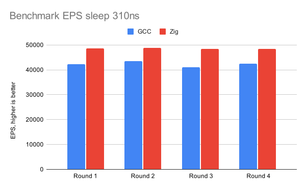
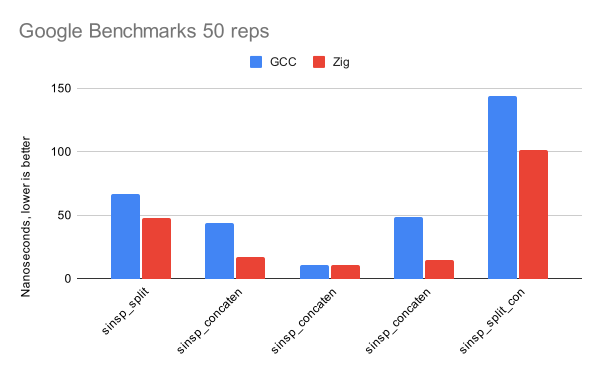

Dear Falco Community, today we are happy to announce the release of Falco 0.40.0!

This version brings several new features, performance improvements, and bug fixes that streamline Falco’s detection capabilities.
During this release cycle, we merged more than 52 PRs on Falco and more than 150 PRs for libs and drivers, version 0.20.0 and version 8.0.0 respectively. Thank you to our maintainers and contributors, as this would not happen without your support and dedication!

To learn all about these changes, read on!

## What’s new? TL;DR

*Key features:*

* [Streamlined Falco docker images](#streamlined-falco-docker-images);
* Falco static build has been reintroduced for `x86_64` binary using `musl`;
* New [process filters](#introducing-new-processs-filters) allow to filter events based on process metadata;
* Added support for `sendmmsg` and `recvmmsg` syscalls parameters;
* [Plugins suggested output fields](#plugins-suggested-output-fields) are now available in the Falco engine;

{}
This release also comes with [breaking changes](#breaking-changes-and-deprecations) that you should be aware of before upgrading.
{}

## Major features and improvements

The 0.40.0 release contains a number of features and UX improvements. Here is a list of some of the key new capabilities.

### Streamlined Falco docker images

In the Falco 0.40.0 release, the Falco team has streamlined the Docker images to improve usability and performance. The new images are designed to be more efficient and easier to use, providing a better experience for users deploying Falco in containerized environments.

Key improvements include:  

* Reduced Image Size: The new images are smaller, which reduces the time required to pull and deploy them.
* Optimized Layers: The layers in the Docker images have been optimized to improve build times and caching efficiency.
* Enhanced Security: The images have been hardened to enhance security, reducing potential vulnerabilities.

These changes make it easier to deploy and manage Falco in various environments.

### Introducing new process filters

A new set of process filters are made available in this release: `proc.pgid, proc.pgid.name, proc.pgid.exe, proc.pgid.exepath, proc.is_pgid_leader`.
These filters enable users to filter events based on process metadata, such as the process name, executable path, and arguments. The new filters
introduce the `pgid` field, which is directly obtained from the kernel. This ID corresponds to the `host pid namespace`, aiding in the creation
of more reliable rules.

### Plugins suggested output fields

The Falco engine now supports plugins that can suggest output fields. This feature allows plugins to provide additional context and information about an event, enhancing its visibility and understanding.
The suggested output fields are displayed in the Falco output, giving users valuable insights into the event and its context. By leveraging this feature, Falco makes it easier for users to take advantage of the metadata provided by plugins and improve their security monitoring and incident response capabilities. New output fields are added only if the option is enabled and the plugin supports this new feature.

Keep an eye on the existing plugins to be updated to support the new feature.

## Breaking changes and deprecations ⚠️
This version comes with breaking changes, mostly in the configuration interface.

### Removed command line options and equivalent configuration options

We removed the already deprecated options  `--cri`, `--disable-cri-async`, and is now possible to achieve the same result through the [Falco configuration](https://falco.org/docs/rules/controlling-rules/#via-falco-configuration-or-parameters).
A new configuration options has been introduced to enable and configure the supported container engines in Falco:
```yaml
container_engines:
  docker:
    enabled: true
  cri:
    enabled: true
    sockets: ["/run/containerd/containerd.sock", "/run/crio/crio.sock", "/run/k3s/containerd/containerd.sock"]
    disable_async: false
  podman:
    enabled: true
  lxc:
    enabled: true
  libvirt_lxc:
    enabled: true
  bpm:
    enabled: true
```
Please keep in mind that the new configuration options are tagged as `incubating` and may change in the future.

You can also use the `-o` command line option:
* `--cri <socket_path>`: use `-o container_engines.cri.enabled=true, -o container_engines.cri.sockets[]=<socket_path, -o container_engines.cri.disable_async=true` instead to enable the CRI runtime and configure the socket path and disable the async mode.

You can find more information on breaking changes in the [tracking issue](https://github.com/falcosecurity/falco/issues/3226).

### New docker images

With the growing prominence of the modern eBPF probe, in Falco `0.38.0` we made the strategic decision to adopt it as the default driver for Falco. This shift brings key advantages to our distribution system by removing the need to bundle the full driver-building toolchain in the standard Falco distribution. As a result, we’re transitioning the default Falco image to a `no-driver/distroless` configuration, simplifying deployments and reducing system complexity. For users seeking alternative setups, a different container image will still be available.

In light of this change, we’ve re-evaluated all Docker images:

| Image Name                     | Tag (aliases)       | Description                                                                                                                                                      |
|---------------------------------|----------------------|------------------------------------------------------------------------------------------------------------------------------------------------------------------|
| `falcosecurity/falco`           | `x.y.z` (`latest`)   | Distroless image without driver building toolchain support, based on the latest released tar.gz of Falco. No tools or `falcoctl` included.                     |
| `falcosecurity/falco`           | `x.y.z-debian` (`latest-debian`) | Debian-based image without driver building toolchain support, based on the latest released Deb of Falco. May include some tools (e.g., `jq`, `curl`), but not `falcoctl`. |
| `falcosecurity/falco-driver-loader` | `x.y.z` (`latest`)  | Based on `falcosecurity/falco:x.y.z-debian`, plus driver building toolchain support and the latest version of `falcoctl`. Recommended only when modern eBPF is unsupported. |
| `falcosecurity/falco-driver-loader` | `x.y.z-buster` (`latest`) | Similar to `falcosecurity/falco-driver-loader`, but based on a legacy Debian image (i.e., `buster`). Recommended only for old kernel versions.                  |


The following images have been deprecated and are not anymore available in the Falco 0.40.0 release:

| Image Name                         | Reason                                                                                  |
|-------------------------------------|-----------------------------------------------------------------------------------------|
| `falcosecurity/falco-distroless`    | Deprecated in favor of `falcosecurity/falco:x.y.z`.                                     |
| `falcosecurity/falco-no-driver`     | Deprecated in favor of `falcosecurity/falco:x.y.z-debian` (essentially the same image with a new name). |


### Deprecations

In Falco 0.40.0, we have deprecated the following options:
* `-S / --snaplen` cli flag has been deprecated in favor of the `falco_libs.snaplen` configuration option;
* `-A` cli flag has been deprecated in favor of the `base_syscalls.all` configuration option;
* `-b` cli flag has been deprecated in favor of the `buffer_format_base64` configuration option;

## Worthy of note

Release artifacts are now built with [zig](https://ziglang.org/), using very recent versions of [clang](https://clang.llvm.org/). This change alone has resulted in up to 10% speedup in userspace benchmarks.

The first graph shows the events processed by userspace per second:



The following one shows the average of multiple runs of [Google Benchmark](https://github.com/google/benchmark) framework embedded in libsinsp:




Additionally, artifacts now use [jemalloc](https://jemalloc.net/) as the allocator library. This should help mitigate some `memory fragmentation-related` issues.

Furthermore, Falco debug symbol files are now attached to GitHub releases. Falco is built in `RelWithDebInfo` mode, enabling users to download debug symbols and attach them to their debugging sessions.


## Try it out

Interested in trying out the new features? Use the resources below to get started.

* [Container Images](/docs/getting-started/running/#docker)
    * `falco` ([DockerHub](https://hub.docker.com/r/falcosecurity/falco), [AWS ECR Gallery](https://gallery.ecr.aws/falcosecurity/falco))
    * `falco-driver-loader` ([DockerHub](https://hub.docker.com/r/falcosecurity/falco-driver-loader), [AWS ECR Gallery](https://gallery.ecr.aws/falcosecurity/falco-driver-loader))
* [CentOS/Amazon Linux](/docs/getting-started/installation/#centos-rhel)
* [Debian/Ubuntu](/docs/getting-started/installation/#debian)
* [openSUSE](/docs/getting-started/installation/#suse)
* [Linux binary package](/docs/getting-started/installation/#linux-binary)

## What’s next?

Falco is more mature with each release. Following its [graduation](/blog/falco-graduation/) we have published the [roadmap](/docs/roadmap/#road-to-falco-1-0-0) for version 1.0.0 which is guiding us in the next steps. For the next release, you can expect more stability, a new container plugin, refinements to our deployment methods with a k8s operator, and as always new detections and fixes.

## Stay connected

Join us on social media and in our weekly community calls! It’s always great to have new members in the community, and we’re looking forward to hearing your feedback and ideas.

You can find all the most up-to-date information at [https://falco.org/community/](https://falco.org/community/).
