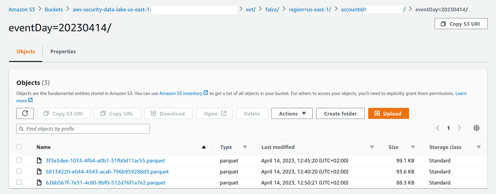

Last November at re:Invent (2022) AWS introduced the new security oriented data lake: [`Amazon Security Lake`](https://aws.amazon.com/fr/blogs/aws/preview-amazon-security-lake-a-purpose-built-customer-owned-data-lake-service/). The AWS team leading the development of the new service contacted the Falco community and proposed a collaboration to develop the first custom source. We greatly accepted and partnered with AWS engineers to prepare a new plugin and service announcement. To support the community with this integration we are introducing best practices for getting started with the AWS Security Lake and Falco plugin.

This blog post describes key concepts around the integration of AWS Security Lake as output for Falco through [Falcosidekick](https://github.com/falcosecurity/falcosidekick) in EKS and how to get started.

- [Concepts](#concepts)
  - [OCSF](#ocsf)
  - [Parquet](#parquet)
- [Register Falco as Custom Source](#register-falco-as-custom-source)
- [Configuration of Falcosidekick](#configuration-of-falcosidekick)
- [Deployment of Falco \& Falcosidekick](#deployment-of-falco--falcosidekick)
- [Results](#results)
  - [Falcosidekick logs](#falcosidekick-logs)
  - [In S3](#in-s3)
- [Conclusion](#conclusion)


## Concepts

### OCSF

Since AWS follows the [Open Cybersecurity Schema Framework (OCSF)](https://github.com/ocsf) for event format, ensure that you have the same standard. This helps to facilitate the extension to a multiple number of sources and consumers. For Falco events, as they may match to several use cases, they can be extended to additional sources by leveraging [plugins](https://falco.org/docs/plugins/). The recommended schema to use is: [Security Finding](https://schema.ocsf.io/classes/security_finding). Falcosidekick will be in charge of converting the Falco events into a JSON payload with the following [schema](https://schema.ocsf.io/api/classes/security_finding). 

### Parquet

AWS Security Lake requires to group events in [`parquet`](https://parquet.apache.org/) files format, this best practices optimizes for analysis and treatments. Once again, Falcosidekick will receive these events from Falco, group them into a parquet file and upload them to your S3 bucket, running continuously every 5 minutes (it's a requirement from AWS Security Lake, for better analysis, it requires a minimum of 5 minutes between two files).

## Register Falco as Custom Source

For custom sources, Amazon Security Lake is responsible for provisioning the S3 bucket location, creating the Lake Formation table associated with that location, creating a role in the customer’s account that will be used to write the custom source data, setting up a Glue crawler to maintain partition metadata, and coordinating subscriber access to the source after it is written to Amazon Security Lake. 

Please follow [the official documentation](https://docs.aws.amazon.com/security-lake/latest/userguide/custom-sources.html) to register Falco as a custom source.

The OCSF Event class to use is `Security Finding` and we'll name our custom source `falco`


You should now have the name of the `bucket`, the `prefix` and the `role` to use in the configuration.

For the bucket, the pattern will be `s3://aws-security-data-lake-{region}-xxxx/ext/falco` with:
* `bucket`: `aws-security-data-lake-{region}-xxxx`
* `prefix`: `ext/falco/`

For the role, 2 roles have been created:
- `arn:aws:iam::{accountID}:role/service-role/AmazonSecurityLakeCustomDataGlueCrawler-falco`
- `arn:aws:iam::{accountID}:role/service-role/AmazonSecurityLake-Provider-falco-{region}`

We will use the role `arn:aws:iam::{accountID}:role/service-role/AmazonSecurityLake-Provider-falco-{region}` as [IRSA](https://docs.aws.amazon.com/eks/latest/userguide/iam-roles-for-service-accounts.html).

Update its `Trust relationships` as follow (adapt the values to your env) to allow your deployment of Falcosidekick to use it. 

```json
{
    "Version": "2012-10-17",
    "Statement": [
        {
            "Sid": "1",
            "Effect": "Allow",
            "Principal": {
                "AWS": "arn:aws:iam::{accountID}:root"
            },
            "Action": "sts:AssumeRole"
        },
        {
            "Effect": "Allow",
            "Principal": {
                "Federated": "arn:aws:iam::{accountID}:oidc-provider/oidc.eks.{region}.amazonaws.com/id/xxxx"
            },
            "Action": "sts:AssumeRoleWithWebIdentity",
            "Condition": {
                "StringEquals": {
                    "oidc.eks.{region}.amazonaws.com/id/xxxx:sub": "system:serviceaccount:falco:falco",
                    "oidc.eks.{region}.amazonaws.com/id/xxxx:aud": "sts.amazonaws.com"
                }
            }
        }
    ]
}
```

For the OIDC details, replace the `xxxx` by the result of the command:
```
aws eks describe-cluster --name {cluster-name} --query "cluster.identity.oidc.issuer" --output text | cut -d '/' -f 5
```

> Note: for that, you must have created an OIDC prodiver your cluster. See the [docs](https://docs.aws.amazon.com/eks/latest/userguide/enable-iam-roles-for-service-accounts.html).

## Configuration of Falcosidekick

Since you made it this far it means that you have everything ready on AWS' side, now it's time to configure Falco and Falcosidekick. The easiest way to get started is by using the official [Helm chart](https://github.com/falcosecurity/charts/tree/master/charts/falco).

To configure Falcosidekick at minimum use this `values.yaml` with all the necessary values to complete the configuration, see [here](https://github.com/falcosecurity/charts/blob/master/charts/falcosidekick/values.yaml):

```yaml
falcosidekick:
  enabled: true
  aws:
    rolearn: "arn:aws:iam::{accountID}:role/service-role/AmazonSecurityLake-Provider-falco-{region}"
    checkidentity: false
    securitylake:
      bucket: "aws-security-data-lake-{region}-xxxx"
      prefix: "ext/falco"
      region: "{region}"
      accountid: "{accountID}"
      interval: 5
      batchsize: 1000
```

Details to note about the settings:
- `rolearn`: the `ARN` of the role created by AWS Security Lake at the Custom Source registration, see above.
- `checkidentity`: must be set to `false` because the role created by AWS Security Lake doesn't allow to call `sts:GetCallerIdentity`
- `securitylake.bucket`: the bucket name returned by AWS Security Lake at Custom source registration (mandatory to enable the output)
- `securitylake.prefix`: the prefix returned by AWS Security Lake at Custom source registration (mandatory to enable the output)
- `securitylake.region`: the region of the events, as a single bucket can store events from different regions (mandatory)
- `securitylake.accountId`: the accountId of the account where the events have been created, as a single bucket can store events from different accounts (mandatory)
- `securitylake.interval`: time in minutes between 2 PUTs of parquet files into S3 to follow the service's requirements
- `securitylake.batchsize`: max number of events by parquet file, to avoid to reach max allowed size

## Deployment of Falco & Falcosidekick

These classic Helm commands will deploy everything for you:

```shell
helm repo add falcosecurity https://falcosecurity.github.io/charts
helm repo update
helm install falco -n falco -f values.yaml --create-namespace
```

The Falco and Falcosidekick configurations are almost ready, the next step is getting the following logs into the Falcosidekick pods:

```
2023/03/13 13:03:06 [INFO]  : Enabled Outputs : [AWSSecurityLake]
2023/03/13 13:03:06 [INFO]  : Falco Sidekick is up and listening on :2801
```

Falcosidekick is ready to receive events and upload them into Amazon Security Lake!

## Results

### Falcosidekick logs

When Falco triggers any rules, Falcosidekick will receive and queue them every 5 minutes, then it will create a parquet file and load them into the S3 bucket:
```
2023/03/13 13:28:18 [INFO]  : AWS SecurityLake. - Event queued (bcc55fc3-c0ab-434f-9921-d76f232ce0aa)
2023/03/13 13:28:37 [INFO]  : AWS SecurityLake. - Event queued (26a482e8-7282-4bee-bd7f-7491112b7568)
2023/03/13 13:29:06 [INFO]  : AWS SecurityLake. - Event queued (13e59c53-e1a4-4876-ba5e-a77de9d07e3c)
2023/03/13 13:29:16 [INFO]  : AWS SecurityLake. - Event queued (0bb6fef3-1ac4-4cc8-a12f-e60250ad48ff)
2023/03/13 13:29:41 [INFO]  : AWS SecurityLake. - Event queued (6c92eeef-98d5-4064-8a91-55bf675532a1)
2023/03/13 13:30:06 [INFO]  : AWS SecurityLake. - Event queued (e1cc973f-6153-45a7-813a-a8793f146144)
2023/03/13 13:30:20 [INFO]  : AWS SecurityLake. - Event queued (d28cf6c9-3503-448f-a3c4-6e132743af5e)
2023/03/13 13:30:30 [INFO]  : AWS SecurityLake. - Event queued (af9aa6c1-c75c-453e-ae1d-947c6b6735c6)
2023/03/13 13:30:56 [INFO]  : AWS SecurityLake. - Event queued (b51449f4-bb2d-4ce4-afd8-397bf28b3345)
2023/03/13 13:31:17 [INFO]  : AWS SecurityLake. - Event queued (8a51e8f2-9b78-4aa1-a9e6-55f304c6bea6)
2023/03/13 13:31:37 [INFO]  : AWS SecurityLake. - Event queued (38985e4a-be74-4033-b807-724caac55f7b)
2023/03/13 13:31:41 [INFO]  : AWS SecurityLake. - Event queued (ad8e0bc7-e0c2-4583-9c10-561786268355)
2023/03/13 13:31:42 [INFO]  : AWS SecurityLake. - Event queued (72a002f0-9460-4fe9-af6a-d05f35d65707)
2023/03/13 13:32:00 [INFO]  : AWS SecurityLake. - Event queued (4986a846-c086-4d06-8b10-eec31132a465)
2023/03/13 13:32:28 [INFO]  : AWS SecurityLake. - Event queued (1000b0fe-76d2-4eba-b7cc-84e1bf0f8a53)
2023/03/13 13:32:50 [INFO]  : AWS SecurityLake. - Event queued (ec9c4cd3-d705-4bd4-bb51-4a7cb4ee4b4c)
2023/03/13 13:33:15 [INFO]  : AWS SecurityLake. - Upload parquet file d6b40894-f53c-46b3-9f85-67a7fbbdd56b.parquet OK (16 events)
```

### In S3

If you take a look at your S3 console now, you'll see the resulting parquet files, correctly ordered by region, account id and day in your AWS Security Lake bucket:



## Conclusion

We hope this step by step blog helps the AWS & Falco community get easily started using this integration. We would like to thank the AWS team for partnering with Falco and the invitation to participate in the AWS Security Lake project launch. It has been a great partnership since the beginning, we are also so appreciative of the contributions and support during the development of the integration in Falcosidekick. The goal of the post is help you get all of your configurations ready to enable the transfer of Falco events into AWS Security Lake. If you have any issues or requests, please join us on [Slack](https://kubernetes.slack.com/?redir=%2Farchives%2FCMWH3EH32).

---
Per usual, if you have any feedback or need help, you can find us at any of the following locations.

* Get started in [Falco.org](http://falco.org/)
* Check out the [Falcosidekick project on GitHub](https://github.com/falcosecurity/falcosidekick).
* Get involved in the [Falco community](https://falco.org/community/).
* Meet the maintainers on the [Falco Slack](https://kubernetes.slack.com/?redir=%2Farchives%2FCMWH3EH32).
* Follow [@falco_org on Twitter](https://twitter.com/falco_org).
