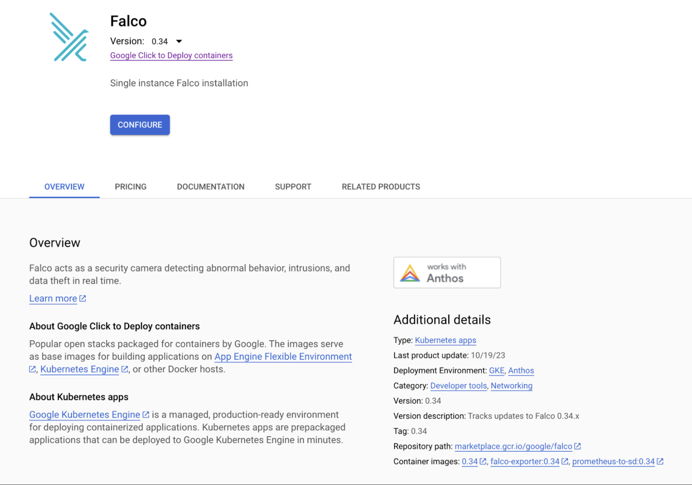
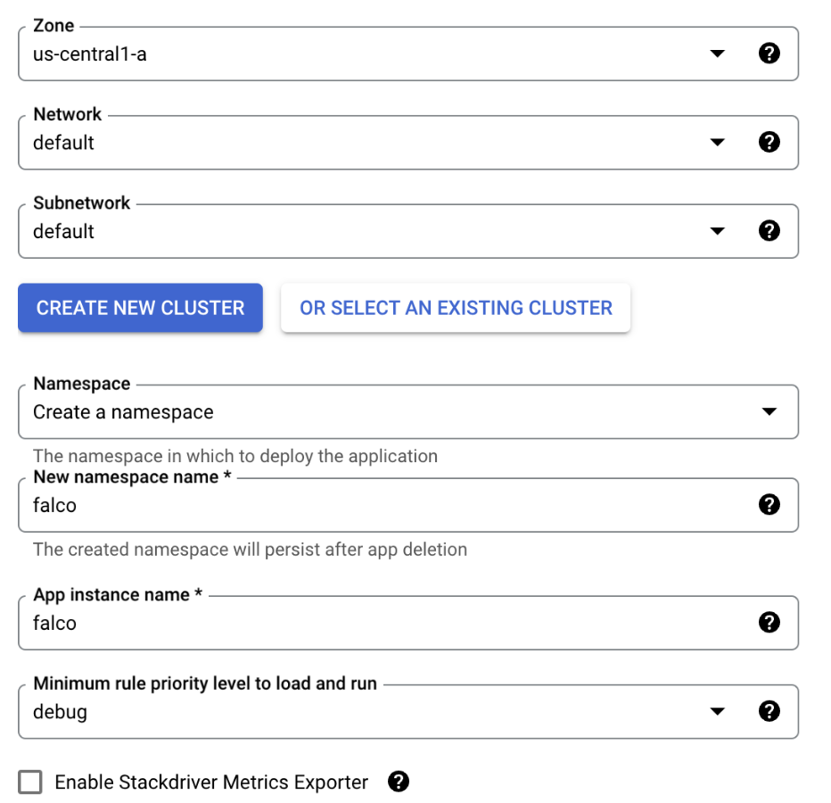

One of the big advantages of running your workloads on a managed Kubernetes service like Google Kubernetes Engine (GKE) is that Google ensures your clusters are being deployed and managed following industry best practices. 

While GKE clusters are incredibly secure and reliable, there is always room for improvement. 

In this blog, we’re going to describe how you can enhance GKE’s already great security by adding runtime threat detection with Falco. 


## What is Falco?

Falco is a Cloud Native Computing Foundation project that provides runtime threat detection. Out of the box, Falco examines syscalls to alert you to any suspicious activity. And, since containers share the same kernel as their host, Falco can monitor not only activity on the host but also activity on all of the containers running on that host. Moreover, Falco pulls data from both Kubernetes and the container runtime to add additional context to its alerts. 

With Falco running on your GKE clusters you can be notified of a wide variety of events, such as: 

* Did someone start a container with high privileges?
* Has someone shelled into a running container?
* Has an executable been added to the container after it was deployed?

These are just a few examples. Falco has over 80 rules that can be used to make you aware of not only external threats but also when clusters aren’t being operated in accordance with industry best practices. 


## GKE Installation considerations

There are two different ways to install Falco on GKE. The first is using the prepackaged click-to-run offering in the Google Cloud Marketplace. The second is using Falco’s helm chart. The click-to-run offering is probably the simplest way to get up and running with Falco on GKE, but the drawback is that the version offered often lags behind the latest release. 

It’s also important to note that as of this writing, you cannot run Falco on GKE clusters running in Autopilot mode. This is primarily because Falco uses an init container running with privileged access to install its driver, and Autopilot does not allow the execution of privileged containers. 

Something else to be aware of is that Falco on GKE needs to use one of Falco’s eBPF drivers. Falco uses a driver to capture syscall events, and this driver is offered as a loadable kernel module or as an eBPF probe. There are actually two eBPF probes with Falco. One is called ‘eBPF’ (or classic eBPF) and the other is referred to as  ‘modern eBPF’ - you can learn more about them in the [Falco docs](https://falco.org/docs/event-sources/kernel/).

On the Google Cloud side, GKE uses Container-Optimized OS (COS) as the default operating system for its worker node pools. COS is a security-enhanced operating system that limits access to certain parts of the underlying OS. Because of this security constraint, Falco cannot insert its kernel module to process system calls. However, COS does support eBPF, so that’s the option we’ll use (more specifically we’ll use the classic eBPF probe)


## Installing Falco via the Google Cloud Marketplace

Note: If you’d like to follow along, you’ll need to ensure your Google Cloud account has the appropriate permissions. 

Installing Falco via the Google Cloud Marketplace is a pretty straightforward process. 


* Log into your Google Cloud account, and ensure you have the required permissions to deploy a new GKE cluster or operate an existing one.

* Navigate to the Falco offering in the [Google Cloud Marketplace](https://console.cloud.google.com/marketplace/product/google/falco).

    


* Click the **configure** button. 

* From the next dialog you can choose the zone where your GKE cluster will run as well as the network and subnet on which it will run. For this walkthrough, the default values are fine. 

* You then choose whether or not you’d like to deploy Falco onto a new GKE cluster or use an existing one. Be aware that if you click **Create New Cluster,** Google Cloud will immediately start deploying a new cluster. Also, any Autopilot clusters that you have in your project will be grayed out and cannot be selected.  

* You can then choose which namespace Falco will run in. To keep things consistent with the rest of this blog, change it from default to `falco`. 

* Again, to keep things consistent with the rest of the blog, change the app instance name to `falco`. 

* Falco rules have different priority levels, you can choose the minimum priority level you’d like to run. The priority levels are ordered by severity, and typically the higher you make the minimum level, the fewer alerts you will receive (which helps to cut down on noise). For this example just leave it as `debug`.

* Stackdriver is the old name for Google Cloud’s logging and monitoring suite. If you’d like to examine Falco’s metrics (not the actual alerts, but metrics on how Falco is performing) you can select that option. We won’t be covering that in this blog, so go ahead and leave it unchecked. 


    

* Click `DEPLOY` to deploy Falco onto the target cluster. (If you choose to deploy a new cluster, you will need to wait until that finishes to click the `DEPLOY` button.)

With that, Falco should be running on your GKE cluster. You can skip the next section, and continue with “Testing Falco”.

## Installing Falco with Helm

Helm is the defacto way to install Falco on Kubernetes. Falco maintains an official Helm chart, and that chart is maintained as part of the overall Falco project. 

If you’d like to follow along, you will need the following:

* A Google Cloud account with appropriate permissions

* A GKE cluster that you can operate 

* Helm and kubectl installed on your local computer or, alternatively, you can use Google Cloud Shell which has both Helm and kubectl already installed. 

    > **NOTE:** Ensure that your kubectl context is set to the cluster on which you wish to install Falco. 

With the pre-requisites out of the way, let's get started with the actual install. 

* Add the Falco chart to the Helm repository.

    ```
    helm repo add falcosecurity \
    https://falcosecurity.github.io/charts && \
    helm repo update
    ```

* Create a namespace (`falco```) for Falco to run in. 

    ```
    kubectl create namespace falco
    ```

* Use Helm to deploy Falco. Notice that we use the `driver.kind `parameter to set the kernel driver to the eBPF probe. 

    ```
    helm install falco \
    -n falco \
    --set tty=true \
    --set driver.kind=ebpf \
    falcosecurity/falco 
    ```


* Wait for the Falco pods to come online.

    ```
    kubectl get pods -n falco -w
    ```

    Eventually you should see something similar to this:

    ```
    falco-wfglg   2/2     Running           0          76s
    falco-mdrlb   2/2     Running           0          91s
    falco-7vxz6   2/2     Running           0          91s
    ```

    Note: You will see one Falco entry for each of the nodes in your cluster. In this case, Falco is running on a 3-node cluster, so there are 3 entries. 


* Verify Falco is running correctly by examining the logs.


    ```
    kubectl logs -n falco -c falco -l app.kubernetes.io/name=falco
    ```
    
    You should see entries similar to this:

    ```
    Fri Nov  3 15:48:07 2023: Falco version: 0.36.2 (x86_64)
    Fri Nov  3 15:48:07 2023: Falco initialized with configuration file: /etc/falco/falco.yaml
    Fri Nov  3 15:48:07 2023: Loading rules from file /etc/falco/falco_rules.yaml
    Fri Nov  3 15:48:07 2023: The chosen syscall buffer dimension is: 8388608 bytes (8 MBs)
    Fri Nov  3 15:48:07 2023: Starting health webserver with threadiness 2, listening on port 8765
    Fri Nov  3 15:48:07 2023: Loaded event sources: syscall
    Fri Nov  3 15:48:07 2023: Enabled event sources: syscall
    Fri Nov  3 15:48:07 2023: Opening 'syscall' source with BPF probe. BPF probe path: /root/.falco/falco-bpf.o
    ```

Falco is now successfully running on your GKE cluster. The next step is to simulate some suspicious activity and verify that Falco detects it. 

## Testing Falco

One of Falco’s default rules fires an alert if someone shells into a running container. Follow the steps below to fire off that rule. 

* Start an Alpine container and have it sleep so it stays running. 
 
    ```
    kubectl run alpine –image alpine – sh -c "sleep infinity"
    ```

* Execute a shell on the Alpine running container.  

    ```
    kubectl exec -it alpine -- sh -c "ls -al"
    ``` 

* Now check the Falco logs to see the alert. 

    ```
    kubectl logs -c falco -n falco -l app.kubernetes.io/name=falco |\
    grep "Notice"
    ```

    You should see something like this:

    ```
    18:52:06.630209324: Notice A shell was spawned in a container with an attached terminal (evt_type=execve user=root user_uid=0 user_loginuid=-1 process=sh proc_exepath=/bin/busybox parent=runc command=sh -c ls -al terminal=34816 exe_flags=EXE_WRITABLE container_id=e71eac85a570 container_image=docker.io/library/alpine container_image_tag=latest container_name=alpine k8s_ns=default k8s_pod_name=alpine)
    ``` 
 
    Notice all the details the alert provides including the container ID, image, and name, as well as the executed command. 

## Conclusion

As mentioned at the outset, one of the big advantages of running a managed Kubernetes service is that a lot of the heavy lifting for hardening the cluster has been done for you. However, by using Falco to provide runtime insights into the activity on your cluster you can help ensure that the cluster is being operated responsibly or has not been compromised by any bad actors. 

If you’d like to learn more about Falco, head on over to[ the docs ](https://falco.org/docs)or our [GitHub repository](https://github.com/falcosecurity). We also have our own channel (#Falco) on the [Kubernetes Slack](https://kubernetes.slack.com) server. 
