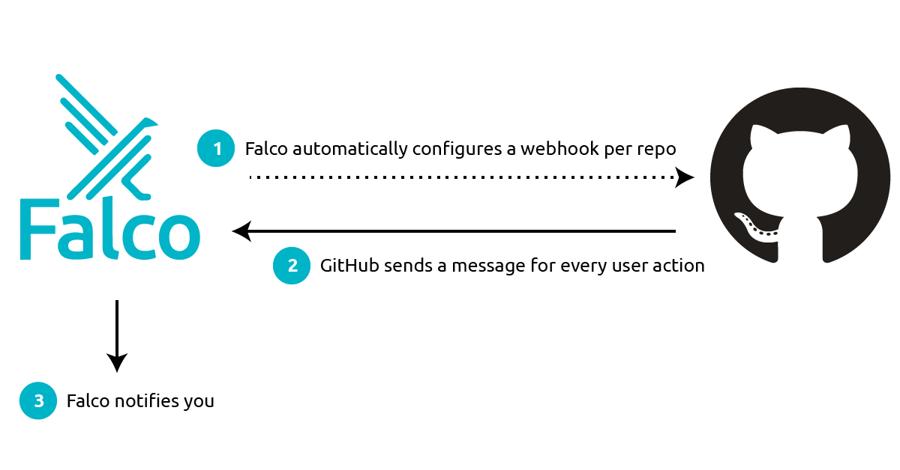

If you are reading this, your source code is likely your most important asset: not only it is at the base of the applications that power your business, but if you operate in the cloud, it’s also likely how you define and control your infrastructure. And, quite probably, your code is stored in one or more git repositories, hosted on GitHub.

As the home of such important assets, GitHub repositories should be at the top of your list of security priorities. However, based on my experience, many people fail to put in place even basic measures to protect source code repositories. This blog looks at three important threats to GitHub repos. You will learn what they are and how you can reliably detect them, as they happen, using the Falco open source security tool.


## The three Biggest GitHub security risks

### 1. Pushing secrets into repos

If there was a competition for the worst thing that can happen to your team on GitHub, pushing secrets into repos would win first prize. No matter how disciplined one is with this, secrets (passwords, tokens, API keys, etc.) always find a way into repositories. 

Case in point, I searched GitHub for “remove secret”. Among the results were 451K commits; the ones on top at the time of writing this article included examples like [this one](https://github.com/natir/pycam_bot/commit/a32f2c5ed1b8b4ff554e8284a42728fefcd76e9c) or [this one](https://github.com/yuriifreire/mini-twitter/commit/af7189674d090950aa9e0e32db9dbb48ad852219). There are even research papers on [how bad the phenomenon is](https://www.ndss-symposium.org/wp-content/uploads/2019/02/ndss2019_04B-3_Meli_paper.pdf)!

Leaking secrets is of course a big deal when the repository is public, since hackers actively scan GitHub, hunting for any type of secrets that they can immediately take advantage of. However, secrets in private repositories are a major security threat as well, as they can be exploited for privilege escalation and lateral movement. 

Protecting from secret leaks is not trivial for many reasons, such as:

* in any team of non-negligible size, it is hard to control how each single member accesses git and what she commits. Even super useful tools like [AWS’s git-secrets](https://github.com/awslabs/git-secrets) need to be installed on every client to be effective.
* data cannot completely be deleted from git, so removed secrets still appear in the repository’s history.

This is why, despite the problem being well known, countless high-profile data breaches happened over the years because of secret leaks, including [a very recent one at Toyota](https://blog.gitguardian.com/toyota-accidently-exposed-a-secret-key-publicly-on-github-for-five-years/).


### 2. Crypto mining through GitHub Actions

GitHub Actions offer the ability to run arbitrary code in response to selected GitHub events (for example, merging a PR). They are a great way to extend code repositories with automation and integrations. GitHub Actions are executed by a computing pool provided by GitHub/Microsoft. Only problem: such a computing pool is also a juicy target for the bad guys trying to make a quick buck by mining bitcoin. [This recent analysis](https://www.trendmicro.com/en_us/research/22/g/unpacking-cloud-based-cryptocurrency-miners-that-abuse-github-ac.html) by TrendMicro offers a good overview of the techniques used by attackers to deploy miners through GitHub Actions.

You might think that mining is mostly a problem for GitHub. They own preventing the bad guys from creating a huge number of repositories and abusing resources. However, this can quickly become your problem. For example, when someone uses a malicious action, importing it from an external source or the GitHub Marketplace. Note how malicious actors have been shown to inject mining actions into repositories by simply opening a PR. As shown [here](https://www.bleepingcomputer.com/news/security/github-actions-being-actively-abused-to-mine-cryptocurrency-on-github-servers/), in some cases the PR doesn’t even need to be approved for the action to run.

Running an action, according to the [github pricing calculator](https://github.com/pricing/calculator), can cost you more than $300 per day, so a breach of this type can quickly cause your bill to explode.


### 3. Mistakenly publishing a private repository

Ahh, that feeling when you just realized that one of your team members has published the wrong repository (maybe one that includes your secrets!) and, by the time you find out, [somebody has already forked it](https://stackoverflow.com/questions/46868562/somene-got-access-to-my-sensitive-information-accidentally-published-on-github). I actually experienced that feeling once and, let me tell you, it’s very much not something I enjoyed.

Yes, GitHub gives you a warning and requires you to type the name of the repo. And yes, despite that, this still happens.


## Detecting these three threats (and more!) using Falco

The three scenarios described above have one thing in common: they need to be detected quickly, very quickly, because the damage they cause grows exponentially with time. Fortunately, Falco can help! Falco is well known for its system calls-based runtime detection capabilities, and for its rich containers and Kubernetes support. Now, with the recently released [GitHub plugin](https://github.com/falcosecurity/plugins/tree/master/plugins/github), Falco turns into a great tool to protect your code repositories. Falco was designed to work in real time, so it allows you to detect threats very quickly and respond accordingly.


### How it works

Integrating Falco with GitHub is pretty straightforward, following the steps in the diagram below: 



Falco is given a GitHub token. It uses the token to set up a webhook for each of the repositories that you specify. It then listens to every message sent by GitHub on those webhooks, filters and interprets the message’s data, and sends you meaningful alerts when something bad happens, in a matter of seconds. You can route these alerts [to your favorite notification channels](https://github.com/falcosecurity/falcosidekick) (email, Slack, a SIEM tool), or you can leverage them [in a response engine](https://falco.org/blog/falcosidekick-response-engine-part-1-kubeless/) to automatically remediate the issue. 

Note Falco operates in true streaming fashion: it doesn’t copy, store or index any data. This makes it inexpensive, easy to run, and super responsive. 


### Unpacking Falco’s GitHub rules

Falco’s currently available GitHub rules can be found [here](https://github.com/falcosecurity/plugins/blob/master/plugins/github/rules/github.yaml). Here are, for example, the rules that detect the execution of an action with crypto miners:


```yaml
- rule: Github action with miners
  desc: a github action containing crypto miners was executed
  condition: > 
    github.type=workflow_run and github.workflow.has_miners=true
  output: > 
    a github action containing crypto miners was executed
    (repository=%github.repo repo_owner=%github.owner org=%github.org
    user=%github.user file=%github.workflow.filename)
  priority: CRITICAL
  source: github
```


Note how the `condition` field filters for webhook messages of type `workflow_run` that point to the execution of miners. `Github.workflow.has_miners` is where the magic happens. It fetches the workflow’s definition file and scans it line by line, looking for patterns that identify the execution of one of the well known miner binaries.

For reference, here are the rules that detect the other two classes of threats described in this blog post: 


```yaml
- rule: Secret pushed into a public repository
  desc: A secret (AWS keys, github token...) was committed into a public repository
  condition: >
    github.type=push 
    and github.diff.has_secrets = true 
    and github.repo.public=true
  output: > 
    One or more secrets were pushed into a private repository 
    (repository=%github.repo repo_owner=%github.owner org=%github.org 
    user=%github.user secret_types=%github.diff.committed_secrets.desc 
    file=%github.diff.committed_secrets.files 
    line=%github.diff.committed_secrets.lines 
    url=%github.diff.committed_secrets.links) 
  priority: CRITICAL
  source: github
- rule: Private Repository Becoming Public
  desc: Detect changing the visibility of a repository to public
  condition: > 
   github.type=repository and github.action=publicized
  output: > 
    A repository went from private to public 
    (repository=%github.repo repo_owner=%github.owner 
    org=%github.org user=%github.user) 
  priority: CRITICAL
  source: github
```

When the condition in one of the rules is met, Falco will send you a message formatted as specified by the `output` field, which includes a bunch of useful contexts. As you can see, these rules are very simple, which means it’s easy for you to customize them, or create new ones that fit your specific needs.  

## Where can you get started?

Instructions to get you up and running can be found in Falco’s [plugins repository](https://github.com/falcosecurity/plugins/tree/master/plugins/github). The same page documents the list of fields you can use to create your own rules. If it all goes well, it will only take a few minutes for your repos to be protected, and for you to sleep well again!

As usual, if you have any feedback or need help, you can find us at any of the following locations.

* Get started in [Falco.org](http://falco.org/)
* Check out the [Falco project on GitHub](https://github.com/falcosecurity/falco).
* Get involved in the [Falco community](https://falco.org/community/).
* Meet the maintainers on the [Falco Slack](https://kubernetes.slack.com/?redir=%2Farchives%2FCMWH3EH32).
* Follow [@falco_org on Twitter](https://twitter.com/falco_org).

