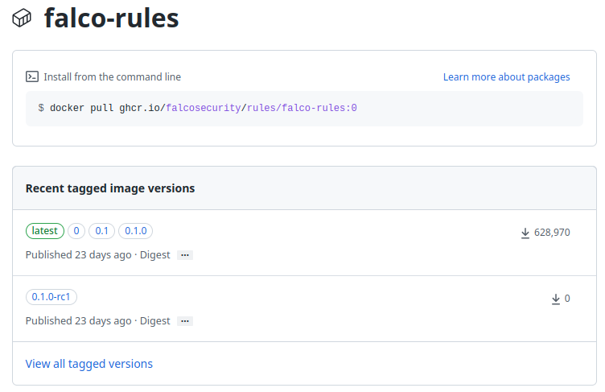

Since the launch of the plugin framework in January 2022, our adopters have requested an out-of-the-box solution to manage the lifecycle of rules (installation, updates). We heard your request and also created a guide to help you smoothly install the [plugins](https://falco.org/docs/plugins/).
The Falco maintainers proposed the following solution to help with these issues: [`falcoctl`](https://github.com/falcosecurity/falcoctl). Falcoctl is a CLI tool that performs several useful tasks for Falco.

This blog post describes key concepts around `falcoctl` to help you get started.

- [Glossary](#glossary)
- [Use falcoctl locally](#use-falcoctl-locally)
  - [Installation](#installation)
  - [Index](#index)
  - [Configuration](#configuration)
  - [Search for artifacts](#search-for-artifacts)
  - [Installation of artifacts](#installation-of-artifacts)
    - [Installation of Rules](#installation-of-rules)
    - [Installation of Plugins](#installation-of-plugins)
    - [Follow artifacts](#follow-artifacts)
      - [Systemd service](#systemd-service)
- [Use falcoctl in Kubernetes with Helm](#use-falcoctl-in-kubernetes-with-helm)
  - [Add the official Helm repo](#add-the-official-helm-repo)
  - [Configure the installation and followed by the artifacts](#configure-the-installation-and-followed-by-the-artifacts)
- [Disable falcoctl in the chart](#disable-falcoctl-in-the-chart)
- [Conclusion](#conclusion)

## Glossary

Before diving into all the details, here's a glossary of the key words to understand how `falcoctl` works. An exhaustive list can be found in the [README](https://github.com/falcosecurity/falcoctl/blob/main/README.md).

- `Artifact`: An artifact is an element `falcoctl` can manipulate, right now, only `rulesfiles` and `plugins` are considered.
- `Index`: A .yaml file containing a list of available artifacts with their registries and repositories. The tool's default configuration contains an index file pointing to the officially supported artifacts from the `falcosecurity` organization, see [here](https://github.com/falcosecurity/falcoctl/tree/gh-pages). Users can also maintain their own index files, pointing to registries and repositories containing custom rulesfiles and plugins.
- `Registry`: A registry stores the artifacts, that `falcoctl` understands in regards to the [OCI standard](https://opencontainers.org/), any compliant OCI can be used. The official registry uses [Github Packages](https://github.com/orgs/falcosecurity/packages).
- `Repository`: similar to containers, it belongs to a registry and contains one or more versions (tags) of an artifact.

## Use falcoctl locally

The following steps explain the basic concepts used to install `falcoctl` locally.

### Installation

For a Linux amd64 system:
```shell
LATEST=$(curl -sI https://github.com/falcosecurity/falcoctl/releases/latest | awk '/location: /{gsub("\r","",$2);split($2,v,"/");print substr(v[8],2)}')
curl --fail -LS "https://github.com/falcosecurity/falcoctl/releases/download/v${LATEST}/falcoctl_${LATEST}_linux_amd64.tar.gz" | tar -xz falcoctl
sudo install -o root -g root -m 0755 falcoctl /usr/local/bin/falcoctl
```

> Other environments are described in the [README](https://github.com/falcosecurity/falcoctl#install-falcoctl-manually)

Now you are able to confirm that the installation went well.
Check the version:
```shell
❯ falcoctl version

Client Version: 0.4.0
```
Print the help:
```shell
❯ falcoctl --help

     __       _                _   _
    / _| __ _| | ___ ___   ___| |_| |
   | |_ / _  | |/ __/ _ \ / __| __| |
   |  _| (_| | | (_| (_) | (__| |_| |
   |_|  \__,_|_|\___\___/ \___|\__|_|
									
	
The official CLI tool for working with Falco and its ecosystem components.

Usage:
  falcoctl [command]

Available Commands:
  artifact    Interact with Falco artifacts
  completion  Generate the autocompletion script for the specified shell
  help        Help with any command
  index       Interact with index
  registry    Interact with OCI registries
  tls         Generate and install TLS material for Falco
  version     Print the falcoctl version information

Flags:
      --config string     config file to be used for falcoctl (default "/etc/falcoctl/falcoctl.yaml")
      --disable-styling   Disable output styling such as spinners, progress bars and colors. Styling is automatically disabled if not attached to a tty (default false)
  -h, --help              help for falcoctl
  -v, --verbose           Enable verbose logs (default false)

Use "falcoctl [command] --help" for more information about a command.

```

### Index

Before being able to download and install artifacts, we need to configure an index, we provide one for all [official artifacts](https://falcosecurity.github.io/falcoctl/index.yaml), plugins and rules:  

```shell
sudo falcoctl index add falcosecurity https://falcosecurity.github.io/falcoctl/index.yaml
```

To confirm the installation:
```
❯ sudo falcoctl index list

NAME            URL                                                     ADDED                   UPDATED
falcosecurity   https://falcosecurity.github.io/falcoctl/index.yaml     2023-02-14 14:57:33     2023-02-14 15:48:43
```

The index is not automatically updated, when a new artifact is added to the list, you can refresh your local cache with:
```shell
sudo falcoctl index update falcosecurity
```

### Configuration

The default configuration of `falcoctl` is `/etc/falcoctl/falcoctl.yaml`, as it can store secrets, like credentials to private registries, the file is protected by default.

```shell
❯ sudo cat /etc/falcoctl/falcoctl.yaml

indexes:
- name: falcosecurity
  url: https://falcosecurity.github.io/falcoctl/index.yaml
```

> To know more about available settings, see the official [docs](https://github.com/falcosecurity/falcoctl/blob/gh-pages/index.yaml).

### Search for artifacts

Everything is set up and ready. We can search for new artifacts:
```shell
❯ sudo falcoctl artifact search falco

INDEX        	ARTIFACT   	TYPE     	REGISTRY	REPOSITORY
falcosecurity	falco-rules	rulesfile	ghcr.io 	falcosecurity/rules/falco-rules
```

```shell
❯ sudo falcoctl artifact search kubernetes

INDEX           ARTIFACT        TYPE            REGISTRY        REPOSITORY
falcosecurity   k8saudit        plugin          ghcr.io         falcosecurity/plugins/plugin/k8saudit
falcosecurity   k8saudit-rules  rulesfile       ghcr.io         falcosecurity/plugins/ruleset/k8saudit
```

> Note the `TYPE` column to determine the kind of artifact.

The search is made through names and keywords as we can find them in the `index.yaml`:
```yaml
- name: k8saudit
  type: plugin
  registry: ghcr.io
  repository: falcosecurity/plugins/plugin/k8saudit
  description: Read Kubernetes Audit Events and monitor Kubernetes Clusters
  home: https://github.com/falcosecurity/plugins/tree/master/plugins/k8saudit
  keywords:
    - audit
    - audit-log
    - audit-events
    - kubernetes
  license: Apache-2.0
  maintainers:
    - email: cncf-falco-dev@lists.cncf.io
      name: The Falco Authors
  sources:
    - https://github.com/falcosecurity/plugins/tree/master/plugins/k8saudit
```

### Installation of artifacts

#### Installation of Rules

It's time to install our first artifact, the beloved [falco default rules](https://github.com/falcosecurity/rules/blob/main/rules/falco_rules.yaml).

```shell
❯ sudo falcoctl artifact install falco-rules

 INFO  Reading all configured index files from "/root/.config/falcoctl/indexes.yaml"
 INFO  Resolving dependencies ...
 INFO  Installing the following artifacts: [ghcr.io/falcosecurity/rules/falco-rules:latest]
 INFO  Preparing to pull "ghcr.io/falcosecurity/rules/falco-rules:latest"
 INFO  Pulling ad24f8acf278: ############################################# 100%
 INFO  Pulling 0d3705a4650f: ############################################# 100%
 INFO  Pulling 0957c1ef3fe4: ############################################# 100%
 INFO  Artifact successfully installed in "/etc/falco"
```

By default, the `latest` version is used, but you can specify a targeted tag `sudo falcoctl artifact install falco-rules:0.5.0`.

All official artifacts come with floating tags, for example:
- `0` for the last `0.x.x`
- `0.5` for the last `0.5.x`
- etc

You can find the available versions (tags) with:
```shell
❯ sudo falcoctl artifact info falco-rules
REF                                    	TAGS  
ghcr.io/falcosecurity/rules/falco-rules	0.0.0 0.1.0-rc1 0.1.0 0.1.0 latest
```

You can also directly check in Github: https://github.com/falcosecurity/rules/pkgs/container/rules%2Ffalco-rules


When you install a ruleset requiring specific plugins, the relative plugins are also installed!
```shell
❯ sudo falcoctl artifact install k8saudit-rules:0.5

 INFO  Reading all configured index files from "/root/.config/falcoctl/indexes.yaml"
 INFO  Resolving dependencies ...
 INFO  Installing the following artifacts: [ghcr.io/falcosecurity/plugins/ruleset/k8saudit:0.5 json:0.6.0 k8saudit:0.5.0]
 INFO  Preparing to pull "ghcr.io/falcosecurity/plugins/ruleset/k8saudit:0.5"
 INFO  Pulling cb5233c876c3: ############################################# 100%
 INFO  Pulling 4383c69ba0ad: ############################################# 100%
 INFO  Pulling 2c6ca9f7dac5: ############################################# 100%
 INFO  Artifact successfully installed in "/etc/falco"                                                                                                            
 INFO  Preparing to pull "ghcr.io/falcosecurity/plugins/plugin/json:0.6.0"
 INFO  Pulling 65a28b294bff: ############################################# 100%
 INFO  Pulling 15fb7eddd978: ############################################# 100%
 INFO  Pulling f4ca8f34ad16: ############################################# 100%
 INFO  Artifact successfully installed in "/usr/share/falco/plugins"                                                                                              
 INFO  Preparing to pull "ghcr.io/falcosecurity/plugins/plugin/k8saudit:0.5.0"
 INFO  Pulling 3e249d372a35: ############################################# 100%
 INFO  Pulling c4abb288df01: ############################################# 100%
 INFO  Pulling 5e5cfe270518: ############################################# 100%
 INFO  Artifact successfully installed in "/usr/share/falco/plugins"
```

#### Installation of Plugins

Like rules, plugins can be installed with one simple command:

```shell
❯ sudo falcoctl artifact install github

 INFO  Reading all configured index files from "/root/.config/falcoctl/indexes.yaml"
 INFO  Resolving dependencies ...
 INFO  Installing the following artifacts: [ghcr.io/falcosecurity/plugins/plugin/github:latest]
 INFO  Preparing to pull "ghcr.io/falcosecurity/plugins/plugin/github:latest"
 INFO  Pulling 19dc1c0f62a0: ############################################# 100%
 INFO  Pulling d97aadfc1199: ############################################# 100%
 INFO  Pulling 5b9143db2a1d: ############################################# 100%
 INFO  Artifact successfully installed in "/usr/share/falco/plugins"
```

Easy!

#### Follow artifacts

A great feature of `falcoctl` is its ability to run as a daemon to periodically check the artifacts' repositories and automatically install new versions.
The configuration of the behavior is also in `/etc/falcoctl/falcoctl.yaml`.

```yaml
indexes:
  - name: falcosecurity
    url: https://falcosecurity.github.io/falcoctl/index.yaml
artifact:
  install:
    refs:
      - k8saudit:0.5.0
  follow:
    every: 6h0m0s
    falcoVersions: http://localhost:8765/versions
    refs:
      - k8saudit:-rules:0.5
```

The `install` section lists the references of the artifacts we want to install at deployment of `falcoctl`.
The `follow` section lists those we want to automatically update and check `every` for frequency.

Some plugins and rules versions depend on the `falco` version, `falcoctl` request, and the `falco` type of `/versions` and API endpoint that gather intel, this is why we have the `falcoVersions` field in the configuration.

> We do not advise to disable the plugins, as they are binaries, and could lead to security breaks.

##### Systemd service

To help you set `falcoctl` as a daemon, here's a systemd service template `/etc/systemd/system/falcoctl.service`:
```toml
[Unit]
Description=Falcoctl
After=network.target
StartLimitIntervalSec=0

[Service]
Type=simple
Restart=always
RestartSec=1
ExecStart=/usr/local/bin/falcoctl artifact follow
```
To enable/start the new service:
```shell
❯ systemctl enable falcoctl
❯ systemctl start falcoctl
❯ systemctl status falcoctl

● falcoctl.service - Falcoctl
     Loaded: loaded (/etc/systemd/system/falcoctl.service; static)
     Active: active (running) since Thu 2023-02-16 16:46:32 CET; 1h ago
   Main PID: 567876 (falcoctl)
      Tasks: 9 (limit: 38132)
     Memory: 6.8M
        CPU: 15ms
     CGroup: /system.slice/falcoctl.service
             └─567876 /usr/local/bin/falcoctl artifact follow
```

## Use falcoctl in Kubernetes with Helm

The last version of the `falco` `helm` chart, [`v3.0.0`](https://github.com/falcosecurity/charts/blob/master/falco/CHANGELOG.md#v300) includes `falcoctl` as an init container and sidecar, to accordingly install and follow artifacts.

### Add the official Helm repo

Nothing new under the sun, a classic `helm` command:
```shell
helm repo add falcosecurity https://falcosecurity.github.io/charts
helm repo update
```

### Configure the installation and followed by the artifacts

Like any other values, we can set the `values.yaml` field to choose the [artifacts to install and follow](https://github.com/falcosecurity/charts/blob/master/charts/falco/values.yaml#L331) the index we use for.

```yaml
...
falcoctl:
  artifact:
    install:
      enabled: true
    follow:
      enabled: true
  config:
    indexes:
    - name: falcosecurity
      url: https://falcosecurity.github.io/falcoctl/index.yaml
    artifact:
      allowedTypes:
        - rulesfile
        - plugin
      install:
        resolveDeps: true
        refs: [k8saudit-rules:0.5, falco-rules:0]
      follow:
        refs: [k8saudit-rules:0.5, falco-rules:0]
        every: 6h
...
```

> The `resolveDeps: true` avoids listing the plugin at install, and will be automatically installed with the rules.

Here's the final command to bootstrap a very basic installation with these settings:
```shell
helm install falco -n falco -f values.yaml falcosecurity/falco --create-namespace
```

## Disable falcoctl in the chart

If for some reason you don't want to use `falcoctl` to manage artifacts, you can disable its installation by following these steps:

```shell
helm install falco \
    --set falcoctl.artifact.install.enabled=false \
    --set falcoctl.artifact.follow.enabled=false
```

## Conclusion

In this blog post we learned some of the basic `falcoctl` usages that we can run locally and in our Kubernetes clusters with `helm`. It helps to manage the lifecycle of the rules and the plugins with an out of the box solution like falcoctl`. Stay tuned as the plugin ecosystem is growing and we are seeing the development of more features and enhancements.
More posts will also be out soon to detail more advanced usages, such as using private registries and creating your own artifacts. See you soon!

---
Per usual, if you have any feedback or need help, you can find us at any of the following locations.

* Get started in [Falco.org](http://falco.org/)
* Check out the [Falcoctl project on GitHub](https://github.com/falcosecurity/falcoctl).
* Check out the [Falco Rules on GitHub](https://github.com/falcosecurity/rules).
* Check out the [Falco Plugins on GitHub](https://github.com/falcosecurity/plugins).
* Get involved in the [Falco community](https://falco.org/community/).
* Meet the maintainers on the [Falco Slack](https://kubernetes.slack.com/?redir=%2Farchives%2FCMWH3EH32).
* Follow [@falco_org on Twitter](https://twitter.com/falco_org).
