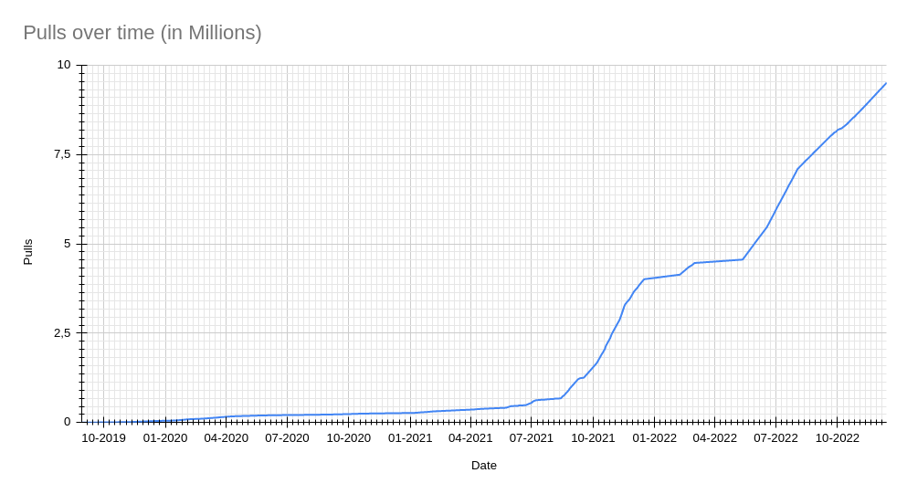
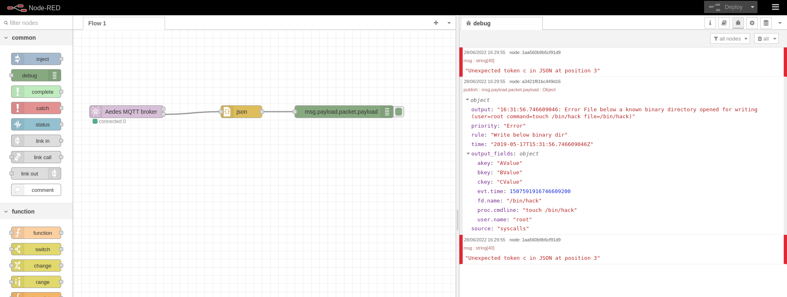
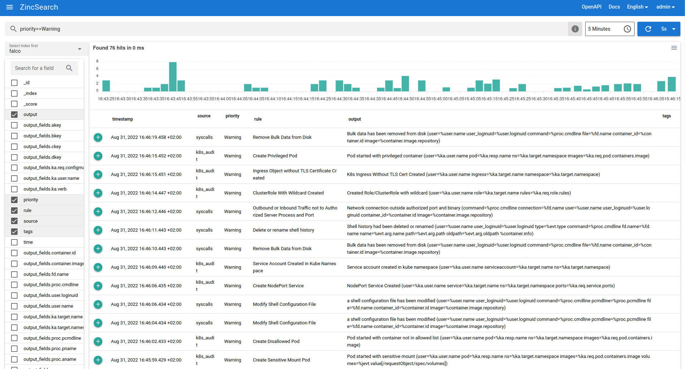
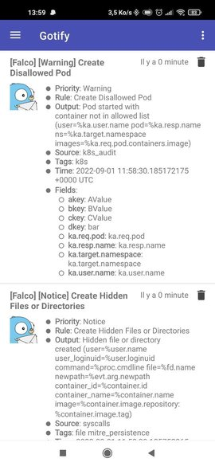
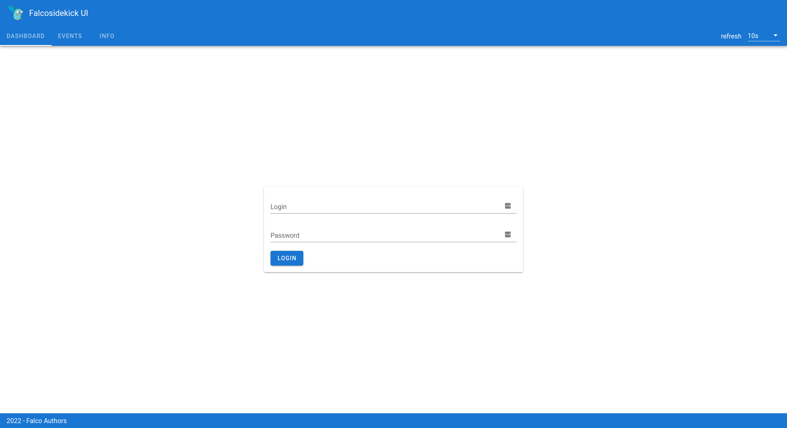
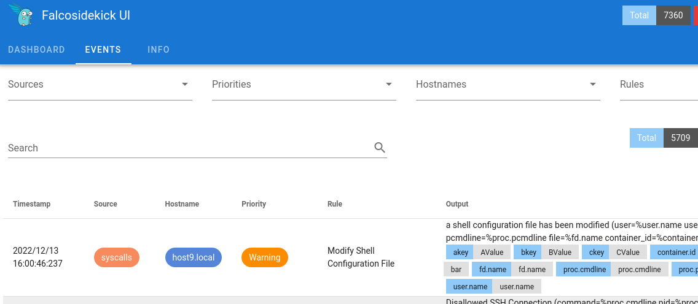

So many good things happened for Falcosidekick and Falcosidekick UI this year. It's still incredible these projects became so beloved and useful for the community. To all contributors, promotors and users, a big big thank you.

The new year is there, it's time to release new versions and reach 10 million Docker pulls for Falcosidekick.



## Falcosidekick v2.27.0

What a huge release! Never has a previous release gotten so many new features and outputs. You can read the full changelog [here](https://github.com/falcosecurity/falcosidekick/releases/tag/2.27.0).

### New outputs

This release brings a lot of new outputs thanks to our amazing contributors. [Here](https://github.com/falcosecurity/falcosidekick/graphs/contributors) you have a list of them.

##### Yandex Data Stream

[Yandex](https://yandex.com) is a Russian cloud provider that provides various services such as [Data Streams](https://cloud.yandex.com/en/docs/data-streams/). With this new output, we can connect Falco to one more cloud providers. Thank you, [preved911](https://github.com/preved911).

##### MQTT and Node-Red

IoT is a whole new world for Falco. With these 2 new outputs, Falco can make its first steps in this ecosystem and we are sure more will come in 2023. Stay tuned.



##### Zincsearch

Do you want a full-text indexer lighter than Elasticsearch? Take a look at [Zincsearch](https://zincsearch.com/).



##### Gotify

By using [Gotify](https://gotify.net) and the new dedicated output, you can now push Falco events to your Android phone.



##### Spyderbat

Are you a user of [Spyderbat](https://www.spyderbat.com) and want to extend its sources of events? Now you can thank [spyder-kyle](https://github.com/spyder-kyle).

##### Tekton

Do you remember the blog post [_how to create a Response Engine for Falco_](/blog/falcosidekick-response-engine-part-4-tekton/) with [Tekton](https://tekton.dev/)? The proposed solution used the generic Webhook output. From now on, Tekton can use a dedicated one.

##### TimescaleDB

[TimescaleDB](https://github.com/timescale/timescaledb) is an OSS database made for time-series data, thanks to [jagretti](https://github.com/jagretti) Falcosidekick can insert into it the Falco events.

##### AWS Security Lake

At re:Invent 2023, AWS announced a new data lake made for security data: AWS Security Lake. We worked with AWS teams to have Falco as a source partner from day one, making it the first OSS project that can be used with that service and strengthening once more the integration with the AWS ecosystem.

### New features

The list of new outputs is already quite long, but the list of enhancements is even longer. The full list is [here](https://github.com/falcosecurity/falcosidekick/blob/master/CHANGELOG.md), but let's have a look at the major changes.

##### SASL auth mechanisms for SMTP and Kafka outputs

Improving security is our duty to all, and one key element is the authentication method. Thanks to [Lowaiz](https://github.com/Lowaiz), both SMTP and Kafka outputs can now use the benefits of SASL Auth mechanisms.

##### Environment variables for custom labels and templated labels

The ability to inject custom fields in the payloads is an important feature of Falcosidekick. The only drawback was these fields were previously static. That limitation is over. Now, you can use environment variables in your custom fields. A new kind of custom fields has become available: `templated fields.' They allow the reuse of the present fields to generate new ones following with [Go template](https://pkg.go.dev/text/template):

```yaml
templatedfields: # templated fields are added to falco events and metrics, it uses Go template + output_fields values
  Dkey: '{{ or (index . "k8s.ns.labels.foo") "bar" }}'
```

##### Hostname field

Since Falco 0.33, a new field is present in Falco events: `hostname`. Falcosidekick and all its current outputs are up to date and ready for it. Once again, thanks to [Lowaiz](https://github.com/Lowaiz).

##### Loki format and Grafana Cloud

The Loki format has been upgraded and credentials can be set. It allows you to use [Grafana Cloud](https://grafana.com/products/cloud/) as a target.

##### K8S Policy Reports are binded to the namespaces

Policy Reports in K8S are still prototypes but Falcosidekick is already able to create them. Some improvements have been made to determine the target resource and the report is now created in the same namespace as the source pod.

##### More headers in SMTP payload

To avoid being flagged as spam by some anti-spam systems, some headers like `From`, `To` and `Date` have been added to the emails created by Falcosidekick.

##### CEF format Syslog

For the Syslog output, you can choose between `json` and `CEF` as formats. It makes easier the integration with some services like [Microsoft Sentinel](https://azure.microsoft.com/en-us/products/microsoft-sentinel/#overview) or [Splunk](https://www.splunk.com/).

### Fixes

Even if we do our best to avoid them, the community has lately faced some bugs that we have fixed in this release.

The most important one was a race condition when headers were added to the POST requests. Adopters with high rates of requests were occasionally facing authentication failures or missing headers. [bc-sb](https://github.com/bc-sb) solved this with a temporary solution, but we'll improve it in the future (Falcosidekick v3? Who knows...).

## Falcosidekick UI v2.1.0

The new features for Falcosidekick UI, although lower in number, are still big improvements. The full changelog is [here](https://github.com/falcosecurity/falcosidekick-ui/releases/tag/v2.1.0).

### Env vars for settings

All settings to configure Falcosidekick UI can be passed as either CLI arguments or as env vars. Run `falcosidekick-ui --help` for more details.

### New logs

The logs were too verbose for production contexts. Now it's configurable via a log-level option:

```bash
-l string   
	  Log level: "debug", "info", "warning", "error" (default "info",  environment "FALCOSIDEKICK_UI_LOGLEVEL")
```

### Auto refresh

Long-term adopters may remember the dashboard in Falcosidekick UI v1 was auto-refreshed. This feature is back, for all widgets, independently of the page.


### Authentication

This is a major new feature. The interface is now protected by the Basic Auth method. More methods will be added in the future:



Set the `FALCOSIDEKICK_UI_USER` env var to define the credentials. 

### Info page

The info page has been rewritten for a nicer look & feel.


### Hostname

As for Falcosidekick, Falcosidekick UI supports the display of the new `hostname` field.



### TTL for keys

Falcosidekick UI can store a huge amount of events, leading to filling the disk of the Redis database. A `TTL` for the entries can be set to avoid this situation.

```bash
-t int
      TTL for keys (default "0", environment "FALCOSIDEKICK_UI_TTL")
```

## Conclusion

The respective Helm charts are already updated to allow you to test on your own all these great new features. Run a `helm upgrade --reuse-values -n falco` to do so.

Once again, thanks to all adopters and contributors who helped and contributed for years to create pieces of software useful to everybody. We hope 2023 will be amazing for Falco and its ecosystem.

---
As usual, if you have any feedback or need help, you can find us at any of the following locations.

* Get started in [Falco.org](http://falco.org/)
* Check out the [Falcosidekick project on GitHub](https://github.com/falcosecurity/falcosidekick).
* Check out the [Falcosidekick UI project on GitHub](https://github.com/falcosecurity/falcosidekick-ui).
* Get involved in the [Falco community](https://falco.org/community/).
* Meet the maintainers on the [Falco Slack](https://kubernetes.slack.com/?redir=%2Farchives%2FCMWH3EH32).
* Follow [@falco_org on Twitter](https://twitter.com/falco_org).
