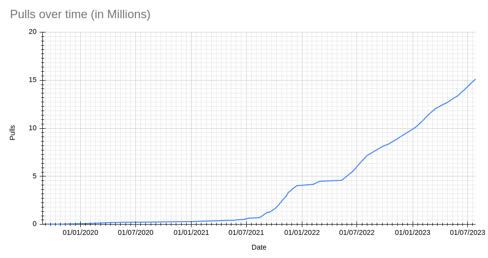
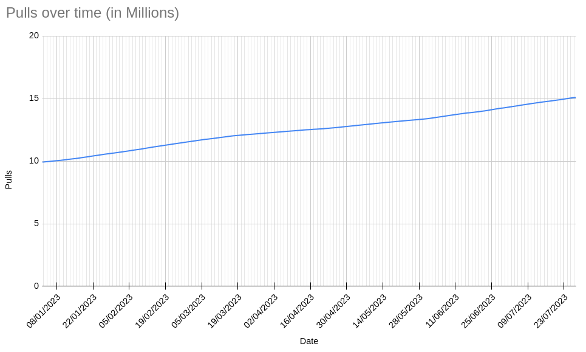
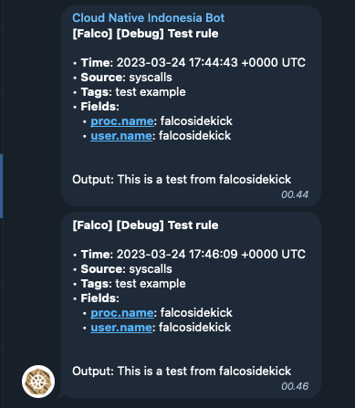
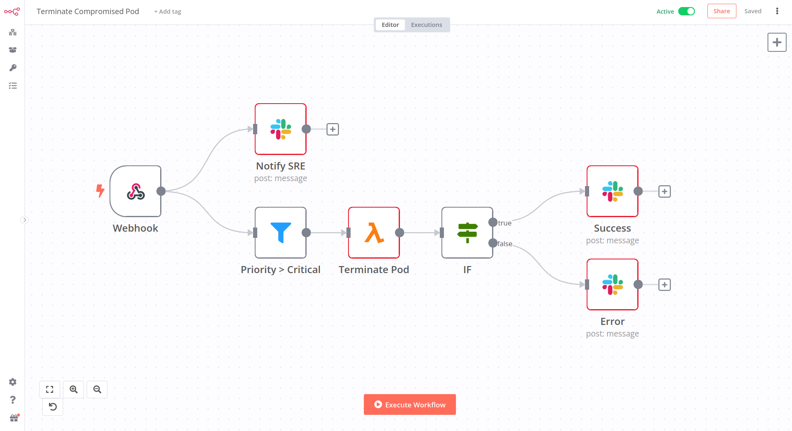
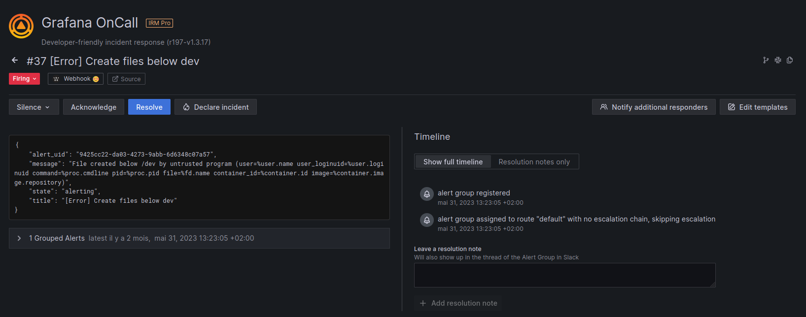
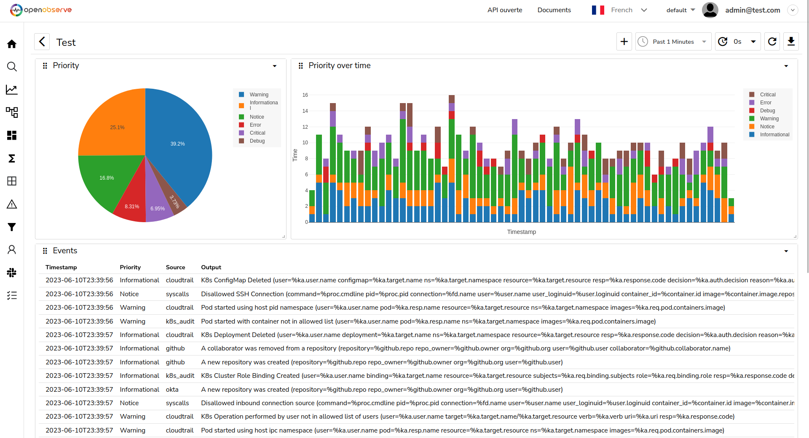

It's summertime, it's hot, and many people are on vacation, but the Falco community is still there. Six months after the release of Falcosidekick's latest upgrade, version 2.28.0 becomes officially available.

The number of pulls of the official Falcosidekick image from Docker Hub has also just reached 15M, which we consider mind-blowing. It took it 3 years to reach the first 5M pulls and now it's needed less than six months to do it again. Awesome!




Once more, Falcosidekick expands Falco's integrability with a lot of new outputs. That and the introduction of many new features has been possible thanks to the hard work of the community. You can find a comprehensive list of these in the [changelog](https://github.com/falcosecurity/falcosidekick/releases/tag/2.28.0).

## New outputs

With every new release, the number of integrations of Falcosidekick increases. We have reached the number of 58 available outputs already, and we hope the threshold of 60 will be left behind very soon. 

### Redis

[Redis](https://redis.com) is a well-known in-memory database with many years of adoption on its path. It is now possible for Falcosidekick to use it as an output destination, thanks to the contributions of [pandyamarut](https://github.com/pandyamarut).

### Telegram

[Telegram](https://telegram.org/), the instant messaging platform, is becoming more and more used by companies for notifications, and thanks to [zufardhiyaulhaq](https://github.com/zufardhiyaulhaq), it can receive Falco alerts too.



### N8N

Do you want to extend the possibilities or just avoid developing a script to react to Falco events? Here comes [n8n](https://n8n.io/).



### Grafana OnCall

At the last KubeCon, we met with some of the Grafana maintainers. We discussed the integration of Falco using Falcosidekick within the OnCall project. It's done now.



### OpenObserve

[OpenObserve](https://openobserve.ai/) is a young but promising full stack observability platform.




## New features

Aside from new outputs, we introduced very important and useful new features. Let's do a recap of them.

### Use different methods for the Webhook output

Since its implementation, the Webhook output has only used the HTTP method `POST`. Now, you can choose between the `POST` and `PUT` methods to send your data, extending the catalog of possible REST APIs to use it with.

```yaml
webhook:
  method: "POST" # HTTP method: POST or PUT (default: POST)
```

### Replace the brackets in the payload

Some Falco fields refer to lists and reflect that their keys contain brackets, like `proc.args[0]`, `proc.args[1]`, etc. Unfortunately, some outputs may refuse payloads with brackets in keys. For this reason, we introduced the possibility of replacing them with any other chosen character:

```yaml
bracketreplacer: "_" # if not empty, the brackets in keys of Output Fields are replaced
```

### Set custom headers for Loki, Elasticsearch and Grafana outputs

If you want to protect your private instances of `Loki`, `Grafana`, or `Elasticsearch` you may need to specify custom headers. This new feature allows you to do so.

```yaml
elasticsearch:
  customHeaders: # Custom headers to add in POST. Useful for Authentication
    key: value
```

### Match the priority with the severity for the AlertManager output

`AlertManager` is a pretty common software at companies also using `Prometheus`. Until now, the mapping between the Priority of Falco events and the Severity of AlertManager was already predefined. You can now define it depending on your needs thanks to [Lowaiz](https://github.com/Lowaiz).

```yaml
alertmanager:
  customseveritymap: "" # comma separated list of tuple composed of a ':' separated Falco priority and Alertmanager severity that is used to override the severity label associated to the priority level of falco event. Example: debug:value_1,critical:value2. Default mapping: emergency:critical,alert:critical,critical:critical,error:warning,warning:warning,notice:information,informational:information,debug:information. (default: "")
```

### Set thresholds for the dropped events for the AlertManager output

Another contribution from [Lowaiz](https://github.com/Lowaiz): You can now configure a set of thresholds to start dropping the events.

```yaml
alertmanager:
  # dropeventdefaultpriority: "" # default priority of dropped events, values are emergency|alert|critical|error|warning|notice|informational|debug (default: "critical")
  dropeventthresholds: # comma separated list of priority re-evaluation thresholds of dropped events composed of a ':' separated integer threshold and string priority. Example: `10000:critical, 100:warning, 1:informational` (default: `"10000:critical, 1000:critical, 100:critical, 10:warning, 1:warning"`)
```

### Better integration with TimescaleDB

We thank [hileef](https://github.com/hileef) for improving the integration with `TimescaleDB`.

### User roleARN and externalID for the AWS outputs

Under some situations, you may want Falcosidekick to assume a role, possibly from another account. You can do it with the new pair of settings `rolearn` and `externalid`:

```yaml
aws:
  rolearn: "" # aws role to assume (optional if you use EC2 Instance Profile)
  externalid: "" # external id for the role to assume (optional if you use EC2 Instance Profile)
```

### Set the region for the PagerDuty output

Falcosidekick allows you to select between one of the two different regions' `PagerDuty` offers now.

```yaml
pagerduty:
  region: "us" # Pagerduty Region, can be 'us' or 'eu' (default: us)
```

### Allow TLS for the SMTP output

It is now possible to communicate with an `SMTP` server using TLS.

```yaml
smtp:
  tls: false # Use TLS connection (true/false). Default: true
```

### Set attributes to GCP PubSUb messages

`GCP PubSub` accepts attributes in its messages. You can specify yours, thanks to [annadorottya](https://github.com/annadorottya).

```yaml
gcp:
  customAttributes: # Custom attributes to add to the Pub/Sub messages
    key: value
```

### More options for TLS and mTLS

These are the most relevant changes of this release. To improve security, Falcosidekick can now listen using HTTPS with TLS. You can also be more specific with the keys and certificates for the mTLS for the outputs.

```yaml
mutualtlsfilespath: "/etc/certs" # folder which will used to store client.crt, client.key and ca.crt files for mutual tls for outputs, will be deprecated in the future (default: "/etc/certs")
  # certfile: "/etc/certs/client/client.crt" # client certification file
  keyfile: "/etc/certs/client/client.key" # client key
  cacertfile: "/etc/certs/client/ca.crt" # for server certification
tlsserver:
  # certfile: "/etc/certs/server/server.crt" # server certification file
  keyfile: "/etc/certs/server/server.key" # server key
```

{}
The `mutualtlsfilespath` setting is kept for now for backward compatibility but it will be remove in future
{}

In some edge cases, you may need some endpoints to listen in HTTP only. You can specifically define them together with the associated port:

```yaml
tlsserver:
  notlsport: 2810 # port to serve http server serving selected endpoints (default: 2810)
  notlspaths: # if not empty, a separate http server will be deployed for the specified endpoints
    - "/metrics"
    - "/healthz"
```

Thanks to [annadorottya](https://github.com/annadorottya) for her impressive work on this functionality.

### Autocreate the topic for the Kafka output

When Falcosidekick doesn't detect the topic, it can create it automatically. This feature is not enabled by default.

```yaml
kafka:
  topiccreation: false # auto create the topic if it doesn't exist (default: false)
```

### Support multiple bootstrap servers and TLS for the Kafka output

To get better resiliency, you can now specify several bootstrap servers and even communicate with them with TLS, thanks to [ibice](https://github.com/ibice).

```yaml
kafka:
  tls: false # Use TLS for the connections (default: false)
```

## Fixes

We're not going to go into detail about all the corrections made in this version - you can find the full list [here](https://github.com/falcosecurity/falcosidekick/releases/tag/2.28.0). 
Thanks to everyone who reported issues and to those who have corrected them.

The most important have been:
- Fix breaking brackets in `AWS SNS` messages.
- Fix setting name for the table of `TimescaleDB` output (thanks to [alika](https://github.com/alika)).
- Fix the cardinality issue with `Prometheus` labels.
- Fix panic when asserting output fields that are `nil`.
- Fix URL generation for `Spyderbat` output (thanks to [bc-sb](https://github.com/bc-sb)).
- Fix `nil` values in `Spyderbat` output (thanks to [spider-guy](https://github.com/spider-guy)).
- Fix duplicated headers in `SMTP` output (thanks to [apsega](https://github.com/apsega)).

## Conclusion

The respective Helm charts are also updated and allow you to test for yourself all these great new features. Just issue the `helm repo update; helm upgrade --reuse-values -n falco` command to do so.

Falcosidekick is now mentioned in the official [Falco docs](https://falco.org/docs/alerts/forwarding/). It's a shy beginning, but more details will come shortly.

Once again, thanks to all the adopters and contributors who helped and contributed to this project all these years. We would never have reached this success without you.

---
* Get started in [Falco.org](http://falco.org/)
* Check out the [Falcosidekick project on GitHub](https://github.com/falcosecurity/falcosidekick).
* Check out the [Falcosidekick UI project on GitHub](https://github.com/falcosecurity/falcosidekick-ui).
* Get involved in the [Falco community](https://falco.org/community/).
* Meet the maintainers on the [Falco Slack](https://kubernetes.slack.com/?redir=%2Farchives%2FCMWH3EH32).
* Follow [@falco_org on Twitter](https://twitter.com/falco_org).
