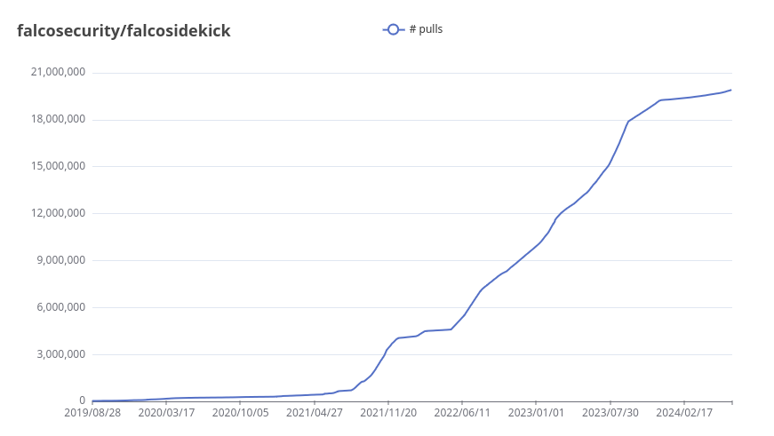
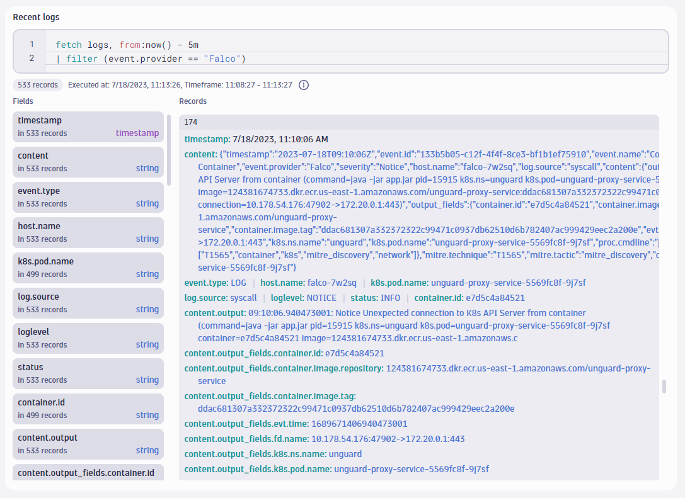
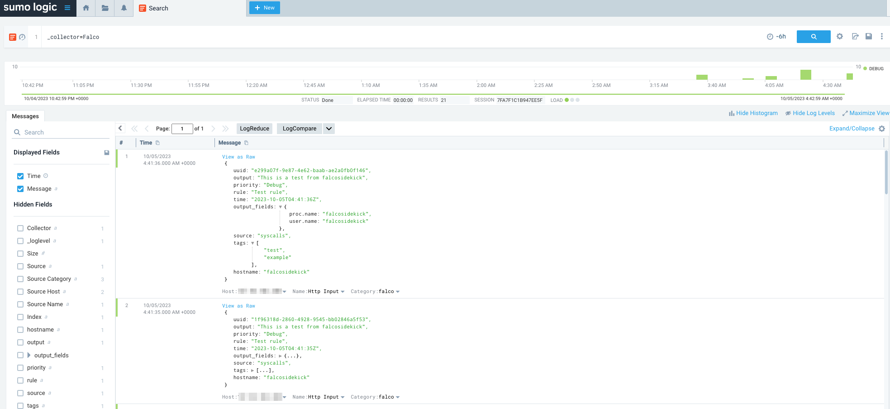
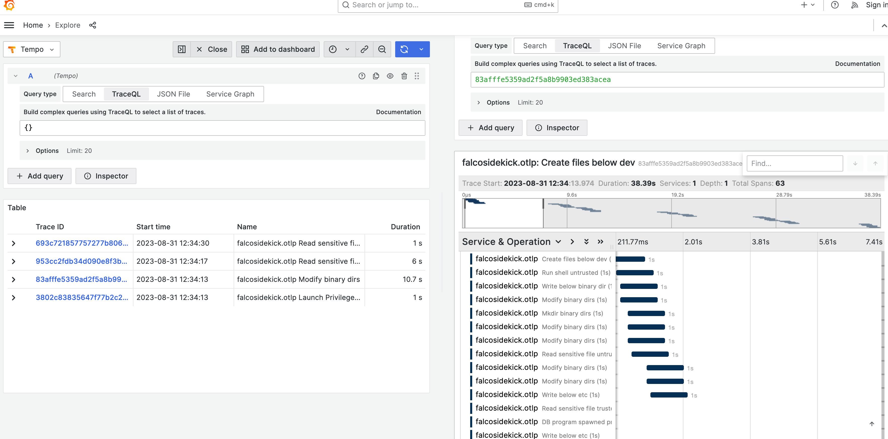
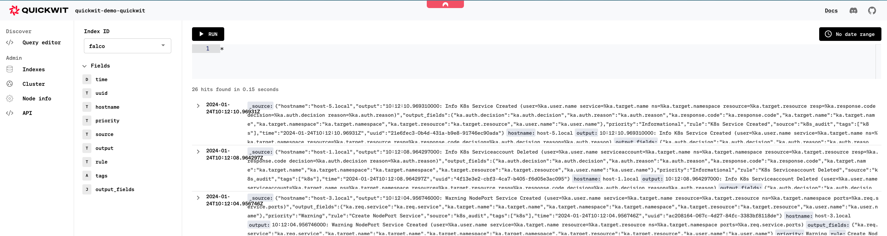
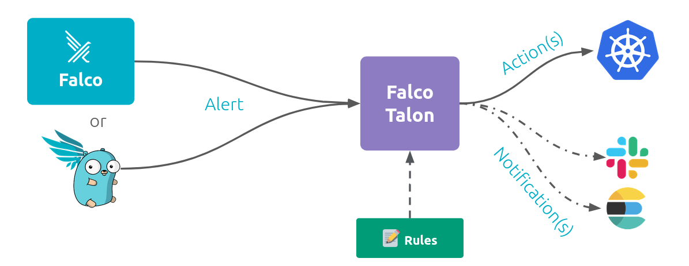

Almost 1 year without a release of Falcosidekick, but version 2.29.0 is finally here. Thanks to all contributors for their patience, you made amazing contributions and we're happy to finally have them available for all users.

Like for every releases, a small recap about its adoption. Falcosidekick continues to be adopted, even if the rate is not as high as before, but we're sure it will explode once again with this new fresh version.



Once more, Falcosidekick expands Falco's integrability with a lot of new outputs. That and the introduction of many new features has been possible thanks to the hard work of the community. You can find a comprehensive list of these in the [changelog](https://github.com/falcosecurity/falcosidekick/releases/tag/2.29.0).

## New outputs

More and more systems are integrated as outputs in Falcosidekick, more and more often directly by the companies themselves and not their end users. It shows Falco and Falcosidekick are seen as major components in the security fields, and trusted as de facto standards.

### Dynatrace

Mario Kahlhofer, aka [@blu3r4y](https://github.com/@blu3r4y), from Dynatrace, integrated the well known observability and security platform he works for. You can even read his [blog post about](https://www.dynatrace.com/news/blog/ttp-based-threat-hunting-solves-alert-noise/), to discover how to correlate the Falco events with their APM agent events.



### Sumologic

Carlo Mencarelli, aka [@mencarellic](https://github.com/mencarellic), did the exporter of the Falco events to [Sumologic](https://www.sumologic.com/), the SaaS platform for your logs.



### OTLP Traces

It started as an internal hackaton at [Grafana Labs](https://grafana.com/) and became a real integration thanks to JuanJo Ciarlante ([@jjo](https://github.com/jjo)). You can now export the Falco event as traces, to have an automatic correlation between the detected events.

> [!WARNING]
 It works only for the syscall related events.



### Quickwit

After a demo of Falco at a CNCF Meetup, the [Quickwit](https://quickwit.io/) team wanted to add their product as a new output for Falcosidekick, and they did it. You can now easily index your Falco events in their search engine thanks to the work of Idriss Neumann ([@idrissneumann](https://github.com/idrissneumann)).



### Falco Talon

New born in the Falco ecosystem, trying to complete the last missing piece: the reaction. You can now forward the Falco events to [Falco Talon](https//docs.falco-talon.org), a tailor made no-code response engine for Falco. The project is still in alpha stage, but moves quickly. Stay tuned.



## New features

Aside from new outputs, we introduced very important and useful new features. Let's do a recap of them.

### Revamp of the Policy Report output

The Policy Report feature in Kubernetes evolved since its integration in Falcosidekick, it was the time to do some clean up. The report now contains more information, and their displays in the [Policy Reporter UI](https://github.com/kyverno/policy-reporter/tree/main?tab=readme-ov-file#policy-reporter-ui) is better. 

### New outputFieldFormat setting

Some systems perform deduplication of the events, for example the on-call platforms. They use the content of the `output` to do so, but the current format starting with a timestamp prevents the process to run as expected. A new setting `outputFieldFormat` is now available allows to "format" the `output` field of the Falco payload before forwarding it to the outputs.

The default format received from Falco is : `<timestamp>: <priority> <output>` which corresponds to this:
```
14:37:27.505989596: Warning Detected ptrace PTRACE_ATTACH attempt (proc_pcmdline=%proc.pcmdline evt_type=%evt.type user=%user.name user_uid=%user.uid user_loginuid=%user.loginuid process=%proc.name proc_exepath=%proc.exepath parent=%proc.pname command=%proc.cmdline terminal=%proc.tty exe_flags=%evt.arg.flags %container.info)
```

By removing the `<timestamp>` and `<priority>`, you get:
```
Detected ptrace PTRACE_ATTACH attempt (proc_pcmdline=%proc.pcmdline evt_type=%evt.type user=%user.name user_uid=%user.uid user_loginuid=%user.loginuid process=%proc.name proc_exepath=%proc.exepath parent=%proc.pname command=%proc.cmdline terminal=%proc.tty exe_flags=%evt.arg.flags %container.info)
```

{}
If you use the settings `customFields` and `templatedFields` of Falcosidekick to inject new elements in the `output_fields`, it's also possible to have them in the `output` with the tokens `<custom_fields>` and `<templated_fields>`.
{}

### Alternative endpoints for AWS S3

Some projects like [Minio](https://min.io/) are S3-compliant, you can now use them as target for the `AWS S3` output by changing the endpoint to use. Thanks to  [@gysel](https://github.com/gysel) for this feature.

### Split of the docs

The main README of the project became really huge over the years, with all those available outputs. We did a big refactor and you can now find one file per output, with more details about the configuration, the default values and some tips. The docs are [here](https://github.com/falcosecurity/falcosidekick/tree/master/docs/outputs), and any help is welcome to make them even better.

## Fixes

The contributors fixed several bugs, here's a non exhaustive list of the more important ones:
- Fix missing root CA for the `Kafka` output (thanks to [@claviola](https://github.com/claviola))
- Fix bug with the extension `source` in the `CloudEvent` output
- Fix panics in the `Prometheus` output when `hostname` field is missing
- Fix locks in the `Loki` output (thanks to [@bsod90](https://github.com/bsod90))
- Fix mTLS client verification failures due to missing ClientCAs (thanks to [@jgmartinez](https://github.com/jgmartinez))
- Fix wrong env vars for pagerduty output 
- Remove hard settings for usernames in `Mattermost` and `Rocketchat`
- Fix multi lines json in the error lines (thanks to [@idrissneumann](https://github.com/idrissneumann))
- Fix duplicated custom headers in clients
- Fix the labels for the `AlertManager` output (thanks to [@Umaaz](https://github.com/Umaaz))

## Conclusion

You can find the full changelog [here](https://github.com/falcosecurity/falcosidekick/releases/tag/2.29.0).

The respective Helm charts are already updated and allow you to test by yourself all these great new features. Just issue the `helm repo update; helm upgrade --reuse-values -n falco` command to do so.

Once again, thanks to all the adopters and contributors who helped and contributed to this project all these years. We would never have reached this success without you.

---
* Get started in [Falco.org](http://falco.org/)
* Check out the [Falcosidekick project on GitHub](https://github.com/falcosecurity/falcosidekick).
* Check out the [Falco Talon project docs](https://docs.falco-talon.org).
* Get involved in the [Falco community](https://falco.org/community/).
* Meet the maintainers on the [Falco Slack](https://kubernetes.slack.com/?redir=%2Farchives%2FCMWH3EH32).
* Follow [@falco_org on Twitter](https://twitter.com/falco_org).
