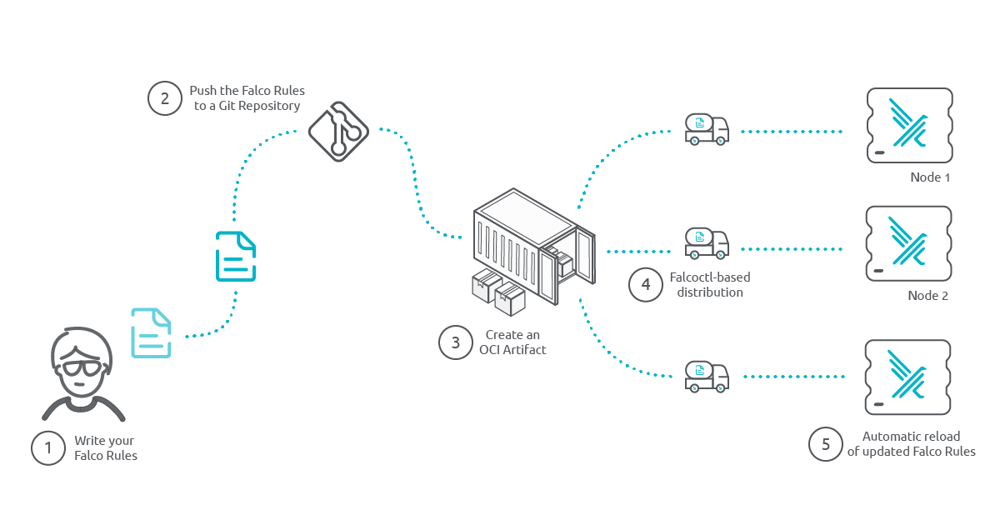
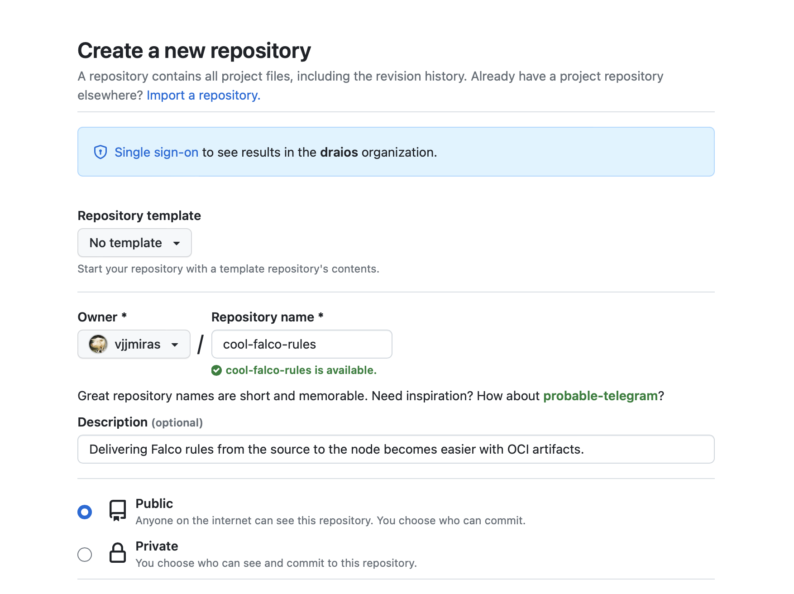
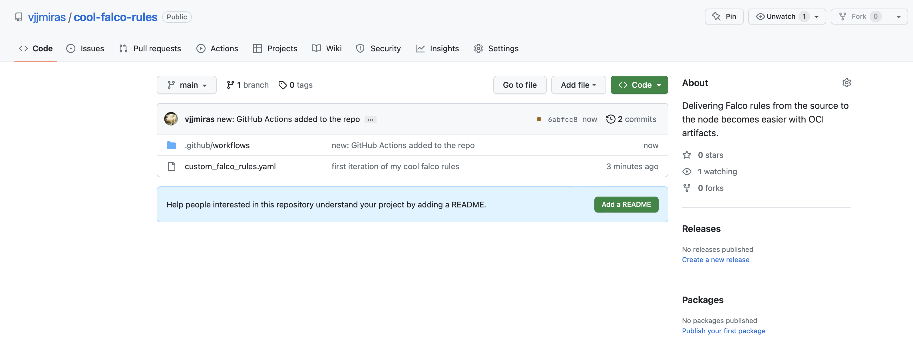
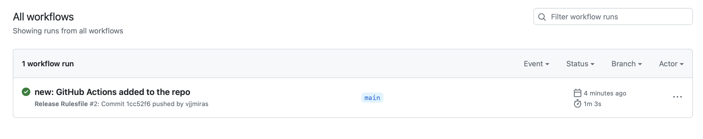

Falco rules management has been a discussed topic for quite a long time. When we start building and customizing rules for our environment, we need a simple way to effectively update and distribute them to our Falco fleet. Starting from Falco 0.34, we can easily do it by using OCI artifacts and leveraging any private or public container registry to store and retrieve them.

Besides what [OCI artifact](#oci-artifacts) are, in this blog we are going to learn 2 main concepts: 

- How we can [create OCI artifacts containing our Falco rules in an automated way](#rules-management-à-la-devops).
- How Falco can [retrieve those OCI artifacts to update its local configuration](#testing-our-rules-workflow):
    - In a [Linux server](#falco-and-falcoctl-running-as-linux-services).
    - In a [Kubernetes cluster](#falco-and-falcoctl-running-on-kubernetes).

As you can see, there's a lot of content to cover, so let's start right away.

## OCI artifacts

OCI stands for Open Container Initiative, which is a project focused on creating open standards for container image formats and runtime specifications. An OCI artifact refers to a container image or a bundle that conforms to the OCI specifications.

In other words, our OCI artifacts will be similar to container images. They will be stored and made available by container registries. They could also be uploaded and downloaded using familiar tools in the container ecosystem. 

Does it mean we need a container runtime to use it? Not at all.

OCI artifacts for Falco are created using the [falcoctl](https://github.com/falcosecurity/falcoctl) tool. This tool takes either a plain rules file or a set of them, inside a compressed file, and will, in a single step, create the OCI artifact and upload it to an OCI-complaint container registry.

In the node, where the `falco` daemon runs, `falcoctl` will retrieve that same OCI artifact, extract its content, and place it on the right place so `falco` can detect the latest threats.

## Automating GitHub to pack Falco custom rules

### Rules management à la DevOps

Git has become the de-facto technology to maintain a versioned copy of our most precious bits. Besides, it allows for automation and collaboration. These features makes it the perfect place to store our rules files. But what about distribution?



Using known CI/CD techniques we can pack the latest rules in a distributable object. Maybe we prefer to stick to a stable version, or maybe we want to be flexible offering multiple versions. Combining the power of Git with the standards of OCI, Falco is able to selectively retrieve the most suitable rules for each platform.

### Choose your weapons, here are mine

Time to get our hands busy. We'll need for this tutorial:

- An empty [GitHub](https://github.com/) repo.
- A Falco ruleset file.
- A Falco installation. This tutorial will use both, [Falco running as a _systemd-service_](#falco-and-falcoctl-running-as-linux-services) and also [deployed using a Helm chart on Kubernetes](#falco-and-falcoctl-running-on-kubernetes).
- A container registry. We're going to use [GitHub packages](https://docs.github.com/en/packages/learn-github-packages/introduction-to-github-packages) that comes with any public GitHub repository for free!

And here is a high-level descriptions of the steps to follow:

- Create an empty GitHub repo.
- Uploading our ruleset. A file is enough.
- Configuring GitHub Actions to generate and publish the OCI artifact.
- Testing. Not strictly required… just kidding. Always test.

Simple enterprise, right? Then, let’s go for it.

### Create a new GitHub repository

That’s probably the easiest task here. We login to GitHub, go to repositories, and create that empty repo with the name of our like:



### Upload your Custom Ruleset

Each person has their own liking for doing this step. Here, we'll clone the repo in a terminal, add the content, and commit it. 

Don’t forget to push the commit. It wouldn’t be the first time we hit our head against the wall for having forgotten it. Have I mention not to forget to push the commit.

For our example, we'll be creating a file named `custom-falco-rules.yaml` with the following content:

```yaml
- list: falco_binaries
  items: [falcoctl]
```

It's not much, and it doesn't do much, we keep it simple, since the content of the rules files is not what we want to focus on. We'll update it later to something more useful for our example.

It's time to upload it to the repository:

```shell
$ git clone https://github.com/vjjmiras/cool-falco-rules
$ cp /tmp/custom_falco_rules.yaml ./cool-falco-rules/
$ cd cool-falco-rules
$ git add custom_falco_rules.yaml
$ git commit -s -m 'first iteration of my cool falco rules'
```

And that’s it. Now we have some content ready for the next step. That was probably no challenge for many of you.

### Configuring GitHub Actions

Well, that’s going to be the fun part. Basically, we’ll tell GitHub what to do when a new version of the ruleset file is pushed to the repository.

Again, a high-level description of the steps to follow will surely help:

- Download the Falcoctl tool.
- Retrieve content of the rules repository (the file we want to distribute as an OCI artifact).
- Upload the OCI artifact to the container registry.

You might be wondering whether we forgot any step. We surely did, intentionally. Just some little tasks that’ll help us set up the workflow properly. What we haven’t missed is the step to convert the ruleset file into an OCI artifact. That’s [falcoctl](https://github.com/falcosecurity/falcoctl) job.

Now, let’s create an outline for the workflow.

{}

Feel free to jump to the [resulting workflow file](#final-workflow-file). You can always come back here to see through the process of creating it.

{}

```yaml
$ mkdir -p .github/workflows/
$ vim .github/workflows/release.yaml

---
name: Release Rulesfile
on: push
jobs:
  Release-Rulesfile:
    runs-on: ubuntu-latest
    steps:
      - name: step 1
        ...
      - name: step 2
        ...
```

To add some flexibility to our example, we'll add a few environmental variables that can be easily tuned for experimentation. These will be the name of the rules file, the container registry that'll store the artifact, and the name and version of it.

```yaml
jobs:

  Release-Rulesfile:
    ...
    env:
      # Only one ruleset file for our demo
      RULESET_FILE: custom_falco_rules.yaml
      # Used to setup Auth and OCI artifact location
      OCI_REGISTRY: ghcr.io
      # Assuming we are in the main branch, our OCI artifact will
      # look something like ghcr.io/user/repo/custom-rules:main
      OCI_ARTIFACT_NAME: custom-rules
      OCI_ARTIFACT_VERSION: ${{ github.ref_name }}
    steps:
      ...
```
Since we need to upload the OCI Artifact to the container registry, let's grant our workflow write permisions that'll allow us to use the GitHub token for that purpose. 

{}

Be aware that we are using the GitHub container registry. You wouldn't need those permissions here if you happened to use an external one.

{}

```yaml
jobs:
  Release-Rulesfile:
    ...

    # These permissions are needed to interact with GitHub's OIDC Token endpoint.
    permissions:
      id-token: write
      contents: read
      packages: write
    env:
       ...
    steps:
       ...
```

Time to add the steps to our workflow to let `falcoctl` tool create the OCI artifact with out rules.

### Define the Steps in your Workflow

{}

The next 3 tasks have one simple goal: Build the `falcoctl` tool. We mentioned before we were going to download it, but at the time of writing this, the latest released version wasn't supporting registry authentication properly. That's our main reason to compile it here.

{}

#### Falcoctl tool

Let's start with downloading the source code for our tool to the `./tools/falcoctl` directory. We'll need that path to access `falcoctl` later.

```yaml
  - name: Checkout Falcoctl Repo
    uses: actions/checkout@v3
    with:
      repository: falcosecurity/falcoctl
      ref: main
      path: tools/falcoctl
```

The second task is just an auxiliary task that will enable the Go cache, which might not be necessary, but it'll save us a lot of time every time you compile the `falcoctl` tool. 

{}

Feel free to ignore the following step it at your discretion, although I wouldn't recommend it.

{}

```yaml
- name: Setup Golang
  uses: actions/setup-go@v4
  with:
    go-version: '^1.20'
    cache-dependency-path: tools/falcoctl/go.sum
```

{}

Pay attention to the parameter (last line) passed to cache the dependencies. It'll depend on the values set in the previous task.

{}

Finally, a simple build step and our tool will be available as `./tools/falcoctl/falcoctl`

```yaml
- name: Build falcoctl
  run: make
  working-directory: tools/falcoctl
```

One last step before creating and uploading the OCI artifact is to have the rules we are pushing into it. This simple GitHub Action will download our repo into the `rules/` directory.

```yaml
- name: Checkout Rules Repo
  uses: actions/checkout@v3
  with:
    path: rules
```

#### Upload the OCI Artifact

Here it is where the magic happens. This example spreads across multiple lines to make it easier to understand.

```yaml
1| - name: Upload OCI artifacts to GitHub packages
2|   run: |
3|     tools/falcoctl/falcoctl registry push \
4|     --config /dev/null \
5|     --type rulesfile \
6|     --version ${OCI_ARTIFACT_VERSION} \
7|     ${OCI_REGISTRY}/${GITHUB_REPOSITORY}/${OCI_ARTIFACT_NAME}:${OCI_ARTIFACT_VERSION} \
8|     rules/${RULESET_FILE}
```

The systax will look like: `falcoctl registry push [--option ...] destination-url source-file`. Let's dissect the command for a better understanding.

- Line 2, uses the **|** symbol, which indicates that all the segments at the same indentation level will be interpreted as a single line. YAML specifics.
- Line 3, contains the **cli** verbs, the fresly compiled `falcoctl` tool with the subverbs `registry push` as shown above. The options will come later.
- Line 4, `--config /dev/null`, is required to tell `falcoctl` not to use a configuration file. Otherwise it will try to create the directory `/etc/falcoctl` and we might not have permissions for that.
Using a config file is an alternative, but for simplicity and pedagogical reasons we've kept everything on the command line.
- Line 5, `--type rulesfile`, indicates what time of content should this artifact have. It could be a plugin or a rulesfile
- Line 6, `--version ${OCI_ARTIFACT_VERSION}`, indicates the version of the artifact. It might look a bit redundant, but it's a mandatory option for the `falcoctl` command.
- Line 7 is the destination URL to push the OCI artifact into. It should contain the registry, git user and repo name, name of the artifact, and the tag, which we have called version in this blog post.
- Line 8 is just the name of the rulesfile that the OCI artifact will include.

#### Credentials

Our step won't need any previous authentication step thanks to the environment variable `FALCOCTL_REGISTRY_AUTH_BASIC` that we'll add at the end of the last step. This variable can contain any number of credentials separated by a semi-colon, but we require only one in our example. 

The 3 elements of a credential, separated by commas, are the registry url, the user that is authenticating and the token for that user.

Appended to the step where we were pushing the OCI artifact, and based on environmental information, we'll instantiate the variable as:

```yaml
env:
  FALCOCTL_REGISTRY_AUTH_BASIC: ${{ env.OCI_REGISTRY }},${{ github.repository_owner }},${{ secrets.GITHUB_TOKEN }}
```

### Final Workflow File

Once our workflow is complete, it should look like:
```yaml
---
name: Release Rulesfile
on: push
jobs:
  Release-Rulesfile:
    runs-on: ubuntu-latest

    # These permissions are needed to interact with GitHub's OIDC Token endpoint.
    permissions:
      id-token: write
      contents: read
      packages: write

    env:
      # Only one ruleset file for our demo
      RULESET_FILE: custom_falco_rules.yaml
      # Used to setup Auth and OCI artifact location
      OCI_REGISTRY: ghcr.io
      # Assuming we are in the main branch, our OCI artifact will
      # look something like ghcr.io/user/repo/custom-rules:main
      OCI_ARTIFACT_NAME: custom-rules
      OCI_ARTIFACT_VERSION: ${{ github.ref_name }}

    steps:

      - name: Checkout Falcoctl Repo
        uses: actions/checkout@v3
        with:
          repository: falcosecurity/falcoctl
          ref: main
          path: tools/falcoctl

      - name: Setup Golang
        uses: actions/setup-go@v4
        with:
          go-version: '^1.20'
          cache-dependency-path: tools/falcoctl/go.sum

      - name: Build falcoctl
        run: make
        working-directory: tools/falcoctl

      - name: Checkout Rules Repo
        uses: actions/checkout@v3
        with:
          path: rules

      - name: Upload OCI artifacts to GitHub packages
        run: |
             tools/falcoctl/falcoctl registry push \
             --config /dev/null \
             --type rulesfile \
             --version ${OCI_ARTIFACT_VERSION} \
             ${OCI_REGISTRY}/${GITHUB_REPOSITORY}/${OCI_ARTIFACT_NAME}:${OCI_ARTIFACT_VERSION} \
             rules/${RULESET_FILE}
        env:
          FALCOCTL_REGISTRY_AUTH_BASIC: ${{ env.OCI_REGISTRY }},${{ github.repository_owner }},${{ secrets.GITHUB_TOKEN }}
```

Once the file is ready, we'll upload it to GitHub, where it'll be processed by GitHub Actions. After that, we'll just need to wait for the workflow to finish.

```shell
$ git add .github/workflows/
$ git commit -s -m 'new: GitHub Actions added to the repo'
$ git push -u origin main
```

Your repository will probably look like this:



And if your GitHub action executed successfully, it'll look like this:



Now it's time to test our freshly generated OCI artifact.

## Testing our Rules Workflow

How do we test our new fancy rule distribution system? The best way would be using a customizable Falco installation to pull our rules.

Here we can have two scenarios: running Falco as a Linux service or deploying it as a Kubernetes Daemonset. Let's cover both of them to see the differences.

### Falco and Falcoctl running as Linux services

For this scenario, I'll use the [Try Falco](https://falco.org/try-falco-on-ubuntu/) scenario which instructions are available in the Falco website. Only the first set of instructions are required to have the scenario up and running. Once our scenario is ready, we'll proceed to configure the rules automatic update.

First of all, let's have a look into the `falcoctl-artifact-follow.service` unit status:
```plain
$ sudo systemctl status falcoctl-artifact-follow.service

● falcoctl-artifact-follow.service - Falcoctl Artifact Follow: automatic artifacts update service
     Loaded: loaded (/lib/systemd/system/falcoctl-artifact-follow.service; disabled; vendor preset: enabled)
     Active: active (running) since Wed 2023-04-12 15:34:06 UTC; 55s ago
       Docs: https://falco.org/docs/
   Main PID: 16152 (falcoctl)
      Tasks: 8 (limit: 2271)
     Memory: 10.5M
     CGroup: /system.slice/falcoctl-artifact-follow.service
             └─16152 /usr/bin/falcoctl artifact follow --allowed-types=rulesfile

Apr 12 15:34:06 vagrant systemd[1]: Started Falcoctl Artifact Follow: automatic artifacts update service.
Apr 12 15:34:06 vagrant falcoctl[16152]: INFO: Reading all configured index files from "/root/.config/falcoctl/indexes.yaml"
Apr 12 15:34:06 vagrant falcoctl[16152]: WARN: No configured index. Consider to configure one using the 'index add' command.
Apr 12 15:34:06 vagrant falcoctl[16152]: INFO: Creating follower for "falco-rules:0", with check every 6h0m0s
Apr 12 15:34:07 vagrant falcoctl[16152]:  INFO  Starting follower for "ghcr.io/falcosecurity/rules/falco-rules:0"
Apr 12 15:34:07 vagrant falcoctl[16152]:  INFO   (ghcr.io/falcosecurity/rules/falco-rules:0) found new version under tag "0"
Apr 12 15:34:10 vagrant falcoctl[16152]:  INFO   (ghcr.io/falcosecurity/rules/falco-rules:0) artifact with tag "0" correctly installed
vagrant@vagrant:~$ 
```
We can see there that there is an instance of `falcoctl` _following_ an item named **falco-rules:0**. We'll come back to that later.

Let's have a look then into `falcoctl.yaml` configuration file, the default one, since no other explicit configuration file has been passed for the service.

```yaml
$ cat /etc/falcoctl/falcoctl.yaml 

artifact:
  follow:
    every: 6h0m0s
    falcoVersions: http://localhost:8765/versions
    refs:
    - falco-rules:0
indexes:
- name: falcosecurity
  url: https://falcosecurity.github.io/falcoctl/index.yaml
```

All right, that is lot of useful information. Let's take our time. 
First, we can observe it contains 2 configuration sections, **artifact** and **indexes**.

The **artifact** section instructs `falcoctl` to update the rules files when necessary, checking for updates every 6 hours. The _files_ to be updated are referenced under the `refs:` section. That list contains a single element at the moment: **falco-rules:0**. That should ring a bell, right?

Now, to understand what **falco-rules:0** means, we should look into the **indexes** section. An index is a file describing where to download an OCI artifact from, and what to do with it. At the moment, it only supports passing the file via http. However, using a local file will also be an option in the future.

In the following command, we'll extract the 14 lines that are relevant to to the **falco-rules** artifact:

```yaml
$ curl -s https://falcosecurity.github.io/falcoctl/index.yaml | \
  grep --after-context=13 -- "^- name: falco-rules" 

- name: falco-rules
  type: rulesfile
  registry: ghcr.io
  repository: falcosecurity/rules/falco-rules
  description: Falco rules that are loaded by default
  home: https://github.com/falcosecurity/rules/blob/main/rules/falco_rules.yaml
  keywords:
    - falco-rules
  license: apache-2.0
  maintainers:
    - email: cncf-falco-dev@lists.cncf.io
      name: The Falco Authors
  sources:
    - https://github.com/falcosecurity/rules/blob/main/rules/falco_rules.yaml

```

We can see in that index the locations of the different OCI artifacts containing each one of the rules files. That in particular is the entry of the **falco-rules** artifact. However, we see no trace of that **:0** suffix.

Let's use the command `falcoctl artifact info` to see where that takes us. That command will use the **index** file and will share information obtained from the remote artifact.

```plain
$ falcoctl artifact info falco-rules

REF                                    	TAGS                            
ghcr.io/falcosecurity/rules/falco-rules	latest, 0.1.0, 0.1, 0, 0.1.0-rc1
```

We found it! The **:0** suffix is just a floating tag referring, in our example, to the **0.1.0** tag. Falco could have used the **0.1.0** tag directly, the **0.1** one, or even the **:latest** tag (but that could have had some consequences in the future).

Summarizing what we have learned so far:
- `falcoctl` will follow the artifact tagged as **falco-rules:0** which resolves to the OCI artifact _ghcr.io/falcosecurity/rules/falco-rules:0.1.0_. 
- This information results from combining the `/etc/falcoctl/falcoctl.yaml` configuration file and the `https://falcosecurity.github.io/falcoctl/index.yaml` index file. 
- The OCI artifact _ghcr.io/falcosecurity/rules/falco-rules:0_ could point to a different artifact in the future without us having to reconfigure every Falco installation. 
- Every 6 hours, `falcoctl` will check whether the artifact has changed and will update it locally.

#### Customize Falcoctl configuration

To let `falcoctl` manage our new artifacts, we are going to add some changes to our `falcoctl.yaml` configuration. 

First, we are installing new custom rules, so we'll add that to the **artifact.install** section:

```yaml
artifact:
...
  install:
    refs:     
      - ghcr.io/vjjmiras/cool-falco-rules/custom-rules:main
```

Then, let's add the new artifact to follow and decrease the checking interval to 5 minutes:

```yaml
artifact:
  follow:
    every: 5m0s
    ...
    refs:
      - falco-rules:0
      - ghcr.io/vjjmiras/cool-falco-rules/custom-rules:main
```

{}

If you container registry is private and requires credentials to access it, here you can find further information to configure it: [Falcoctl Configuration Example](https://github.com/falcosecurity/falcoctl#etcfalcoctlfalcoctlyaml).

{}

The final `falcoctl.yaml` file would look like that, depending on the changes you have done:

```yaml
$ cat /etc/falcoctl/falcoctl.yaml

artifact:
  follow:
    every: 5m0s
    falcoVersions: http://localhost:8765/versions
    refs:
      - falco-rules:0
      - ghcr.io/vjjmiras/cool-falco-rules/custom-rules:main
indexes:
  - name: falcosecurity
    url: https://falcosecurity.github.io/falcoctl/index.yaml
```

To verify the `custom_falco_rules.yaml` file doesn't exist, we'll

```plain
$ stat /etc/falco/custom_falco_rules.yaml

stat: cannot access '/etc/falco/custom_falco_rules.yaml': No such file or directory
```

Before we fully apply those changes, instruct Falco to read this new file. Open the file `/etc/falco/falco.yaml` and add the new rules file:

```yaml
...
rules_file:
  - /etc/falco/falco_rules.yaml
  - /etc/falco/falco_rules.local.yaml
  - /etc/falco/custom_falco_rules.yaml <-- Add this line
  - /etc/falco/rules.d

```

Time to let `falcoctl` _follow_ the new artifact:

```yaml
$ sudo systemctl restart falcoctl-artifact-follow
$ sudo systemctl status falcoctl-artifact-follow
$ sudo cat /etc/falco/custom_falco_rules.yaml

- list: falco_binaries
  items: [falcoctl]
```

Before we move on, observe the alert that Falco has been giving when the `falcoctl-artifact-follow` service restarts:

```plain
$ sudo systemctl status falco

...
Apr 14 15:31:19 vagrant falco[24944]: 15:31:19.049935845: Error File below /etc opened for writing (user=root user_loginuid=-1 command=falcoctl artifact follow --allowed-types=rulesfile pid=24990 parent=falcoctl pcmdline=falcoctl artifact follow --allowed-types=rulesfile file=/etc/falco/._check_writable program=falcoctl gparent=<NA> ggparent=<NA> gggparent=<NA> container_id=host image=<NA>)
...
```

We can get rid of that alert by extending our `custom-falco-rules.yaml` ruleset file, generate a new OCI artifact and let `falcoctl` download it. It'll be the perfect example to test our new configuration.

The following macro adds a new condition not to trigger the rule. The condition is that the process trying to write in the the `/etc/` directory is `falcoctl`. We added that list previously to have some content in the file.

```yaml
- list: falco_binaries
  items: [falcoctl]

- macro: write_etc_common
  append: true
  condition: and not proc.pname in (falco_binaries)
```

```plain
$ git commit -a -s -m 'new: adding the macro to the list'

[main b82c5e6] adding the macro to the list
 1 file changed, 4 insertions(+)

$ git push

Enumerating objects: 5, done.
Counting objects: 100% (5/5), done.
Delta compression using up to 12 threads
Compressing objects: 100% (3/3), done.
Writing objects: 100% (3/3), 439 bytes | 219.00 KiB/s, done.
Total 3 (delta 0), reused 0 (delta 0), pack-reused 0
To https://github.com/vjjmiras/cool-falco-rules.git
   957bbcc..b82c5e6  main -> main
 ```
 
This should trigger the GitHub actions workflow and in a few minutes, we should have an updated ruleset file in our `/etc/falco` directory:
 
```yaml
$ sudo cat /etc/falco/custom_falco_rules.yaml

- list: falco_binaries
  items: [falcoctl]

- macro: write_etc_common
  append: true
  condition: and not proc.pname in (falco_binaries)
```
 
If you look at the status of the `falco` service you should see the line indicating the reload of Falco's configuration:
 
```shell
falco[...]: SIGHUP received, restarting...
```

### Falco and Falcoctl running on Kubernetes

The architecture here is a bit different. Basically, since `falco` is deployed as a container inside a `Pod` managed by a `DaemonSet`, `falcoctl` will also run as a sidecar container within the same Pod. That way, they can share the rules directory where `falcoctl` will deposit every updated version of the rules files.

Let's start deploying Falco on Kubernetes and see how the initial configuration looks like:

```plain
$ helm install falco -n falco --set tty=true falcosecurity/falco

NAME: falco
LAST DEPLOYED: Fri Apr 14 16:37:19 2023
NAMESPACE: falco
STATUS: deployed
REVISION: 1
TEST SUITE: None
NOTES:
Falco agents are spinning up on each node in your cluster. After a few
seconds, they are going to start monitoring your containers looking for
security issues.

$ kubectl -n falco get daemonset,pods

NAME                   DESIRED   CURRENT   READY   UP-TO-DATE   AVAILABLE   NODE SELECTOR   AGE
daemonset.apps/falco   1         1         1       1            1           <none>          81s

NAME              READY   STATUS    RESTARTS   AGE
pod/falco-8dv99   2/2     Running   0          81s
```

There we can see the `falco` Pod with 2 running containers. Let's extract their names:

```plain
$ kubectl -n falco get pod falco-8dv99 -o jsonpath='{range .spec.containers[*]}{.name}{"\t"}{.spec.containers[*]}{.image}{"\n"}{end}'

falco                       docker.io/falcosecurity/falco-no-driver:0.34.1
falcoctl-artifact-follow    docker.io/falcosecurity/falcoctl:0.4.0
```

The first container seems to be based on the `falco-no-driver` image (the driver is loaded separately), and the second one has the name `falcoctl-artifact-follow`. If you went through the previous section, you'll see the name of the container matches the service name in Linux.

Now we need to look for the configuration file. We saw in the previous section its name was `/etc/falcoctl/falcoctl.yaml`. Let's start extracting the volumes on the `falcoctl-artifact-follow` container:

```yaml
$ kubectl -n falco get pod falco-8dv99 -o json | jq '.spec.volumes[]'

[
... output omitted ...
{
  "configMap": {
    "defaultMode": 420,
    "items": [
      {
        "key": "falcoctl.yaml",
        "path": "falcoctl.yaml"
      }
    ],
    "name": "falco-falcoctl"
  },
}
... output omitted ...
]
```
Now that we have the configMap name, we can proceed to update its configuration.

#### Customing the Falcoctl ConfigMap

It is a good practice to observe what normal logs look like before changing a program to a newer configuration. So just to keep track of it:

```plain
$ kubectl -n falco logs falco-8dv99 -c falcoctl-artifact-follow 

INFO: Retrieving versions from Falco (timeout 2m0s) ...
INFO: Successfully retrieved versions from Falco ...
INFO: Reading all configured index files from "/root/.config/falcoctl/indexes.yaml"
WARN: No configured index. Consider to configure one using the 'index add' command.
INFO: Creating follower for "falco-rules:0", with check every 6h0m0s
... output omitted...
```

Nothing new, it follows the `falco-rules:0` artifact and checks every 6 hours. Same as in the previous section.

Here we have the default configuration installed by Helm when deploying `falco` and `falcoctl`:

```yaml
$ kubectl -n falco get cm falco-falcoctl -o yaml

... output omitted ...
data:
  falcoctl.yaml: |-
    artifact:
      allowedTypes:
      - rulesfile
      follow:
        every: 6h
        falcoversions: http://localhost:8765/versions
        pluginsDir: /plugins
        refs:
        - falco-rules:0
        rulesfilesDir: /rulesfiles
      install:
        pluginsDir: /plugins
        refs:
        - falco-rules:0
        resolveDeps: false
        rulesfilesDir: /rulesfiles
    indexes:
    - name: falcosecurity
      url: https://falcosecurity.github.io/falcoctl/index.yaml
... output omitted ...
```

and here are the changes that we want to do on it so it checks every 2 minutes, as before, and for a newer OCI artifact. 

```yaml
...
    artifact:
      ...
      follow:
        every: 2m
        refs:
        - ghcr.io/vjjmiras/cool-falco-ruleset/custom-rules:main
...
```

Translated into our Helm chart `values.yaml`, the fields to modify would look like:

```yaml
...
falcoctl:
  ...
  config:
    ...
    artifact:
      ...
      follow:
        refs:
          - falco-rules:0
          - ghcr.io/vjjmiras/cool-falco-ruleset/custom-rules:main  <-- Add this line
        every: 2m                                                  <-- Modify this line
        ...
```

Followed by Helm upgrade command:

```shell
$ helm upgrade falco -n falco --set tty=true falcosecurity/falco
```

Once we have updated those changes, we can wait for the new Pods with the current configuration:

```plain
$ kubectl -n falco get pods -w

NAME          READY   STATUS     RESTARTS   AGE
falco-np6hj   0/2     Init:1/2   0          4s
falco-np6hj   0/2     PodInitializing   0          6s
falco-np6hj   1/2     Running           0          7s
falco-np6hj   2/2     Running           0          45s
```

Once the Pod is running, the logs from the sidecar container should tell us if all went as expected:

```plain
$ kubectl -n falco logs falco-np6hj -c falcoctl-artifact-follow

INFO: Retrieving versions from Falco (timeout 2m0s) ...
INFO: Successfully retrieved versions from Falco ...
INFO: Reading all configured index files from "/root/.config/falcoctl/indexes.yaml"
WARN: No configured index. Consider to configure one using the 'index add' command.
INFO: Creating follower for "ghcr.io/vjjmiras/cool-falco-rules/custom-rules:main", with check every 2m0s
```

Our rules artifact is being followed now, it'll check every 2 minutes, so we can observe the content of the rules directory and the rules file:

```yaml
$ kubectl -n falco exec falco-np6hj -c falco -it -- ls -l /etc/falco/

-rw------- 1 root root     43 Apr 14 17:11 custom_falco_rules.yaml
-rw-r--r-- 1 root root   1626 Apr 14 17:11 falco.yaml
-rw-r--r-- 1 root root 147885 Apr 14 17:11 falco_rules.yaml

$ kubectl -n falco exec falco-np6hj -c falco -it -- cat
    /etc/falco/custom_falco_rules.yaml

- list: falco_binaries
  items: [falcoctl]
```

To test the workflow, as we did before, we can update the rules file locally, commit and push it to GitHub, and see if `falcoctl` updates it the same way it did in the previous section.

After some minutes, this should be the content of the rules file inside the new container:

```yaml
$ kubectl -n falco exec falco-np6hj -c falco -it -- \
  cat /etc/falco/custom_falco_rules.yaml

- list: falco_binaries
  items: [falcoctl]

- macro: write_etc_common
  append: true
  condition: and not proc.pname in (falco_binaries)
```
To make `falco` use this file, we'd need to tell Falco where to find these new rules. We can do that by editing the Helm `values.yaml` file again to make Falco aware of our custom rules file:

```yaml
falco:
  ...
  rules_file:
  - /etc/falco/falco_rules.yaml
  - /etc/falco/falco_rules.local.yaml
  - /etc/falco/rules.d
  - /etc/falco/custom_falco_rules.yaml   <-- Add this line
```

Followed again by the respective Helm upgrade command:

```shell
$ helm upgrade falco -n falco --set tty=true falcosecurity/falco
```

Once updated the deployment, we can wait for the Pods with the newest configuration. Their logs will look like the following:

```plain
$ kubectl -n falco logs falco-np6hj -c falco
 
Fri Apr 14 17:24:20 2023: Falco version: 0.34.1 (x86_64)
Fri Apr 14 17:24:20 2023: Falco initialized with configuration file: /etc/falco/falco.yaml
Fri Apr 14 17:24:20 2023: Loading rules from file /etc/falco/falco_rules.yaml
Fri Apr 14 17:24:20 2023: Loading rules from file /etc/falco/custom_falco_rules.yaml
... output omitted ...
```

And we can continue updating our rules files in the GitHub repository, the GitHub Actions pipeline will take care of creating the OCI artifacts, and `falcoctl` will distribute those rules to wherever we have configured. 

## Conclusion

The Falco community has recognized the importance of staying up-to-date with the latest security threats and best practices, and the Falco maintainers have adopted the use of OCI artifacts as a solution for easy, controlled, and efficient delivery of Falco rules. 

Through this blog, readers have learned how using OCI artifacts Falco takes a step towards ensuring the security of their systems and staying ahead of potential security threats.
