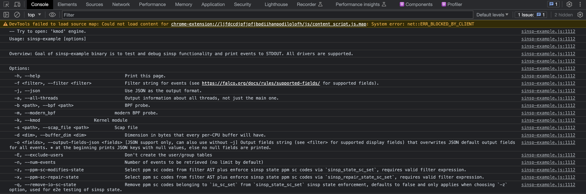

Alright, it's week 2 and I've got some updates. This week I learnt the different nuances and difficulties that comes while trying to compile a project for a new
target. In my case it was WebAssemebly. 

Parts of Falco, which will be used for the web application is completely written in C and C++. So, we'll be using the [emscripten](https://emscripten.org/) toolchain to compile the C/C++ code into wasm.

# Compiling Falco to Wasm 😱
So, Falco's core logic is inside the [libs](https://github.com/falcosecurity/libs) repository.


We need to filter out libraries that won't be used and can't be compiled to wasm i.e kubernetes, grpc etc. There were a lot of modifications done, most of which are pre-processor checks for emscripten. Emscripten provies tools like `emcmake` and `emmake` to work with projects that are integrated using `cmake` build system. After that we wrote a github workflow that can sucessfully compile libs to wasm. It looks something like this. 

```
 build-libs-emscripten:
    name: build-libs-emscripten 
    runs-on: ubuntu-latest
    steps:
      - name: Install deps 
        run: |
          sudo apt update
          sudo apt install -y --no-install-recommends ca-certificates cmake build-essential clang-14 llvm-14 git pkg-config autoconf automake libtool libelf-dev libcap-dev linux-headers-$(uname -r) emscripten

      - name: Checkout Libs 
        uses: actions/checkout@v3
        with:
          fetch-depth: 0

      - name: Git safe directory
        run: |
          git config --global --add safe.directory $GITHUB_WORKSPACE

      - name: Build and test 
        run: |
          mkdir -p build
          cd build && emcmake cmake -DUSE_BUNDLED_DEPS=True ../
          KERNELDIR=/lib/modules/$(ls /lib/modules)/build emmake make run-unit-tests -j4
```

You can find more information about the PR [here](https://github.com/falcosecurity/libs/pull/1156).

# Testing the shiny new Wasm build 😎

During the final steps of compilation, the c++ exceutable will be converted to a `.js` file with a `.wasm` file linked to it. I loaded the wasm module with the help of a fancy react hook provied by my mentor, [Jason](https://github.com/jasondellaluce) and to my suprise! it worked without any additional configurations. 

<br><a target="_blank" href="images/sinsp-example-output.png">
  
  </img>
</a><br><br>

The above image contains the `help` funtion of a `CLI` interface. This is a simple `std::cout<<` statement that logs the entire string into the console.  

# Conclutions

Overall, This week was super productive and  informative for me. For the next week, I'm looking into adding `parsers` for the syscalls that I added previous week. Also we'll be supporting `wasm` build for Falco's main repository, which looks very exciting!   