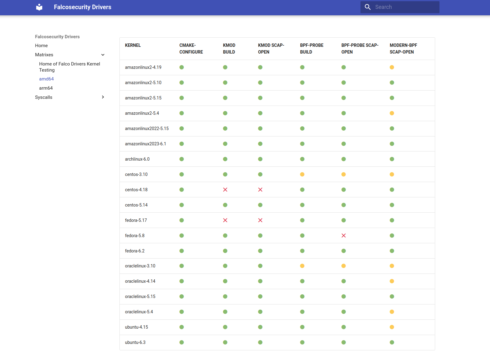

There are a few foundational technologies that empower the Cloud Native ecosystem. Containers is one. And one of the basis for containerization is the Linux Kernel itself. With Falco, we are developing a runtime security tool that hooks directly in the kernel to collect information about the system and notifies about malicious behavior.  
We have found the need to validate our drivers against various versions of the Linux kernel, to properly ensure that with each iteration of our drivers, supported kernels remained unaffected.  
To elaborate, we lacked a means to guarantee that a new driver release could:

* Successfully compile on multiple kernel versions.
* Pass the eBPF verifier when executed on various kernel versions.
* Operate as expected, such as retrieving kernel events, across multiple kernel versions.

To address this issue, we started a major intervention. Initially, a [proposal](https://github.com/falcosecurity/libs/blob/master/proposals/20230530-driver-kernel-testing-framework.md) was discussed and incorporated into the libs repository.

Since this was a pretty novel area, there were no pre-existing tools available to tackle it. Consequently, we embarked on the development of a completely new framework.  
Allow us to introduce you to the `kernel testing framework`.

### Components of a kernel testing framework

Considering the inherent characteristics of the challenge, we need to set up a complete virtual machine for each distinct kernel version.  
These tests should be executed automatically each time new code is integrated into our drivers, serving as a means to promptly identify any issue or flaw in the tested kernel versions.  
With these objectives in mind, our approach should fulfill the following requirements:

* Rapid and cost-effective VM creation: the process of creating these virtual machines should be efficient and budget-friendly.
* Effortless distribution of VM images: we should ensure easy sharing and deployment of the virtual machine images.
* Parallel execution of tests on multiple VMs: tests should run concurrently on each virtual machine to expedite the process.
* Reproducibility in local environments for debugging purposes: developers should be able to replicate the test environment locally to investigate and troubleshoot issues.
* Straightforward and user-friendly presentation of the test results: they should be presented in a simple and intuitive manner to immediately spot failures.

#### Ignite a Firecracker microVM

[Weave Ignite](https://https://github.com/weaveworks/ignite) is used to provision the [firecracker](https://github.com/firecracker-microvm/firecracker) microVMs. Weave Ignite is an open-source tool designed for lightweight and fast virtual machine management. It enables users to effortlessly create and manage virtual machines (VMs) for various purposes, such as development, testing, and experimentation. 
One of the main reasons why we chose to use this tool was its capability to create firecracker microVMs from kernels and rootfs packed as OCI images.
Currently, we are using a patched version located at [a forked repository](https://github.com/therealbobo/ignite). These patches were essential to enable the booting of kernels that necessitated the use of an initrd (initial ramdisk).

#### Kernel & Rootfs OCI images

Virtual machines consist of two essential layers: the kernel and the rootfs. These layers are packaged and distributed as OCI (Open Container Initiative) images. The kernel image encompasses the kernel that the virtual machine relies on, in contrast the rootfs image serves as the fundamental building block of a virtual machine, offering the essential filesystem necessary for booting the VM. Typically, these rootfs images incorporate a Linux distribution. 
For more info on how we build them please check the available [images documentation](https://github.com/falcosecurity/kernel-testing/tree/main/images).

#### Ansible Playbooks

Automation is accomplished through the utilization of [Ansible](https://docs.ansible.com/ansible/latest/index.html). A collection of [playbooks](https://github.com/falcosecurity/kernel-testing/tree/main/ansible-playbooks) is responsible for:

* Orchestrating the provisioning of microVMs.
* Configuring the machines.
* Retrieving the code to be tested.
* Eliminating the microVMs once the testing process is completed.

#### Presenting test results

We wanted the test data to be publicly and easily accessible by anyone, thus we had to find a way to represent the test output.  
Since there are 3 possible ways of instrumenting the kernel, that are using a kernel module or one of the available eBPF probes, the playbooks perform up to 3 tests. Taking into account that the modern eBPF probe is built in the Falco libraries, only 2 drivers need to be compiled.
We have 3 possible results for each of them:
* success, when the test goes fine
* error, when the test fails
* skipped, when the test is not runnable for the kernel (for example, skipping modern eBPF tests where it is unsupported)

The natural way of dealing with all of this was to develop a [small tool](https://github.com/falcosecurity/kernel-testing/tree/main/matrix_gen) that, given as input the output root folder, would generate a markdown matrix with the results.  

While scrutinizing the first version of the markdown matrix, we understood that it would have been even better if errors were also attached to the markdown, allowing for a more streamlined visualization of the results.  
This is the format we settled with; it can be found [at libs github pages](https://falcosecurity.github.io/libs/matrix_X64/):  



### How we use it

We implemented a new Github action workflow in the libs repository that triggers on pushes to master, using an x86_64 and an aarch64 nodes with virtualization capabilities provided by the CNCF.  
The [workflow](https://github.com/falcosecurity/libs/blob/master/.github/workflows/kernel_tests.yaml) itself is very simple since it runs the testing framework on self-hosted nodes just like you would run it locally:
```yaml=
jobs:
  test-kernels:
    strategy:
      fail-fast: false
      matrix:
        architecture: [X64, ARM64] # We use a matrix to run our job on both supported arch
    # Since github actions do not support arm64 runners and they do not offer virtualization capabilities, we need to use self hosted nodes. 
    runs-on: [ "self-hosted", "linux", "${{matrix.architecture}}" ] 
    steps:
      # We clone the kernel-testing repo, generate vars.yaml (ie: input options for the kernel-testing run) 
      # and run needed ansible playbooks one by one, directly on each node.
      - name: Checkout
        uses: actions/checkout@v3
        with:
          repository: falcosecurity/kernel-testing
          ref: v0.2.3
        
      - name: Generate vars yaml
        working-directory: ./ansible-playbooks
        run: |
          LIBS_V=${{ github.event.inputs.libsversion }}
          LIBS_VERSION=${LIBS_V:-${{ github.ref_name }}}
          cat > vars.yml <<EOF
          run_id: "id-${{ github.run_id }}"
          output_dir: "~/ansible_output_${{ github.run_id }}"
          repos:
            libs: {name: "falcosecurity-libs", repo: "https://github.com/falcosecurity/libs.git", version: "$LIBS_VERSION"}
          EOF
    
      - name: Bootstrap VMs
        working-directory: ./ansible-playbooks
        run: |
          ansible-playbook bootstrap.yml --extra-vars "@vars.yml"
      
      - name: Common setup
        working-directory: ./ansible-playbooks
        run: |
          ansible-playbook common.yml --extra-vars "@vars.yml"

      - name: Prepare github repos
        working-directory: ./ansible-playbooks
        run: |
          ansible-playbook git-repos.yml --extra-vars "@vars.yml"
      
      - name: Run scap-open tests
        working-directory: ./ansible-playbooks
        run: |
          ansible-playbook scap-open.yml --extra-vars "@vars.yml" || :
      
      # Once test finished, we collect its output folder and upload it to the github workflow space
      - name: Tar output files
        run: |
          tar -cvf ansible_output.tar ~/ansible_output_${{ github.run_id }}

      - uses: actions/upload-artifact@v3
        with:
          name: ansible_output_${{matrix.architecture}}
          path: ansible_output.tar
    
      # We then build the matrix and upload them too
      - name: Build matrix_gen
        working-directory: ./matrix_gen
        env:
          GOPATH: /root/go
          GOCACHE: /root/.cache/go-build
        run: |
          go build .
        
      - name: Generate new matrix
        working-directory: ./matrix_gen
        run: |
          ./matrix_gen --root-folder ~/ansible_output_${{ github.run_id }} --output-file matrix_${{matrix.architecture}}.md
        
      - uses: actions/upload-artifact@v3
        with:
          name: matrix_${{matrix.architecture}}
          path: ./matrix_gen/matrix_${{matrix.architecture}}.md
      
      # Always run the cleanup playbook to avoid leaving garbage on the nodes
      - name: Cleanup
        if: always()
        working-directory: ./ansible-playbooks
        run: |
          ansible-playbook clean-up.yml --extra-vars "@vars.yml" || :
```

In the `Generate new matrix` step, the kernel matrix gets generated and then uploaded.  
Once this workflow runs successfully for both architectures, another [workflow](https://github.com/falcosecurity/libs/blob/master/.github/workflows/pages.yml) gets triggered,  
that is responsible for generating and pushing updated Github pages.  
The end result can be seen at https://falcosecurity.github.io/libs/matrix/.

Moreover, the kernel-testing workflow gets also triggered on each driver's tag; then a [supplementary workflow](https://github.com/falcosecurity/libs/blob/master/.github/workflows/release-body.yml) takes care of attaching matrixes to the release body;  
here is an example: https://github.com/falcosecurity/libs/releases/tag/6.0.0%2Bdriver.

Pretty nice, uh?

### What's next for the framework

There are quite a few gaps that still need to be addressed by our framework. First of all, the images being used by Ignite to spawn FireCracker VMs are still under a development Docker repository and need to be moved under Falcosecurity.  
Moreover, we need to implement a CI to automatically build and push those images.  

As previously said, the kernel tests are currently running [`scap-open`](https://github.com/falcosecurity/libs/tree/master/userspace/libscap/examples/01-open) binary to check whether any event gets received. It is a small libscap C example that loads a driver and waits for events, nothing more.  
It would be great to run [drivers tests](https://github.com/falcosecurity/libs/tree/master/test/drivers) instead, to fully test the expected behavior of the drivers.  

Finally, an utopian idea: imagine if we were able to run [`kernel-crawler`](https://github.com/falcosecurity/kernel-crawler) to fetch kernel images, and then **automatically** build new kernel testing matrix entries for newly discovered images.  
This would mean that our kernel testing matrix coverage increases steadily week after week, giving users even more guarantees about the stability of the Falco drivers!

Here is the libs tracking issue: https://github.com/falcosecurity/libs/issues/1224.  

We would love to hear back from you! If you try out the framework and find any issues, please file them at https://github.com/falcosecurity/kernel-testing/issues. If you want to help us to improve, please join our Slack, and feel free to open a Pull Request!
