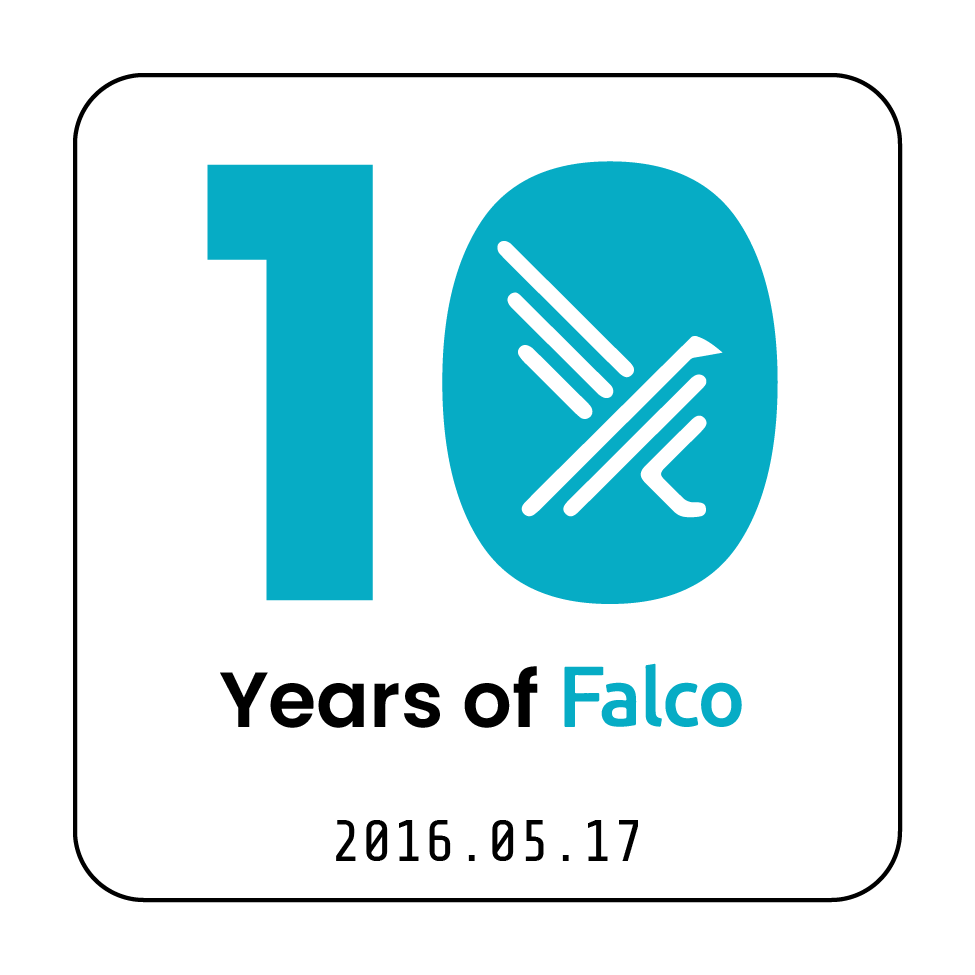

We're excited to share that the Falco community will be at **KubeCon + CloudNativeCon Europe 2026** in Amsterdam! Whether you're a long-time contributor, a curious user, or just want to say hi, we'd love to see you there.

Falco is celebrating **10 years** of development and adoption, and we are on the lookout for people who would like to say Happy Birthday to the project or share their best Falco story. Libby Schulze and I will be on the event floor with mic and camera to capture some amazing moments and memories from Falco's 10 years. So bring your best story, and we'll see you at the Falco booth!

Here’s where you can find us in Amsterdam and everything we have lined up.

## Project lightning talk

[**Forensics With Falco**](https://kccnceu2026.sched.com/event/2EFx1/project-lightning-talk-forensics-with-falco-gerald-combs-maintainer)  
**Speaker:** Gerald Combs, Maintainer  
**When:** Monday, March 23, 2026 — 10:27 to 10:32 CET  
**Where:** Elicium 2  

Falco has recently expanded its capabilities with capture recording, opening the door to seamless integration with forensic analysis tools like Stratoshark. In this lightning talk, Gerald will walk through how the two tools work together to provide deep visibility into container and system activity. He will demonstrate how captured event data can accelerate investigations and discuss key considerations for safely and efficiently deploying these features in production environments.

## Sysdig-led workshop

[**Hands-On Cloud Native Security Workshop**](https://sysdig.pathfactory.com/kceu26-falco-workshop/)  
**When:** Monday, March 23 — 2:00–4:00 PM CET  

Run Atomic Red Team™ tests, then step into the Blue Team role to detect threats and create custom Falco™ detection rules in this hands‑on 90‑minute keyboard workshop.

## Conference talk

[**In Falco's Nest: The Evolution of Cloud Native Runtime Security**](https://kccnceu2026.sched.com/event/2EF6W/in-falcos-nest-the-evolution-of-cloud-native-runtime-security-iacopo-rozzo-sysdig-aldo-lacuku-kong-inc)  
**Speakers:** Iacopo Rozzo (Sysdig), Aldo Lacuku (Kong Inc.)  
**When:** Tuesday, March 24, 2026 — 12:00 to 12:30 CET  
**Where:** G102–103  

Falco, the Cloud Native Runtime Security project, is constantly evolving to meet the demands of modern cloud environments. This maintainer track session, led by the Falco maintainers, will dive deep into the latest advancements and the strategic direction of the project. We will focus on two major areas of growth: the introduction of the new Falco Operator and the new features that enhance Falco's performance and reliability.

The new Falco Operator simplifies the deployment, configuration, and management of Falco across Kubernetes clusters, making it easier than ever for users to secure their runtime environments at scale.

Furthermore, we will explore the most significant new features integrated into Falco. This includes performance optimizations for high-throughput environments. The session will also touch upon community contributions, ecosystem integrations, and the roadmap for the upcoming release.

## Booth demo

**Pivoting from detection to investigation with Falco and Stratoshark**  
**Speaker:** Gerald Combs  
**When:** Tuesday, March 24, 2026 — 15:45 CET  
**Where:** Sysdig Booth #671  

See how to move from “we detected something” to “here’s what happened” using Falco and Stratoshark. Stop by the Sysdig booth and say hello!

## Thank you!

We couldn’t do this without you all in our community - the contributors, users, and everyone who shows up at events. If you’re in Amsterdam, come find us at the talks, the workshop, or the booth. We’d love to meet you and hear how you’re using Falco.

See you there! 🐦
