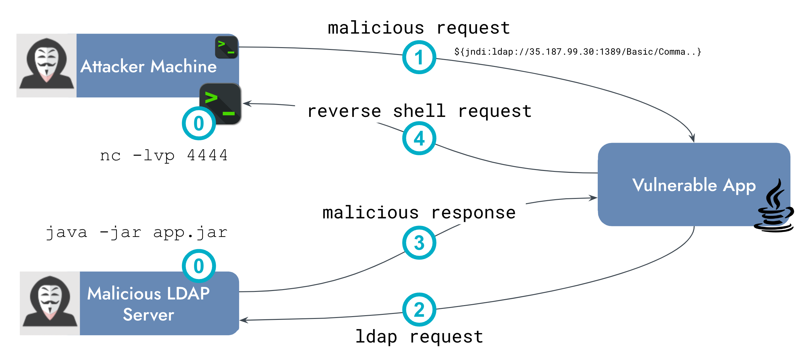

[Detecting Cloud Runtime Threats with Falco (LFS254)](https://training.linuxfoundation.org/training/detecting-cloud-runtime-threats-with-falco-lfs254/) is the new Falco training course created by CNCF, Linux Foundation, and Sysdig. We're very excited about this new immersive course designed to enhance your expertise in securing cloud-native applications through hands-on learning.

Detecting Cloud Runtime Threats with Falco (LFS254) is a 20-hour course focused on runtime security. It covers what is runtime security and how Falco is a powerful tool designed to detect anomalous activity in applications. From Falco's history and design principles to its architecture, to how it addresses cloud security challenges.

This course is designed for IT professionals, security analysts, DevOps engineers, and anyone interested in cloud security.

### Why?

In a rapidly evolving digital landscape with a surge in cloud adoption, the importance of comprehending and deploying robust security solutions, such as Falco, cannot be overstated. Regrettably, cloud-native technologies, particularly cloud-native security, are relatively novel, and there exists a gap in knowledge and expertise for addressing these emerging challenges. Our mission is to bridge this knowledge gap and empower individuals to tackle cloud and container security complexities effectively. Through accessible training, we aspire to contribute to narrowing the talent deficit in these pivotal domains.

### How?

In this course, you'll embark on a journey of securing cloud-native environments. The course breaks down complex concepts, making them accessible and actionable. Its self-paced nature provides the flexibility to learn at your own rhythm, accommodating your personal and professional commitments. This structure allows you to digest intricate concepts and apply them bit by bit, ensuring a deeper and more lasting comprehension.

#### Course Structure

The course begins with an introduction to Falco, encompassing its history, design principles, and its broader role in cloud security. It then delves into the core components of Falco, explaining its architectural design and walking you through the setup and operation of Falco. Moving forward, the course explores the significance of the system call data source in host security, offering insights into the nature of system calls, observation techniques, and best practices for efficient data collection. It further showcases Falco's versatility by examining its utilization of diverse data sources such as Github, Cloudtrail, and Kubernetes Audit logs through its Plugin Framework.

The course also thoroughly covers conditions and fields, delving into the realm of Falco default rules and their integration with security frameworks. It then provides comprehensive guidance on customizing Falco rules to align with specific requirements. The course also addresses Falco outputs and introduces Falcosidekick as a valuable output management and customization tool.

Finally, the course guides you through Falco's configuration process and fine-tuning strategies. It concludes by streamlining the process of writing new Falco rules, presenting a development methodology, along with key considerations to bear in mind when crafting rules.

#### Sneek Peek

In one of the course exercises, we explain the Log4j vulnerability and the Log4Shell exploit. We detail each step of the attack, allowing you to simulate it in the lab environment.

 <a target="_blank" href="images/new-cncf-lf-training-log4shell-attack-diagram.png">
  
  </img>
</a>  

Then, we walk you through how to write a new rule to detect this type of attack in Falco.

### Enrol Now

Ready to embark on this transformative journey? Visit [the course page](https://training.linuxfoundation.org/training/detecting-cloud-runtime-threats-with-falco-lfs254/) to enroll and step into the world of cloud-native security mastery with Falco.
