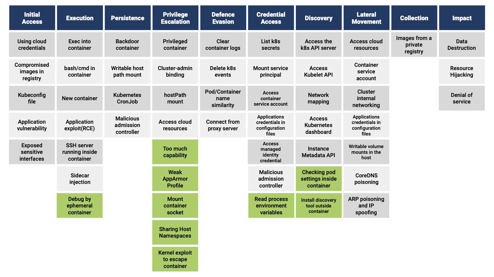

I’m Hiroki Akamatsu ([@hi120ki](https://twitter.com/hi120ki)), an intern on [Mercari](https://about.mercari.com/en/)’s [Security Engineering Team](https://mercan.mercari.com/en/articles/35855/). During my internship, I worked on the re-evaluation of [Falco](https://github.com/falcosecurity/falco), runtime security monitoring tools for Kubernetes.

This article presents the following findings from the evaluation.

- Findings of attack methods missing from the [Threat matrix for Kubernetes](https://www.microsoft.com/security/blog/2021/03/23/secure-containerized-environments-with-updated-threat-matrix-for-kubernetes/) published by Microsoft.
- Contribution to the attack detection rules in Falco
- Understanding Falco detection evasion methods and countermeasures
- Understanding the Effectiveness and Limitations of Falco Attack Detection

## Introduction to Falco, Falco, and scope of tasks

Falco is an open source software that collects system calls (syscalls) executed by the kernel module or eBPF and detects attacks according to predefined rules.
Rules managed as open source are published in the [Falco repository](https://github.com/falcosecurity/falco/blob/master/rules/falco_rules.yaml) on GitHub, and can detect access to critical files, suspicious program execution, and network access based on these rules.

Falco collects syscalls on the kernel, so it can collect activities executed by processes on containers. Therefore, it is known as a tool to detect attacks on containers and Kubernetes.

Mercari runs many of its services on Kubernetes (Google Kubernetes Engine) and has been using Falco since 2020 to detect attacks on Kubernetes clusters and record traces of the attacks. At the time of implementation in 2020, Hiroki Suezawa([@rung](https://twitter.com/rung)) performed threat modeling and compared its functionality with other tools before adopting it.
It has been two years since then, more Kubernetes security threat information is available, and new rules have been added to Falco. Therefore, we conducted threat modeling again to evaluate new open source Falco rules. We then created new rules to detect attack methods that are not covered by the existing rules found during our threat modeling, and implemented and verified these new rules in the production environment.

## Threat modeling for Kubernetes clusters

Threat modeling is the process of identifying security threats to a system and is often performed when designing a system. In this case, however, we focused on a Kubernetes cluster that is already in operation and how an attacker intrudes and gains a foothold to attack the Kubernetes cluster.
Threat modeling for Kubernetes clusters is based on the [Threat matrix for Kubernetes](https://www.microsoft.com/security/blog/2021/03/23/secure-containerized-environments-with-updated-threat-matrix-for-kubernetes/) published by Microsoft. The Threat matrix is a list of attack methods from [MITRE ATT&CK](https://attack.mitre.org/), a collection of cyber-attack methods, that are applicable to Kubernetes. It describes the attacker’s actions in the attack lifecycle of a Kubernetes cluster, starting with Initial Access, followed by Execution, Privilege Escalation, Credential Access, Discovery, and Lateral Movement.
In the threat modeling, we have supplemented the attack techniques that were missing in Microsoft’s [Threat matrix for Kubernetes](https://www.microsoft.com/security/blog/2021/03/23/secure-containerized-environments-with-updated-threat-matrix-for-kubernetes/) by referring to MITRE ATT&CK’s [Containers Matrix](https://attack.mitre.org/matrices/enterprise/containers/) and other sources as appropriate. For example, we have added the following additional attack methods: checking privileges after an intrusion, mounting a Container socket, adding Capability, which is a potential Container Escape risk, and executing a Container Escape Exploit.

The Threat matrix created by threat modeling based on the above looks like this.



The attack techniques marked in green have been added to the [Threat matrix for Kubernetes](https://www.microsoft.com/security/blog/2021/03/23/secure-containerized-environments-with-updated-threat-matrix-for-kubernetes/) by us and are detailed below.

- Execution
  - Debug by ephemeral container: If the attacker has access to Kubernetes, the new `kubectl debug` in addition to the existing `kubectl exec` allows arbitrary code execution in the container via an Ephemeral container.
- Privilege Escalation
  - Too many capabilities: The risk of container escaping is increased by granting a specific Capability to the container, such as CAP_SYS_ADMIN. If a container is escaped, An Attacker can perform operations on the host.
  - Weak AppArmorProfile: Disabling the AppArmor profile, which restricts behavior inside containers, increases the risk of container escapes. A container escape allows an Attacker to perform operations on the host directly.
  - Mount container socket: Mounting a Socket with access to the container runtime allows you to manipulate other containers and the host from inside the container
  - Sharing Host Namespace: Sharing Host Namespaces such as Host Network and Host PIDs leads to privilege escalation from inside the container.
  - Kernel exploit to escape container: Container escape through attack code exploiting kernel vulnerability, allowing operation on the host.
- Credential Access
  - Read process environment variables: If environment variables are leaked, various credentials like Cloud Secret Access Key and configuration values may be stolen making it possible to access other resources.
- Discovery
  - Checking pod settings inside container: Determine what permissions are granted to the container by examining the internal file system, etc.
  - Install discovery tool outside container: Network scanning tools and other tools installed from the outside can lead to an investigation of the Kubernetes environment for infiltration escalation.

We also implemented attack code for each specific technique. We then compiled a spreadsheet containing the attack methods, the implementation, and other references so that anyone could reproduce and verify them simply by looking at the Threat matrix and the spreadsheet.

We aimed to cover all attack methods by conducting threat modeling and creating a threat matrix. One important thing to note is that an attacker would be using a combination of these attacks rather than just one; for example, they might attack via Initial Access, Execution, and Privilege Escalation methods to spread their attacks.
Thus, in updating Falco’s attack detection rules (described in the next chapter), we aimed to create a set of rules that would allow us to detect each phase of such an attack.

## Updating Falco’s Attack Detection Rules

For our verification purposes, We executed each attack in the threat matrix on a Kubernetes cluster and checked whether Falco could detect each of them. Based on the results, we created new rules for Falco and patched the existing rules where necessary.

An example of a new rule we created was a detection rule for the “Read process environment variables” technique that we added to the Threat matrix. This rule detects when processes read from `/proc/self/environ` and `/proc/1/environ` files; both files are accessed when reading the environment variables via SSRF or Path traversal vulnerabilities.
In many cases environment variables store important information such as credentials for accessing other resources and application configuration values.
In addition to the above, Linux provides files under /proc that allows programs to obtain various interface information. Particularly, it provides files in the form of `/proc/[pid]/environ` that allows programs to obtain the contents of environment variables for a specific process, specified by a pid.

For example, let us assume that a Pod was created with an environment variable containing some credential information using the manifest below.

```yaml
kind: Pod
apiVersion: v1
spec:
  containers:
    - name: ssrf-poc
      env:
      - name: MY_SECRET
        value: 8c2886dca39e7b692cb378e704072ad4
```

If the attacker is able to read the contents of `/proc/self/environ` (note: here “self” is used instead of a pid to specify the environment variable for the current process), the confidential information MY_SECRET set in the Pod can easily be stolen.

```
KUBERNETES_PORT=tcp://10.24.0.1:443
KUBERNETES_SERVICE_PORT=443
...
MY_SECRET=8c2886dca39e7b692cb378e704072ad4
```

This rule should be useful in many environments, and so we have created a Pull Request to the Falco repository, which they have since merged. ([Add new rule that detect retrieving environment variables from /proc files #2193 – Falcosecurity/Falco](https://github.com/falcosecurity/falco/pull/2193))

In addition, we created 8 other Pull Requests to fix bugs in the existing rules or to make them more robust. while working closely with the Falco team as we communicated.

## Falco detection evasion via symbolic links, and countermeasures

We also investigated methods to evade Falco’s detection during our research on threat models and detection rules.
In particular, I paid attention to the file path detection evasion method using `/proc/self/root` in Symbolic link files introduced in Kohei Morita([@mrtc0](https://twitter.com/mrtc0))’s article "[How to Bypass Falco](https://blog.ssrf.in/post/how-to-bypass-falco/)".

When you perform an operation on a file in Linux, the openat system call is executed to open that file. The second argument to the openat system call contains a file path. For example, `cat /etc/shadow` command will invoke the following openat system call.

```
openat(AT_FDCWD, name=/etc/shadow, flags=1(O_RDONLY))
```

Falco can detect these system calls and also provides users with the filename being accessed. In the above example, the filename `/etc/shadow` will be stored in a variable named `fd.name`. Falco’s detection rules may use this to analyze the action and possibly raise a flag. For example, the “Read sensitive file trusted after startup” rule uses this `fd.name` variable to detect access to files containing potentially sensitive data.
However, one thing to note is that Falco tries to provide `fd.name` as an absolute path, which means that it will try to logically resolve relative path specifications such as `.` and `...` For example, a path like `/var/spool/cron/crontabs/../shadow` will be resolved to `/var/spool/cron/shadow` which is then made available in the `fd.name` variable by Falco.

At this point we must consider the existence of symbolic links. A symbolic link is a link that points to another path. For example, in Ubuntu, `/proc/self/root/` is a symbolic link to `/` (the root directory), therefore it is possible to specify the file `/etc/shadow` as `/proc/self/root/etc/shadow`: they will point to the exact same file. To find out the list of symbolic links on your system, you can execute the following command, and you will be presented with the list of available symbolic links.

```
# find / -type l -xtype d -ls 2> /dev/null
  1554024 0 lrwxrwxrwx 1 root root 9 Aug 15 11:50 /lib64 -> usr/lib64
       12 0 lrwxrwxrwx 1 root root root 13 Sep 15 04:36 /dev/fd -> /proc/self/fd
```

For our purposes, we are interested in symbolic links that point to certain “interesting” directories:

```
/proc/self/root -> /
/proc/self/cwd -> (process dir)
/dev/fd -> /proc/self/fd
/var/spool/cron/crontabs -> /etc/crontabs
/var/spool/mail -> /var/mail
```

Note that in the above example `/var/spool/cron/crontabs` actually points to `/etc/crontabs`. With this knowledge in mind, you might realize that the path `/var/spool/cron/crontabs/../shadow` actually points to `/etc/crontabs/../shadow`, which in turn resolves to `/etc/shadow`, as can also be seen in the following table.

| Arguments of the openat system call | Falco’s fd.name | Actual file path to be accessed |
| - | - | - |
| /var/spool/cron/crontabs/ | /var/spool/cron/crontabs/ | /etc/crontabs |
| /var/spool/cron/crontabs/../ | /var/spool/cron/ | /etc/ |
| /var/spool/cron/crontabs/../shadow | /var/spool/cron/shadow| /etc/shadow |

However, when Falco reports on the cat `/var/spool/cron/crontabs/../shadow` command being executed, Falco only resolves the file path of the argument of the openat system call to `/var/spool/cron/shadow` and passes it to `fd.name`, without resolving the symbolic link. When an attacker uses this method, they can evade the “Read sensitive file trusted after startup”, as `fd.name` must match `/etc/shadow` exactly.

Using the same method we were also able to evade our newly proposed rule to detect reads against `/proc/self/environ`, by utilizing the fact that `/dev/fd` is a symbolic link to `/proc/self/fd` and specifying `/dev/fd/../environ/` instead.

We have proposed to Falco a temporary solution to this problem as follows: First, as a temporary measure, we sent a Pull Request ([Add rule to detect bypass by symlink files #2202](https://github.com/falcosecurity/falco/pull/2202)) for a new rule to detect the use of directory traversal via symbolic links for specific links pointing to sensitive directories, which are present by default in widely used Docker images. However, this rule alone does not work for newly introduced or previously unknown symbolic links are used, especially when they come from other container images or are created by packages that the users installed. To solve this problem we have created a new issue to discuss Symbolic link paths in the generation of fd.name. This is still under continuous discussion under the Issue ([Discuss about fundamental solution of detecting symlink file based bypass method #2203](https://github.com/falcosecurity/falco/pull/2202)).

## Limitations of attack detection by Falco and what to expect in the future

In this section, we will introduce our perceived effectiveness and limitations of Falco during our work, including the deployment of detection rules to Mercari’s actual production environment.
As mentioned at the introduction, Falco collects executed syscalls and detects them according to predefined rules.
This detection technique is very effective for attacks that always execute a specific syscall. For example, attacks that require access to specific well-known files or attacks that must access descriptors to make external communications are prime candidates However, this technique falls short when trying to detect following types of attacks.

- Attacks that are completed within the application layer (i.e. no syscalls are made)
- Attacks that use a combination of multiple syscalls, and thus cannot be identified by a single syscall
For attacks such as SQL injection that are completed within the application layer, it requires a fundamentally separate approach than syscall-based detection.

For attacks using multiple syscalls, while Falco is currently only capable of detecting single syscall-based attacks, we are hoping to see improvements to Flaco’s functionality that allows it to identify these attacks in the future. We also believe that Falco will benefit greatly if they can decrease the amount of false positives. Currently Falco detection has a high rate of false positives, and If Falco can reduce these by only raising alerts when a combination of multiple high-risk behaviors are identified, it should increase Falco’s usability even more.

Finally, we would very much like to see a way to prune multiple identical alerts. For example, when a Pod that contains a potential vulnerability is deployed at scale, we would be overwhelmed by the same alerts. At Mercari we have developed a mechanism to first intercept these alerts within a common monitoring platform, which then consolidates them before sending the alerts to responsible staff. It would be nice if a similar feature were to be implemented upstream.

## Final words

I would like to thank Hiroki Suezawa ([@rung](https://twitter.com/rung)) for his mentorship, the Falco team for responding to Pull Requests and Issues, and external experts such as Chihiro Hasegawa, Kohei Morita([@mrtc0](https://twitter.com/mrtc0)), and everyone who supported my internship.

---

*This article is cross-posted from [Mercari Engineering Blog](https://engineering.mercari.com/en/blog/entry/20220928-kubernetes-threat-matrix-and-attack-detection-by-falco/).*
