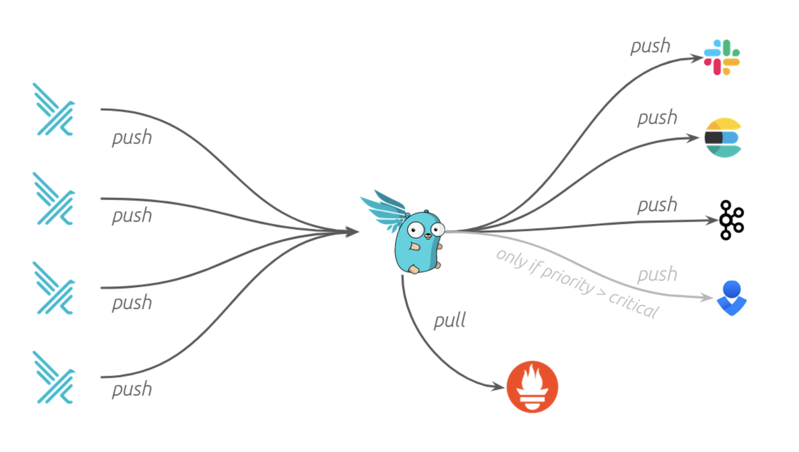

If you’re looking to integrate runtime security into your existing environment, [Falco](https://falco.org) is an obvious choice. Falco is a Cloud Native Computing Foundation backed open source project that provides real-time threat detection for cloud, container, and Kubernetes workloads. With over 80 million downloads Falco has been adopted by some of the largest companies in the world. 

However, what many Falco users discover early on is that Falco’s default event output is rather limited. Out of the box, Falco can only send output to five different endpoints: syslog, stdout, stderr, and gRPC or HTTPS endpoints. 

While these outputs might be enough to get you started, most practitioners want to integrate Falco with the tooling they already use. This is where [Falcosidekick](https://github.com/falcosecurity/falcosidekick) comes in. 

Falcosidekick is a companion (i.e. a side-kick ;)) project for Falco that allows Falco events to be forwarded to 60 different services (with more being added all the time) allowing practitioners to monitor and react to Falco events with the tools they are already using. 

For example, if you’d like to receive immediate notifications of suspicious activity you can forward Falco events to chat programs such as Slack or Telegram, alerting platforms like PagerDuty or AlertManager, or, of course, email. In order to minimize noise, you can expressly set the level on which to notify, for example, warning-level events might be delivered via email, while critical or higher-level events are sent via chat or directed to your alerting platform. 

If you want to programmatically address certain events, Falcosidekick integrates with a bunch of different services including functions as a service platforms like AWS Lambda, GCP Cloud Run and Cloud Functions, or Knative. Alerts can also be sent to message queues like Amazon SNS, Apache Kafka, or RabbitMQ. These integrations offer almost endless possibilities for building out response systems for events. 

For instance, let’s say you’re running Falco on your Kubernetes cluster, and Falco discovers that someone ran a program that wasn’t part of a container’s base image. In this case, you might choose to have Falcosidekick send that event over to AWS Lambda. Lambda would receive the alert and execute a function to apply a label to the pod that houses the suspect container resulting in the pod being taken out of service and a new one spawned to replace it.

Falcosidekick can also send events to traditional monitoring and logging platforms such as Elasticsearch, Prometheus, Grafana, or Datadog (and many many others). These platforms can be used to aggregate and process alerts en masse so you can spot trends or anomalies. 

In addition to looking at the actual Falco events, Falcosidekick also provides metrics on its own performance. There are also service endpoints to check if Falscosidekick is running and its general health. 

Falcosidkick features its own web-based user interface to get a quick view into your Falco environment. This UI offers reporting on Falcosidick’s performance metrics as well as a feed for events reported by the connected Falco instances.

If you want to archive Falco events, Falcosidekick can send them to Redis or various object storage services like AWS S3 or Google Cloud Storage. 

Falcosidekick runs as a daemon and can be easily installed via multiple mechanisms including as a Docker container, or via Helm. With Helm, you can either install Falcosidekick when you install Falco or add it to your environment later. From an architectural standpoint, Sidekick is deployed to two pods to help ensure high availability and a single Sidekick instance can receive events from multiple Falco environments. 

With so many different options, Falcosidekick opens up a myriad of possibilities for integrating Falco’s runtime security capabilities into your existing tooling. If you’d like to try Falcosidekick yourself, check out [Thomas’ blog post](https://falco.org/blog/extend-falco-outputs-with-falcosidekick/) which covers how to integrate Falcosidekick with Slack. And, if you’d like to get involved with Falco or Falcosidekick come chat with us over on the #Falco channel in the [Kubernetes](https://kubernetes.slack.com) Slack or check out the [Github repos](https://github.com/falcosecurity).
