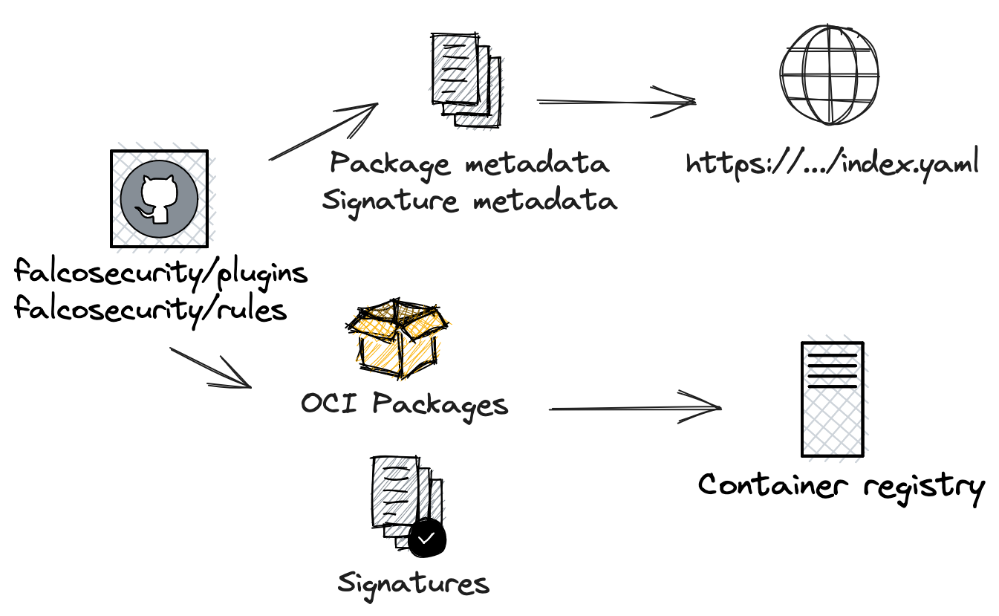
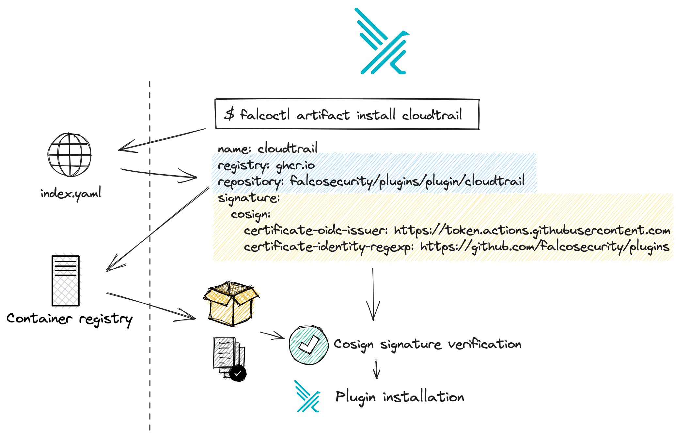

## Falco v0.36.0 and the Software Supply Chain (SSC) security

The latest stable Falco release, v0.36.0, alongside falcoctl 0.6.1 and the 0.7.0 Helm chart introduced new features and improvements to the security of Falco's software supply chain artifacts. Falco's two main downloadable artifacts are plugins and rule sets. They're shipped in the OCI specification format and distributed through the official Falcosecurity OCI repositories.

Software supply chain attacks aim at injecting malicious code into software components, to compromise downstream users. These types of attacks are among the primary threats in today's threat landscape.

In particular, attackers abuse trust relationships existing between the different open-source stakeholders. The increase in attacks on open-source software throughout the last few years demonstrates that attackers consider them a viable means for spreading malware.

## SSC safeguards

Securing the software supply chain may seem daunting at first glance, but there are a lot of safeguards that can be put in action. And there are ways to categorize them, and ways to prioritize them.

Safeguards against supply chain attacks can be classified by control type: directive, preventive, detective, corrective, and recovery. But there ain't no such thing as a free lunch. Besides safeguard classifications, the utility-to-cost ratio can also be an important factor in deciding where to start in improving the supply chain security of software, and can be pretty easy to measure it.

There are cheap preventive safeguards that can be implemented in open source projects especially, where stakeholders platea can be pretty wide considering the contributions. For example, branch protection rules are usually simple per-code repository configurations in providers (e.g. GitHub) and alongside pull request-based flows enforcing code review quorum, are also standard best practices nowadays. The same applies to reproducible builds, dependency pinning, build steps isolation, MFA authentication to repository providers, etc.

On the other side, safeguards with a high utility value can require a considerable amount of effort to be implemented end-to-end (producer and consumer sides).

MITRE and OpenSSF increased their efforts to improve SSC security recently in general and in the open source, by providing frameworks and tools that increase the utility-to-cost ratio.
MITRE for example proposes an [end-to-end framework](https://sot.mitre.org/framework/system_of_trust.html) to preserve the integrity of the software supply chain. OpenSSF develops the [SLSA framework](https://slsa.dev/spec/v1.0/about) that groups several security best practices for open-source projects.

Moreover, the in-toto Attestation Framework defines a fixed, lightweight Statement that communicates some information about the execution of the software supply chain, such as if the source was reviewed, or if it went through a SLSA conformant build process.

Because new attacks are being introduced almost every day, It's important to be constantly evolving your SSC security tools and processes. These safeguards should be placed as early as possible in the SSC ("shift left"). Additionally, they need to be continuously maintained in order to keep pace with attacker's efforts.
 
Thanks to important projects like Sigstore's [cosign](https://github.com/sigstore/cosign), software artifact signatures are one of the SSC safeguards with a high utility-to-cost ratio. Due to these factors, the Falco Software Supply Chain Working group decided to make implementing these signatures a goal for the Falco project"

## Artifacts distributed as OCI

Since January 2023 we started distributing Falco plugins and rules as [OCI artifacts](https://github.com/opencontainers/image-spec/blob/main/manifest.md#guidelines-for-artifact-usage). If you are not familiar with the concept, think about OCI artifacts as a content-addressable unit of data that can be tagged, stored and indexed in container registries alongside your container images but can hold any type of file. You can find the source and the data for Falco's artifacts in the [plugins](https://github.com/falcosecurity/plugins) and [rules](https://github.com/falcosecurity/rules) repositories respectively. We are using GitHub Container Registry to publish them so you can find them in the "Package" section of each repository.

Packaging Falco's rules and plugins as container artifacts brings several advantages, such as:
* We can create multiple tags, both fixed and floating, for each artifact. Keeping track of the `latest` version is easy as well as the latest version for each major and minor release.
* Distribution is handled with a standard protocol implemented by many different container registries, which means that creating [your own rules registry](https://falco.org/blog/gitops-your-falco-rules/), either public or private, is easy and you can use your existing container distribution infrastructure (or any ready-to-use registry service as offered by all major cloud providers) without installing and maintaining any custom server.
* There are standard and developing mechanisms and specifications to store artifact metadata, like [link between artifacts](https://opencontainers.org/posts/blog/2023-07-07-summary-of-upcoming-changes-in-oci-image-and-distribution-specs-v-1-1/#2-new-manifest-field-for-establishing-relationships) for references to signature or Software Bill Of Materials (SBOM), so we do not need to reinvent the wheel.

In [falcoctl](https://github.com/falcosecurity/falcoctl) we have used the CNCF [ORAS](https://oras.land/) library to manage downloading and uploading artifacts to the container registry.

## Cosign keyless signing and verification

Another very interesting thing you can do with OCI artifacts is now sign them thanks to [cosign](https://github.com/sigstore/cosign)! Cosign supports a very interesting mechanism called [keyless signing](https://edu.chainguard.dev/open-source/sigstore/cosign/an-introduction-to-cosign/#keyless-signing). This allows us to perform artifact signature and verification without the need for creating, maintaining and securing long-lived and opaque signing keys.

Moreover, cosign [supports OCI v1.1](https://www.chainguard.dev/unchained/building-towards-oci-v1-1-support-in-cosign) being able to link security artifacts through OCI references when supported by the registry.

## Implementation

### Release pipelines for signed plugins and rules



Plugins and rules that we sign are packaged as OCI artifacts.

As for the diagram above, there are two distinct distribution pipelines: one is to update the general Falcoctl index and one is to distribute the single artifact, whether plugin or rule set, to the OCI registry.

#### Container registry update

At the same time, in the release pipeline, an OCI artifact [is built](https://github.com/falcosecurity/plugins/blob/81ccd91dfa2565a99f8e392d50b642aed89799e7/.github/workflows/upload-oci-artifacts.yaml#L31) with a specific [build tool](https://github.com/falcosecurity/plugins/blob/81ccd91dfa2565a99f8e392d50b642aed89799e7/build/registry/pkg/oci/oci.go#L398) for each artifact updated, and [a signature is generated](https://github.com/falcosecurity/plugins/blob/81ccd91dfa2565a99f8e392d50b642aed89799e7/.github/workflows/upload-oci-artifacts.yaml#L72) and distributed to the registry for each one. The signature is generated with the help of Cosign using the keyless mode, which leverages OIDC with GitHub as the identity provider.

> In-depth: as the pipeline is a non-interactive environment, cosign automatically uses the OIDC [device flow](https://docs.sigstore.dev/signing/overview/#identity-tokens) to verify the Github action identity token and [generates a certificate](https://docs.sigstore.dev/signing/overview/#verifying-identity-and-signing-the-artifact) as proof of the identity of the user that is signing the artifact. Cosign generates a transparency log object that contains the hash of the artifact, the previously generated certificate's public key, and the signature. This object [can be verified](https://docs.sigstore.dev/signing/overview/#verifying-the-signed-artifact) against the signature, certificate, and artifact pulled from the OCI registry.

For example, you can check with the [`cosign`](https://github.com/sigstore/cosign) CLI that a valid signature for the plugin `cloudtrail` is available:

```shell=
$ cosign tree ghcr.io/falcosecurity/plugins/plugin/cloudtrail:latest
📦 Supply Chain Security Related artifacts for an image: ghcr.io/falcosecurity/plugins/plugin/cloudtrail:latest
└── 🔐 Signatures for an image tag: ghcr.io/falcosecurity/plugins/plugin/cloudtrail:sha256-ec47c7448d455b6bb84f39d5c400c2fa207ab5fbe8c21327c6c1d06a3f1eecb4.sig
   └── 🍒 sha256:f8aae8441b2d41419ae99d4979d6eab1543d81a269e4721fdbff0d837571aa4d
```

And you can inspect with the [`oras`](https://oras.land/docs/category/oras-commands/) CLI its manifest, by taking the tag that contains the digest content identifier of the artifact signed (i.e. `ghcr.io/falcosecurity/plugins/plugin/cloudtrail:sha256-ec47c7448d455b6bb84f39d5c400c2fa207ab5fbe8c21327c6c1d06a3f1eecb4.sig`):

```json=
$ oras manifest fetch ghcr.io/falcosecurity/plugins/plugin/cloudtrail:sha256-ec47c7448d455b6bb84f39d5c400c2fa207ab5fbe8c21327c6c1d06a3f1eecb4.sig  | jq
{
  "schemaVersion": 2,
  "mediaType": "application/vnd.oci.image.manifest.v1+json",
  "config": {
    "mediaType": "application/vnd.oci.image.config.v1+json",
    "size": 242,
    "digest": "sha256:ef254edd0dd0ae2b9b6ef0471c915682c0ba31858fe45bc817a951cad715fe8d"
  },
  "layers": [
    {
      "mediaType": "application/vnd.dev.cosign.simplesigning.v1+json",
      "size": 263,
      "digest": "sha256:f8aae8441b2d41419ae99d4979d6eab1543d81a269e4721fdbff0d837571aa4d",
      "annotations": {
        "dev.cosignproject.cosign/signature": "MEUCIGvgIIu9JX5vVCZ5YHsoVe3wpVoIianJvzkCZUIClVlAAiEAyx7GZztNDzCJN5Fjg8vwq0pv7PH3TrseIXN1ou35Jmw=",
        "dev.sigstore.cosign/bundle": "{\"SignedEntryTimestamp\":\"MEYCIQDsAPhTbHc7w+LHpipbx0HSEIlmjjbAszF5ChHRO1jyKgIhAJrDmeLtzO72fGD1WHabY8Mwz7Qph9CzDg+EMkC9JR7A\",\"Payload\":{\"body\":REDACTED}}",
        "dev.sigstore.cosign/certificate": "-----BEGIN CERTIFICATE-----\nREDACTED\n-----END CERTIFICATE-----\n",
        "dev.sigstore.cosign/chain": "-----BEGIN CERTIFICATE-----\nREDACTED=\n-----END CERTIFICATE-----\n-----BEGIN CERTIFICATE-----\nREDACTED\n-----END CERTIFICATE-----"
      }
    }
  ]
}
```
You can see that it contains a layer of type `application/vnd.dev.cosign.simplesigning.v1+json`. Also, its annotation metadata helps cosign to authenticate the signature against the Sigstore's [Rekor transparency log](https://docs.sigstore.dev/logging/overview/).

#### Index update

Each artifact type has its own [registry metadata file](https://github.com/falcosecurity/plugins/blob/master/registry.yaml). The general [falcoctl index.yaml](https://github.com/falcosecurity/falcoctl/blob/gh-pages/index.yaml), which refers to all artifact types, [is updated](https://github.com/falcosecurity/test-infra/blob/bc4db5255ad6f85ee437368bc37ee752f980182d/config/jobs/build-plugins/build-plugins.yaml#L2) when a modification to the specific artifact type metadata occurs. In order to verify a keyless signature we need to know in advance some additional metadata about the type of signature and how to verify its authenticity. We are adding this data to the registry metadata so that it can be published to the index by the pipeline. We will see this content in the next section.


### Transparent signature verification in `falcoctl`



We have seen that every artifact now has signature data available. This is nice, but to complete this feature we need to make sure that the signature data is automatically checked when we download an artifact. In the same way, package signatures are verified when you run `apt-get install`, falcoctl needs to do the same to the OCI artifacts it downloads.

When designing this feature we decided not to change the existing usage of `falcoctl`. For example, you may already know that when you decide to install a new `apt` repository you need to also import its public key. When installing Falco artifacts with `falcoctl`, we can avoid this step and make verification transparent, thanks to keyless signing by trusting the Sigstore [Fulcio](https://docs.sigstore.dev/certificate_authority/overview/) CA. In the section [above](#Index-update) we introduced the concept of index files. Every time you use falcoctl, there is an index file that tells details about artifacts distributed by the Falco organization. For instance, the `cloudtrail` plugin has [an entry](https://github.com/falcosecurity/falcoctl/blob/gh-pages/index.yaml#L15) with several pieces of metadata, including the OCI artifact coordinates: `ghcr.io/falcosecurity/plugins/plugin/cloudtrail`. Of course, anyone can distribute and [install their own index file](https://falco.org/blog/falcoctl-install-manage-rules-plugins/#index) for their plugins and rules.

What we have recently added is the `signature` part:

```yaml
signature:
  cosign:
    certificate-oidc-issuer: https://token.actions.githubusercontent.com
    certificate-identity-regexp: https://github.com/falcosecurity/plugins/
```

This section indicates how [to check the signature](https://docs.sigstore.dev/signing/overview/#verifying-the-signed-artifact) for this artifact. This way the index file contains information on how to download and how to verify the artifact.

Upon request to install the artifact `falcoctl` is going to check the index file, resolve the name, identify the digest from the registry, pull the signature, and validate it by using cosign as a library. Only once the signature is verified, falcoctl will allow the installation of the plugin with that specific digest. If the signature data does not match the installation will be halted with an error.

You can try it yourself to make sure that the signature works!

```
sudo docker run -it --entrypoint sh falcosecurity/falcoctl:0.6.1
# falcoctl artifact install cloudtrail:0.9 --rulesfiles-dir=/tmp --plugins-dir=/tmp
```


But there is more! If you have `cosign` installed you can independently verify the signature without using falcoctl or any index file:

```
$ cosign verify ghcr.io/falcosecurity/plugins/plugin/cloudtrail:0.9.0 --certificate-oidc-issuer=https://token.actions.githubusercontent.com --certificate-identity-regexp=https://github.com/falcosecurity/plugins/

Verification for ghcr.io/falcosecurity/plugins/plugin/cloudtrail:0.9.0 --
The following checks were performed on each of these signatures:
  - The cosign claims were validated
  - Existence of the claims in the transparency log was verified offline
  - The code-signing certificate was verified using trusted certificate authority certificates

[...]
```

This is one of the main advantages of relying on widely adopted container artifacts signing technologies of the cloud native world. Authentication of the artifacts is decoupled from the producer, and consumers can always choose the method they prefer.

### Security Analysis

With the above scheme, we made steps forward and implemented best practices towards better supply chain security in the Falco ecosystem. We would like to conclude our discussion with the main takeaways for a security practitioner.

#### Safeguards against registry tampering, secure by default

Making use of container registries to distribute artifacts is convenient, and allows for easy replication of the data across multiple regions or providers. But even if one of those registries is at [risk of being compromised](https://www.bleepingcomputer.com/news/security/amazon-ecr-public-gallery-flaw-could-have-wiped-or-poisoned-any-image/) , clients will be protected from potentially malicious applications. If **an artifact is replaced in the registry** without going through the appropriate approval and open source release pipeline, **clients will identify that the signature does not match and automatically refuse to install** any compromised package. This is only possible because cosign signature information is distributed in a file that is separate from the artifact itself. With falcoctl 0.6.1 this feature is on by default and requires no extra action from users.

#### Independent signature verification

It is now possible for **all Falco rules and plugins users to independently verify the authenticity** of every artifact they download. We implemented this feature staying true to the open nature of Falco, so by design, you do not need any Falco-specific tool (like `falcoctl`) to verify your artifact and you can do it manually with `cosign` to implement even tighter controls.


#### Attack surface

As security practitioners, we should always analyze the attack surface of the security schemes we design and update our threat model accordingly. In this case, we can identify that:

* If the source repositories are compromised, so will the packages. Of course, the open-source repositories act as the single source of truth for our plugins and rules. If an attacker manages to merge malicious code and release a malicious plugin they will be able to compromise users once they update or install a new version. Release pipelines are the only component that can generate a proper signature for the artifacts.
* If the index file is compromised, so will the packages. The index file maps artifact names (e.g. `cloudtrail`) to their location in the container registry (e.g. `ghcr.io/falcosecurity/plugins/plugin/cloudtrail`). If that entry is modified to point to an attacker-controlled registry, possibly alongside an attacker-controlled signature, clients will download a potentially malicious artifact instead of the official one.
* At this point in time, the entire infrastructure is hosted by GitHub, making it a potential single point of failure and an entity that the Falco project completely trusts. However, even if parts of the infrastructure (container registry, CDN for index distribution, ...) were not, GitHub release pipelines would still have permissions or access tokens to operate those locations.

## Let's keep in touch

Security is a never ending effort, and supply chain security is no exception. Falco maintainers and community are committed to keep improving all security aspects of the Falco project.

We'll keep you up to date with the next steps and remember, if you want to be involved you're more than welcome, don't hesitate to reach out to the [community](https://falco.org/community/) and the Falco Software Supply Chain Security Working Group in the [#falco-sscs-wg](https://cloud-native.slack.com/archives/C04ET5YR014) Slack channel in the CNCF workspace.
