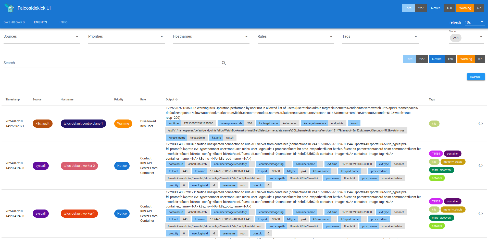

[`Talos Linux`](https://www.talos.dev/) is an OS designed for Kubernetes, with in mind to be secure, immutable and minimal. It offers a solution for having secure nodes for your Kubernetes cluster. Running Falco on them requires some configurations we'll see in this blog post. The good news is everything is available to collect the syscalls with `eBPF` and also the audit logs from the `Kubernetes` control plane.

{}
In this tutorial we'll use a local `Talos` cluster created with Docker containers for convenience, adapt the configurations to your own context.
{}

## Requirements

For this tutorial, you'll need several tools installed:
* [Docker](https://docs.docker.com/engine/install/)
* [Helm](https://helm.sh/docs/intro/install/)
* [talosctl](https://www.talos.dev/v1.7/introduction/getting-started/)
* [kubectl](https://kubernetes.io/docs/tasks/tools/#kubectl)

## Set up the Talos cluster

We'll start with a 2 workers cluster:

```shell
talosctl cluster create --workers 2 --wait-timeout 5m
```

After a few minutes, your containers and so your cluster should be up and running. You can check the status with:

```shell
talosctl cluster show --nodes 10.5.0.2,10.5.0.3,10.5.0.4
```
*Output:*
```shell
PROVISIONER       docker
NAME              talos-default
NETWORK NAME      talos-default
NETWORK CIDR      10.5.0.0/24
NETWORK GATEWAY
NETWORK MTU       1500

NODES:

NAME                           TYPE           IP         CPU   RAM   DISK
talos-default-controlplane-1   controlplane   10.5.0.2   -     -     -
talos-default-worker-1         worker         10.5.0.3   -     -     -
talos-default-worker-2         worker         10.5.0.4   -     -     -
```

## Get the kubeconfig

The `talosctl` CLI allows to easily set up your `kubeconfig` file for managing the apps in your fresh new cluster:

```shell
talosctl kubeconfig -n 10.5.0.2 -f
```

Check you have access to the cluster:

```shell
kubectl cluster-info
```
*Output:*
```shell
Kubernetes control plane is running at https://10.5.0.2:6443
CoreDNS is running at https://10.5.0.2:6443/api/v1/namespaces/kube-system/services/kube-dns:dns/proxy

To further debug and diagnose cluster problems, use 'kubectl cluster-info dump'.
```

## Patch the cluster

When you deploy `Falco` with `Helm` in a `Kubernetes` cluster, an `initContainer` is bootstrapped to inject the `eBPF` probe into the kernel of each node. This behavior requires some privileges but `Talos`, designed to be secured, doesn't allow that by default. It's possible anyway by patching the nodes.

Create this `patch.yaml` file:
```shell
cluster:
  apiServer:
    admissionControl:
      - name: PodSecurity
        configuration:
          exemptions:
            namespaces:
              - falco
```

{}
As you can see, we allow the pods in the namespace `falco` to use `PodSecurity` settings.
{}

And now patch the cluster:
```shell
talosctl patch machineconfig --patch @patch.yaml --nodes 10.5.0.2
```
*Output:*
```shell
patched MachineConfigs.config.talos.dev/v1alpha1 at the node 10.5.0.2
Applied configuration without a reboot
```

## Install Falco

We'll use [Helm](https://helm.sh) to deploy `Falco`.

* Install the Helm registry for the `Falco` chart:
  ```shell
  helm repo add falcosecurity https://falcosecurity.github.io/charts
  helm repo update
  ```
* Create the `values.yaml` file:
  ```yaml
  cat << EOF > values.yaml
  driver:
    kind: modern_ebpf
  tty: true

  falcosidekick:
    enabled: true
    replicaCount: 1
    webui:
      enabled: true
      replicaCount: 1
      redis:
        storageEnabled: false
      service:
        type: NodePort
        port: 2802
        targetPort: 2802
        nodePort: 30128

  falcoctl:
    artifact:
      install:
        enabled: true
      follow:
        enabled: true
    config:
      artifact:
        install:
          refs: [falco-rules:latest, falco-incubating-rules:latest, k8saudit-rules:latest]
        follow:
          refs: [falco-rules:latest, falco-incubating-rules:latest, k8saudit-rules:latest]

  services:
    - name: k8saudit-webhook
      type: ClusterIP
      ports:
        - port: 9765
          targetPort: 9765
          protocol: TCP
          name: http

  falco:
    rules_files:
      - /etc/falco/falco_rules.yaml
      - /etc/falco/falco-incubating_rules.yaml
      - /etc/falco/k8s_audit_rules.yaml
      - /etc/falco/rules.d
    plugins:
      - name: k8saudit
        library_path: libk8saudit.so
        init_config: ""
        open_params: "http://:9765/k8s-audit"
      - name: json
        library_path: libjson.so
        init_config: ""
    load_plugins: [k8saudit, json]
  EOF
  ```
* Deploy `Falco`:
```shell
helm upgrade -i falco falcosecurity/falco -n falco --create-namespace -f values.yaml
```
* Follow the deployment:
```shell
kubectl get pods -w -n falco
```

Before moving on, let's take time to explain why some of these values.

```yaml
  driver:
    kind: modern_ebpf
  tty: true
```

* We use the `modern_epbf` probe to collec the syscall events.
* `tty: true` allows to get the alerts in the stdout immediatly, without any buffering.

```yaml
  falcosidekick:
    enabled: true
    replicaCount: 1
    webui:
      enabled: true
      replicaCount: 1
      redis:
        storageEnabled: false
      service:
        type: NodePort
        port: 2802
        targetPort: 2802
        nodePort: 30128
```

* We install [`Falcosidekick`](https://github.com/falcosecurity/falcosidekick) and its [`UI`](https://github.com/falcosecurity/falcosidekick). All settings for the forwarding of the events between `Falco` and `Falcosidekick` are managed by the `Helm` chart.
* As it's local cluster, we set the `replicaCounts` to 1, it loses the HA but save resources.
* The UI will be exposed directly by the nodes on the port `30128`, very convenient for a local cluster, **prefer an ingress or just a port-forward for production**.

```yaml
  falcoctl:
    artifact:
      install:
        enabled: true
      follow:
        enabled: true
    config:
      artifact:
        install:
          refs: [falco-rules:latest, falco-incubating-rules:latest, k8saudit-rules:latest]
        follow:
          refs: [falco-rules:latest, falco-incubating-rules:latest, k8saudit-rules:latest]
```

* [`falcoctl`](https://github.com/falcosecurity/falcoctl) controls which plugins and rules to install and follow.
* We install the stable and incubating rules for `Falco`
* We install and follow the rules for the Kubernetes audit logs, the relevant plugins [`k8saudit`](https://github.com/falcosecurity/plugins/tree/main/plugins/k8saudit) and [`json`](https://github.com/falcosecurity/plugins/tree/main/plugins/k8saudit) will be automatically installed by `falcoctl`.

```yaml
  services:
    - name: k8saudit-webhook
      type: ClusterIP
      ports:
        - port: 9765
          targetPort: 9765
          protocol: TCP
          name: http
```

The `k8saudit` plugin requires to create a `Service` listen the incoming events from the control plane.

```yaml
  falco:
    rules_files:
      - /etc/falco/falco_rules.yaml
      - /etc/falco/falco-incubating_rules.yaml
      - /etc/falco/k8s_audit_rules.yaml
      - /etc/falco/rules.d
    plugins:
      - name: k8saudit
        library_path: libk8saudit.so
        init_config: ""
        open_params: "http://:9765/k8s-audit"
      - name: json
        library_path: libjson.so
        init_config: ""
    load_plugins: [k8saudit, json]
```

* We load the rules for the `syscalls` and for the `audit logs`.
* We load the plugins and their config. The `k8saudit` plugin will listen on the same port than configured in the `services` section.

## Forward the audit logs to Falco

In a classic context, the control plane is configured to send its audit logs to an endpoint, like the `k8saudit` plugin. With `Talos`, it's not yet possible to configure this endpoint, but fortunately for us, these audit logs are written as files in the `/var/log/audit/kube/` folder of the master nodes.

We'll use [`Fluent Bit`](https://fluentbit.io/) to parse these files and forward them to the `k8saudit` plugin.

* Install the Helm registry for the `Fluent Bit` chart:
  ```shell
  helm repo add fluent https://fluent.github.io/helm-charts
  helm repo update
  ```
* Create the `values.yaml` file:
  ```shell
  cat << EOF > values.yaml
  podAnnotations:
    fluentbit.io/exclude: 'true'

  daemonSetVolumes:
    - name: varlog
      hostPath:
        path: /var/log

  daemonSetVolumeMounts:
    - name: varlog
      mountPath: /var/log

  tolerations:
    - operator: Exists
      effect: NoSchedule

  nodeSelector:
    node-role.kubernetes.io/control-plane: ""

  config:
    service: |
      [SERVICE]
        Flush            5
        Daemon           Off
        Log_Level        warn
        HTTP_Server      On
        HTTP_Listen      0.0.0.0
        HTTP_Port        2020
        Health_Check     On
        Parsers_File     /fluent-bit/etc/parsers.conf
        Parsers_File     /fluent-bit/etc/conf/custom_parsers.conf

    inputs: |
      [INPUT]
        Name          tail
        Alias         audit
        Path          /var/log/audit/kube/*.log
        Parser        audit
        Tag           audit.*
        Ignore_older  true

    customParsers: |
      [PARSER]
        Name          audit
        Format        json
        Time_Key      requestReceivedTimestamp
        Time_Format   %Y-%m-%dT%H:%M:%S.%L%z

    outputs: |
      [OUTPUT]
        Name    http
        Alias   http
        Match   *
        Host    falco-k8saudit-webhook.falco.svc.cluster.local
        Port    9765
        URI     /k8s-audit
        Format  json
  EOF
  ```
*  Deploy `Fluent Bit`:
  ```shell
  helm upgrade -i fluent-bit fluent/fluent-bit -n kube-system -f values.yaml
  ```
  {}
  To be allowed to mount the folder with the logs, we install `Fluent Bit` in the namespace `kube-system`.
  {}
* Follow the deployment:
  ```shell
  kubectl get pods -n kube-system -w -l app.kubernetes.io/name=fluent-bit
  ```

Some explanations of the `values.yaml`.

```yaml
daemonSetVolumes:
  - name: varlog
    hostPath:
      path: /var/log

daemonSetVolumeMounts:
  - name: varlog
    mountPath: /var/log
```

The host folder with the logs is mounted inside the `Fluent Bit` pod.

```yaml
tolerations:
  - operator: Exists
    effect: NoSchedule

nodeSelector:
  node-role.kubernetes.io/control-plane: ""
```

These settings are there to deploy `Fluent Bit` on the master nodes only.

```yaml
config:
  inputs: |
    [INPUT]
      Name          tail
      Alias         audit
      Path          /var/log/audit/kube/*.log
      Parser        audit
      Tag           audit.*
      Ignore_older  true
```

`Fluent Bit` will parse the files `*.logs` from the folder `/var/log/audit/kube/`.

```yaml
config:
  outputs: |
    [OUTPUT]
      Name    http
      Alias   http
      Match   *
      Host    falco-k8saudit-webhook.falco.svc.cluster.local
      Port    9765
      URI     /k8s-audit
      Format  json
```

The logs are forwarded to the endpoint `falco-k8saudit-webhook.falco.svc.cluster.local:9765/k8s-audit`, which is listened by the `k8saudit` plugin.

## Visalize the alerts

Everything should be set up and running from now. You can access to the `Falcosidekick-UI` by the URL [http://10.5.0.2:30128](http://10.5.0.2:30128).

The default credentials are `admin`/`admin`.



## Conclusion

`Talos Linux` is a more and more famous solution for creating resilient and secure `Kubernetes` clusters, but the trust doesn't exclude control. Mixing `Talos` and `Falco` makes you gain a step upper in term of security for your applications. 
Thanks to our modern `eBPF` probe and our `k8saudit` plugin, you can see how easy and quick it is to install `Falco` in `Talos` and start to observe what's happening.

Thanks to [Quentin Joly](https://twitter.com/TheBidouilleur) for his [blog post about `Talos`](https://a-cup-of.coffee/blog/talos/) which helped me a lot to write this one.

---
* Get started in [Falco.org](http://falco.org/)
* Check out the [Falcosidekick project on GitHub](https://github.com/falcosecurity/falcosidekick).
* Check out the [Falcosidekick UI project on GitHub](https://github.com/falcosecurity/falcosidekick-ui).
* Get involved in the [Falco community](https://falco.org/community/).
* Meet the maintainers on the [Falco Slack](https://kubernetes.slack.com/?redir=%2Farchives%2FCMWH3EH32).
* Follow [@falco_org on Twitter](https://twitter.com/falco_org).