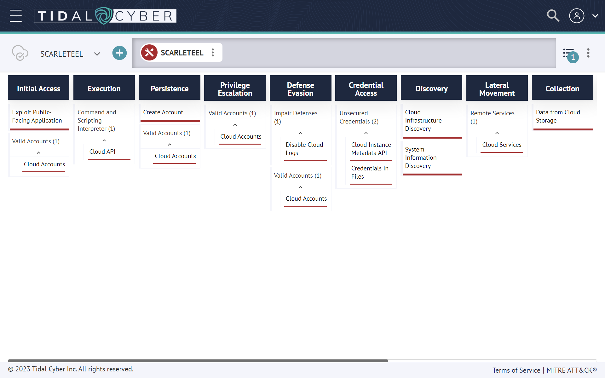

## Introduction

The Sysdig Threat Research Team recently made a significant discovery within a customer environment, unveiling a highly intricate cloud operation known as SCARLETEEL. This operation was responsible for the theft of valuable proprietary data. The attacker's strategy involved exploiting a containerized workload, utilizing it as a springboard for privilege escalation within an AWS account, and ultimately pilfering proprietary software and credentials. Notably, they also made attempts to expand their influence across the organization by leveraging a Terraform state file to access other interconnected AWS accounts.

What sets this attack apart from others is its elevated level of sophistication. It originated from a compromised Kubernetes container and propagated into the victim's AWS account. Moreover, the attackers exhibited a deep understanding of AWS cloud mechanisms, including Elastic Compute Cloud (EC2) roles, Lambda serverless functions, and Terraform. It is important to note that their intentions surpassed the typical objectives of a cryptojacking attack, as their primary goal was the theft of proprietary software.

This sophisticated attack underscores the imperative of aligning with MITRE ATT&CK principles for containers and the cloud. By embracing these principles, organizations can gain a better understanding of the intricate security challenges faced by cloud-native systems. Open Source Falco, with its extensive collection of preconfigured rules, offers a valuable resource for addressing the insecure behaviors associated with such attacks.

Falco workload/host-based capabilities were recently added to the Tidal Cyber [Product Registry](https://app.tidalcyber.com/vendors). The community now has a greater ability to operationalize the rules while implementing threat-informed defense using Tidal Cyber’s Community Edition, a freely-availably platform that makes threat and adversary behavior research easy. A summary of the capabilities can be found [here](https://app.tidalcyber.com/products/b3a86cef-804b-5176-ba70-9570350f4e8f-Falco). A Technique Set summarizing & visualizing the ATT&CK-mapped SCARLETEEL techniques described here was also added to the Community Edition Community Spotlight [here](https://app.tidalcyber.com/share/be828b0d-2c95-4e30-b93b-f15de00a9606):



## Overview

This infographic shows the main steps in the kill chain. Let’s first show the attack at a high level, then provide greater detail of each state:


Step 1: The attacker gained initial access by exploiting a public-facing service in a self-managed Kubernetes cluster hosted inside an AWS cloud account.

Step 2: Once the attacker gained access to the pod, the malware was able to perform two initial actions during execution:

1. Launch a crypto miner in order to make money or provide a distraction.
2. Obtain credential access through a worker’s temporary credentials in Instance Metadata Service (IMDS) v1 to enumerate and collect information on its behalf using the cluster role permissions.

Due to excessive granted permissions, the attacker was able to:

1. Enumerate AWS resources.
2. Find credentials of other identity and access management (IAM) users both set as Lambda environment variables and pushed in plain text to Amazon Simple Storage Service (S3) buckets.

Step 3: The attacker used the credentials found in the previous step to move laterally. They directly contacted the AWS API, further enumerated the account, and proceeded with information gathering and data exfiltration. During this step, they were able to:

1. Disable CloudTrail logs to evade detection.
2. Steal proprietary software.
3. Find the credentials of an IAM user related to a different AWS account by discovering Terraform state files in S3 buckets.

Step 4: The attacker used the new credentials to move laterally again, repeating the attack and their kill chain from the other AWS account they found. Fortunately, in this case they were not able to enumerate resources, since all of the AWS API requests they attempted failed due to a lack of permissions.

## Technical Analysis

### Initial Access – Container Compromise

The attacker successfully identified and exploited an internet-facing service that was deployed within a Kubernetes cluster. With access to the compromised container, they initiated a series of actions to further their attack objectives.

Their initial course of action involved the download and execution of a mining script to illicitly obtain memory cycles. The attacker executed the script miner.sh, which triggered the execution of an XMRig executable, accompanied by the miner configuration file config_background.json.

It is worth noting that while this behavior is not enabled by default, Falco offers a readily available rule that can detect outbound connections to commonly used miner pool ports or domains. As the connection had already been established in this scenario, the detection falls under the MITRE Execution technique, identified by the associated technique ID ['T1496'](https://attack.mitre.org/techniques/T1496/).

```yaml
- rule: Detect outbound connections to common miner pool ports
  desc: Miners typically connect to miner pools on common ports.
  condition: net_miner_pool and not trusted_images_query_miner_domain_dns
  enabled: false
  output: Outbound connection to IP/Port flagged by https://cryptoioc.ch (command=%proc.cmdline pid=%proc.pid port=%fd.rport ip=%fd.rip container=%container.info image=%container.image.repository)
  priority: CRITICAL
  tags: [host, container, network, mitre_execution, T1496]
```

This rule can be surfaced in Tidal Community Edition's Product Registry [here](https://app.tidalcyber.com/capability/0a6d8ee2-f655-5ca2-ac25-47dea3047b07-Detect%20outbound%20connections%20to%20common%20miner%20pool%20ports).

Cryptomining is probably the most common example of resource hijacking. However, the purpose of the attack went far beyond cryptomining. Either cryptomining was the attacker’s initial goal and the goal changed once they accessed the victim’s environment, or cryptomining was used as a decoy to evade the detection of data exfiltration.

During the installation of the cryptominer, the Sysdig team observed a bash script running simultaneously on the container to enumerate and extract additional information in the environment, such as credentials. Since Falco handles system calls, we can get the same, deep level of visibility into running scripts in containers as we do on the host system.

```
- rule: Run shell untrusted
  desc: an attempt to spawn a shell below a non-shell application. Specific applications are monitored.
  condition: >
    spawned_process
    and shell_procs
    and proc.pname exists
    and protected_shell_spawner
    and not proc.pname in (shell_binaries, gitlab_binaries, cron_binaries, user_known_shell_spawn_binaries,
                           needrestart_binaries,
                           mesos_shell_binaries,
                           erl_child_setup, exechealthz,
                           PM2, PassengerWatchd, c_rehash, svlogd, logrotate, hhvm, serf,
                           lb-controller, nvidia-installe, runsv, statsite, erlexec, calico-node,
                           "puma reactor")
    and not proc.cmdline in (known_shell_spawn_cmdlines)
    and not proc.aname in (unicorn_launche)
    and not consul_running_net_scripts
    and not consul_running_alert_checks
    and not nginx_starting_nginx
    and not nginx_running_aws_s3_cp
    and not run_by_package_mgmt_binaries
    and not serf_script
    and not check_process_status
    and not run_by_foreman
    and not python_mesos_marathon_scripting
    and not splunk_running_forwarder
    and not postgres_running_wal_e
    and not redis_running_prepost_scripts
    and not rabbitmq_running_scripts
    and not rabbitmqctl_running_scripts
    and not run_by_appdynamics
    and not user_shell_container_exclusions
  output: >
    Shell spawned by untrusted binary (user=%user.name user_loginuid=%user.loginuid shell=%proc.name parent=%proc.pname
    cmdline=%proc.cmdline pid=%proc.pid pcmdline=%proc.pcmdline gparent=%proc.aname[2] ggparent=%proc.aname[3]
    aname[4]=%proc.aname[4] aname[5]=%proc.aname[5] aname[6]=%proc.aname[6] aname[7]=%proc.aname[7] container_id=%container.id image=%container.image.repository)
  priority: DEBUG
  tags: [host, container, process, shell, mitre_execution, T1059.004]
```

This rule can be surfaced in Tidal Community Edition's Product Registry [here](https://labsee.tidalcyber.com/capability/fd02337e-cf6b-5523-945e-c6619b9839b6-Run%20shell%20untrusted).

In order to find credentials, the attacker directly accessed IMDS. IMDS v1 is the version used by default when creating older versions of self-managed clusters or EC2 instances in AWS. It’s used to configure and manage machines.

Retrieving AWS temporary security credentials bound to the EC2 instance role from IMDS v1 is a very well-known practice. The attacker was looking to discover the IAM role bound to the worker instance in order to obtain the AccessKeyId, SecretAccessKey, and temporary token.

The attacker targeted both the instance metadata endpoints and what commands were executed by the malicious script in order to grep and retrieve the IAM role keys. On EC2 instances, 169.254.169.254 is a special IP used to fetch metadata about the instance. It may be desirable to prevent access to this IP from containers.

```
- rule: Contact EC2 Instance Metadata Service From Container
  desc: Detect attempts to contact the EC2 Instance Metadata Service from a container
  condition: outbound and fd.sip="169.254.169.254" and container and not ec2_metadata_containers
  output: Outbound connection to EC2 instance metadata service (command=%proc.cmdline pid=%proc.pid connection=%fd.name %container.info image=%container.image.repository:%container.image.tag)
  priority: NOTICE
  enabled: false
  tags: [network, aws, container, mitre_discovery, T1565]
```

This rule can be surfaced in Tidal Community Edition's Product Registry [here](https://labsee.tidalcyber.com/capability/03578cc7-45a6-5570-8386-2ec8b7c22a9f-Contact%20EC2%20Instance%20Metadata%20Service%20From%20Container).

Once collected, it is possible to use those credentials for a short period of time in order to run operations on behalf of the impersonated IAM role, calling the AWS API directly. Using CloudTrail logs, the Sysdig team could see that the first API calls from the attacker were using the compromised cluster role.

The attacker ran some AWS actions to gain persistence on the AWS platform, trying to create new users, groups, and bind new access keys to existing IAM users. Since Falco can handle events from AWS CloudTrail, we can easily detect when new users and groups are created under suspicious circumstances.

```
- rule: Create AWS user
  desc: Detect creation of a new AWS user.
  condition:
    ct.name="CreateUser" and not ct.error exists
  output:
    A new AWS user has been created
    (requesting user=%ct.user,
     requesting IP=%ct.srcip,
     AWS region=%ct.region,
     new user created=%ct.request.username)
  priority: INFO
  tags:
    - cloud
    - aws
    - aws_iam
  source: aws_cloudtrail
```

This rule can be surfaced in the Falco Plugin Registry repository [here](https://github.com/falcosecurity/plugins/blob/master/plugins/cloudtrail/rules/aws_cloudtrail_rules.yaml#LL125C1-L140C25).

Fortunately, all of these executions were denied because of a lack of permissions on the account the attacker was using. Unfortunately, the AWS cluster role was misconfigured with excessive read permissions.

The original intent was to allow the reading of a specific S3 bucket, but the permissions allowed the role to read everything in the account, which enabled the attacker to gain further knowledge of the AWS account, including Lambda.

### Discovery – AWS Cloud

Once the attacker obtained initial access into the cloud account, they started gathering information about the resources deployed in the AWS account. The most common activities reported include the listing of AWS buckets. These API requests were recorded in the AWS account. Again, Falco rules are already curated for these scenarios:

```
- rule: List Buckets
  desc: Detect listing of all S3 buckets.
  condition:
    ct.name="ListBuckets" and not ct.error exists
  output:
    A list of all S3 buckets has been requested.
    (requesting user=%ct.user,
     requesting IP=%ct.srcip,
     AWS region=%ct.region,
     host=%ct.request.host)
  priority: WARNING
  enabled: false
  tags:
    - cloud
    - aws
    - aws_s3
  source: aws_cloudtrail
```

This rule can be surfaced in the Falco Plugin Registry repository [here](https://github.com/falcosecurity/plugins/blob/master/plugins/cloudtrail/rules/aws_cloudtrail_rules.yaml#LL354C1-L370C25).

During these scraping operations, the attacker focused their efforts on the most used AWS services: Serverless Lambda functions and S3 buckets.

### Lambda Function Enumeration – Stolen Proprietary Code and Software

Lambda functions and other serverless functions are commonly used to execute custom code without worrying about the infrastructure underneath, leaving a lot of flexibility for end users.

There were different Lambda functions in the affected AWS account, mainly related to account automation. The attacker started to enumerate and retrieve all of the Lambda functions located in a specific region in the AWS account using the proper API call.

After obtaining the list of functions, the attacker tried to dig deeper by downloading the Lambda code. Calling the AWS API, they were able to get the code location so that they could download the code that makes up the Lambda. In this case, the Lambda function held proprietary software and the keys needed to execute it.

Using curl or wget commands, the attacker successfully exfiltrated the Lambda code and stole proprietary code and software from the Lambda functions. There was also evidence that the attacker executed the stolen software. They took the time to look at the Lambda function’s environment variables and find additional AWS credentials related to IAM users in the same account. However, any attempts to tamper with the Lambda functions configuration would have been instantly detected by Falco:

```
- rule: Update Lambda Function Code
  desc: Detect updates to a Lambda function code.
  condition:
    ct.name="UpdateFunctionCode20150331v2" and not ct.error exists
  output:
    The code of a Lambda function has been updated.
    (requesting user=%ct.user,
     requesting IP=%ct.srcip,
     AWS region=%ct.region,
     lambda function=%ct.request.functionname)
  priority: WARNING
  tags:
    - cloud
    - aws
    - aws_lambda
  source: aws_cloudtrail
```

This rule can be surfaced in the Falco Plugin Registry repository [here](https://github.com/falcosecurity/plugins/blob/master/plugins/cloudtrail/rules/aws_cloudtrail_rules.yaml#LL236C1-L251C25).

As you will see in the next steps of the attack, adversaries used the credentials found here to retry enumeration with the new user, hoping for new findings or to evaluate possible privilege escalation inside the account.

### Defense Evasion – Disable CloudTrail Logging

Once the attacker accessed the cloud account, they attempted to disable CloudTrail logs inside the compromised account. The attacker succeeded in disabling some of the logs configured in the account because of extra permissions assigned to one of the users compromised in the previous steps.

Since Falco pre-processes all event data from Cloudtrail, we can also see when Cloudtrail audit logging is disabled in a specific AWS region.

```
- rule: CloudTrail Logging Disabled
  desc: The CloudTrail logging has been disabled, this could be potentially malicious.
  condition:
    ct.name="StopLogging" and not ct.error exists
  output:
    The CloudTrail logging has been disabled.
    (requesting user=%ct.user,
     requesting IP=%ct.srcip,
     AWS region=%ct.region,
     resource name=%ct.request.name)
  priority: WARNING
  tags:
    - cloud
    - aws
    - aws_cloudtrail
  source: aws_cloudtrail
```

This rule can be surfaced in the Falco Plugin Registry repository [here](https://github.com/falcosecurity/plugins/blob/master/plugins/cloudtrail/rules/aws_cloudtrail_rules.yaml#LL424C1-L439C25).

As a result of this action, the Sysdig team could not retrieve additional attack evidence. When reviewing account permissions, it is critical to keep the ability to disable or delete security logs to as few users as possible. Deletion shouldn’t even be possible in most situations without a solid backup solution.

### Lateral Movement – AWS account

With the new credentials acquired, the attacker restarted their enumeration and information-gathering process to determine whether they could gain additional resources from inside this additional compromised account. In addition, CloudTrail recorded suspicious activities in the connected AWS account mentioned above.

The attacker tried to perform enumeration on different AWS resources in the connected cloud account. Fortunately, the IAM user was very well scoped, so all of the requests failed due to a lack of permissions, leaving just the harmless GetCallerIdentity API, which is permitted by default.

### Attack Summary and Conclusion

In summary, the SCARLETEEL attack began by exploiting a vulnerable pod and leveraging the associated IAM role's identity. The attacker then proceeded to conduct enumeration, search for sensitive data, and steal proprietary software using the compromised role. Upon discovering new credentials, they used them to establish persistence and attempt to gain further privileges.

Following the detection of the attack, several measures were implemented to secure the environment. These included disabling and removing users' access keys and secret access keys, securing vulnerable applications through audits and penetration tests, restricting access to sensitive S3 buckets with stringent policies, and adopting additional least privilege measures to minimize the attack surface and impede lateral movement within the cloud.

This sophisticated attack serves as a stark reminder of the extent to which an attacker can exploit a vulnerable application lacking proper security measures. It reaffirms two crucial principles: the significance of zero trust and the principle of least privilege. By implementing these principles, the probability of compromise can be significantly reduced. Furthermore, robust detection mechanisms and timely alerts are essential in detecting and mitigating such activities before an attacker gains substantial access.
