## Introduction:
In this article, we will delve into the details of eBPF (extended Berkeley Packet Filter) and explore its significance in tracing system calls. This particular blog will be in two parts; in the first blog, we will discuss eBPF, and in the subsequent section, we will delve into probes. eBPF is a powerful technology that allows for the dynamic and efficient tracing of events within the kernel space of an operating system. You have probably heard of the acronyms BPF and eBPF being used interchangeably. That's why we will aim to address both BPF and eBPF before discussing how and why Falco uses this technology.

## BPF (Berkeley Packet Filter)
BPF is a technology used for network packet filtering and analysis. It is a powerful tool for implementing network security features, such as firewalls and intrusion detection systems. It can also be used to examine network traffic in real-time, detect suspicious patterns, and take appropriate actions to protect the network.

## eBPF (Extended Berkeley Packet Filter)
The Extended Berkeley Filter (eBPF) is an evolution of the original BPF technology. It extends the capabilities of BPF by providing a more powerful and flexible way to perform dynamic tracing, network analysis, and performance monitoring. It allows developers to write and load programs into the kernel which can be attached to various hooks and events in the system. These programs can provide real-time insights and control over system activities.

## Working on an eBPF program
The process of compiling and running an eBPF program involves several steps:

1. The eBPF program is converted into bytecode by using a compiler, ready to be loaded by a loader program.

2. The eBPF verifier checks the program for safety, correctness and adherence to specific rules and constraints. First of all, it performs a depth-first search on all possible execution paths to ensure that the program always proceeds to completion. Next, it performs a static analysis on the bytecode and ensures that the program doesn't violate memory access rules, and doesn't cause instability. 

3. Once the eBPF program passes the verification process, it can be loaded into the kernel. The loader ensures that the program is securely loaded and attached to the desired hooks or targets in the system.

4. At runtime, the eBPF bytecode is further optimised through JIT (Just-in-time) compilation. This step converts the eBPF bytecode into machine code that can be executed by the CPU.

## Kernel Modules

Apart from eBPF, the other approach we previously discussed for process tracing in Linux is the use of kernel modules. Kernel modules allow developers to write custom code that can be loaded into the kernel to extend its functionality. 

By leveraging kernel modules, it is possible to hook into various points of the kernel's process management code and capture detailed information about process execution. This includes events such as process creation, termination, and context switches. 

By accessing the kernel's internal data structures and functions, the module can gather valuable insights such as process IDs, parent-child relationships, execution time, system calls, and more.

## So why does Falco use eBPF?
The integration of eBPF brings significant advantages to projects like Falco, empowering them to securely and efficiently monitor and analyze system calls in real-time. You might be wondering why eBPF is necessary when Falco already has real-time detection capabilities through its kprobe (kernel probe) that handles syscall events.

One compelling reason for incorporating eBPF support is to enable Falco to seamlessly operate in modern cloud native environments, where the traditional kernel probe may encounter limitations or face restrictions imposed by the control plane nodes.

By embracing eBPF, Falco ensures the continuity of its real-time detection capabilities in a secure manner, allowing for the prompt and accurate identification of security incidents, regardless of the underlying environment.

Later in the article, we will delve into the various considerations surrounding the adoption of an eBPF probe for Falco, providing valuable insights for determining when it becomes advantageous to leverage this functionality.

## eBPF programs vs kernel modules

### Safety and Isolation

eBPF programs are subjected to a thorough verification process before they are loaded into the kernel. This step provides an extra layer of protection and helps prevent security vulnerabilities. In contrast, kernel modules have direct access to the kernel code, which can pose a threat to the system if not implemented correctly.

### Performance

eBPF programs are JIT compiled into machine code, which significantly improves the performance. JIT compilation optimizes the program for the specific CPU architecture, enabling efficient execution. Despite all these efforts, an eBPF instrumentation will always cause a greater overhead in the system than a kernel module one, the reason is that in the kernel module instrumentation there are no calls to the BPF subsystem.

### Observability and Debugging

eBPF provides powerful tracing and observability capabilities. eBPF programs can be attached to various events, such as network packets, system calls, or kernel functions, allowing detailed visibility into the system behaviour. This makes eBPF a valuable tool for debugging, performance analysis, and security monitoring. Kernel modules typically require more invasive and complex mechanisms for achieving similar observability.

## Attaching eBPF programs to hooks and events

There are various instrumentation points defined in the Linux kernel. An instrumentation is a specific point in a computer program where additional code, known as instrumentation code, is inserted to gather information about the program's execution. Instrumentation code can be injected at runtime using JIT compilation. Kernel probes, tracepoints, user-space probes, kretprobes are examples of instrumentation points.

Here is an eBPF program that runs when the execve system call is made. 

 <a target="_blank" href="images/ebpf-01.png">
  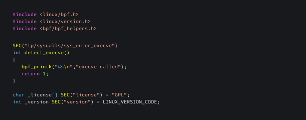
  </img>
</a>  

- In the eBPF programming context, the `macro SEC()` from the `bpf/bpf_helper.h` header file plays a crucial role. It allows the programmer to specify the section in which a function or variable will be placed within the `eBPF object file`. This becomes essential when loading eBPF programs into the kernel using mechanisms like the `bpf() system call`. 

- By organizing functions and variables into named sections, the eBPF loader can efficiently locate and load the required code and data. Specifically, when dealing with tracepoint events, the `SEC` format follows the pattern `SEC("tp/<category>/<name>")`, where `<category>` and `<name>` represent the respective tracepoint category and event name.

- `tp/syscalls/sys_enter_execve` refers to a tracepoint that records when a process spawns the execve system call.

- A list of all the available tracepoints is present in the `/sys/kernel/debug/tracing/available_events` file. The format for each line in the file is `<category>:<name>`. For example, syscalls:sys_enter_execve. 

Before compiling the program, we need to do some basic configuration:

 <a target="_blank" href="images/ebpf-02.png">
  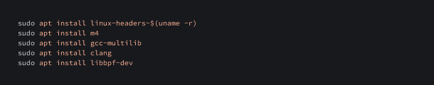
  </img>
</a>  

Let's compile the program. 
The following command can be used to do this task:

 <a target="_blank" href="images/ebpf-03.png">
  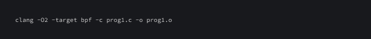
  </img>
</a>  

Now, we need to write a loader program that loads and attaches this program. This loader program is used to load and attach an eBPF program to the Linux kernel. It opens and loads the eBPF object file, checks for errors during the process, finds a specific eBPF program within the loaded object, and attaches it to the kernel. Once attached, the eBPF program will be executed when certain events occur. The program enters an infinite loop at the end, indicating that it will continue running until it is manually terminated.

 <a target="_blank" href="images/ebpf-04.png">
  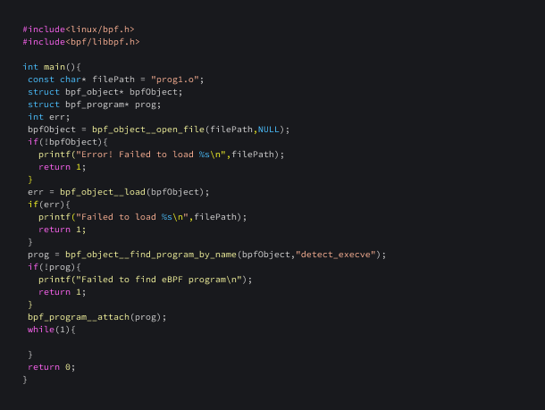
  </img>
</a>  

Let's compile and run this program

 <a target="_blank" href="images/ebpf-05.png">
  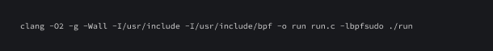
  </img>
</a>  

To get the logs generated by the function `bpf_printk`, we can read the file:
`/sys/kernel/tracing/trace_pipe`

 <a target="_blank" href="images/ebpf-06.png">
  
  </img>
</a>  

 <a target="_blank" href="images/ebpf-res-01.png">
  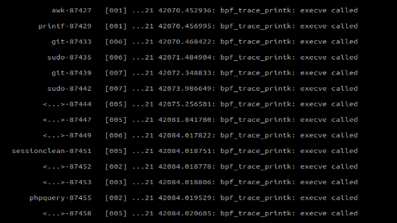
  </img>
</a>  

Manually reading messages from the tracepipe doesn't seem to be an efficient approach. It would be advantageous to establish a mechanism for the eBPF program to send messages to the loader program. One viable solution is to utilize ring buffers. Let’s review more details about ring buffers.

## Ring buffers

eBPF ring buffer, also known as `bpf_ringbuf`, is a mechanism provided by the Linux kernel for efficient communication between eBPF programs and user-space programs. 

It allows the exchange of data and events between eBPF programs running in the kernel and user-space applications. It is a `MPSC (Multi Producer Single Consumer)` queue and can be safely shared across multiple CPUs simultaneously. 

The eBPF ring buffer, being shared across all CPUs, offers a unified and efficient solution for managing memory utilisation, mitigating issues of overuse or under-allocation that commonly occur with perfbuf. 

Let's have a look at a few functions that we'll be using to write an eBPF program that sends data to userspace.

### bpf_ringbuf_reserve

This function is used to reserve `size` bytes of space in a BPF ring buffer.

 <a target="_blank" href="images/ebpf-08.png">
  
  </img>
</a>  

### bpf_probe_read_user_str

This function is used to read a null terminated string from user-space memory into the destination `dst`. The dst parameter is a pointer to the destination buffer in the kernel space. `unsafe_ptr` is a pointer to the source string in the user-space.

 <a target="_blank" href="images/ebpf-09.png">
  
  </img>
</a>  

### bpf_ringbuf_submit

This function is used to submit data that had previously been reserved in a `ringbuf`.

 <a target="_blank" href="images/ebpf-10.png">
  
  </img>
</a>  

### bpf_object__find_map_fd_by_name

This function is used to find the file descriptor of a named map.

 <a target="_blank" href="images/ebpf-11.png">
  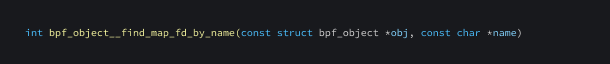
  </img>
</a>  

### bpf_program__attach_tracepoint

This function is used to attach an eBPF program to a kernel tracepoint.

 <a target="_blank" href="images/ebpf-12.png">
  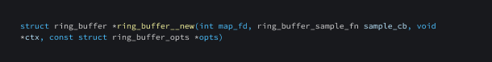
  </img>
</a>  

### ring_buffer__new

This function is used for creating and opening a new ringbuf manager.

 <a target="_blank" href="images/ebpf-13.png">
  
  </img>
</a>  

### ring_buf__consume

Used to remove or consume data from a `ring buffer`.

 <a target="_blank" href="images/ebpf-14.png">
  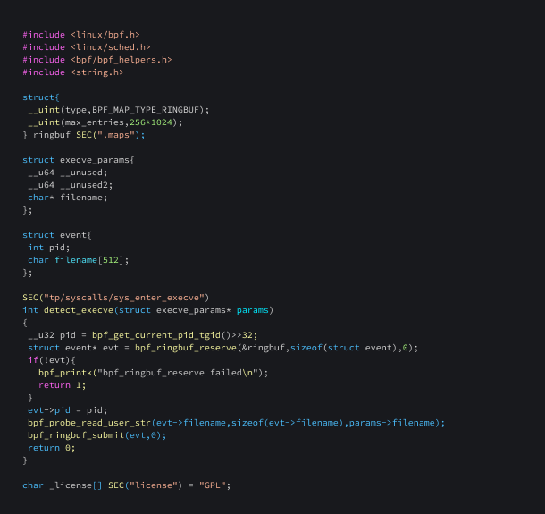
  </img>
</a>  

## BTF (BPF Type Format)

It provides a way to describe the types of data structures used by eBPF programs, allowing for improved type safety, debugging, and introspection.

Now, let's write a program that sends data to userspace using ringbuf.

 <a target="_blank" href="images/ebpf-15.png">
  
  </img>
</a>  

Having created the program, we can write a loader to load this eBPF program.

 <a target="_blank" href="images/ebpf-16.png">
  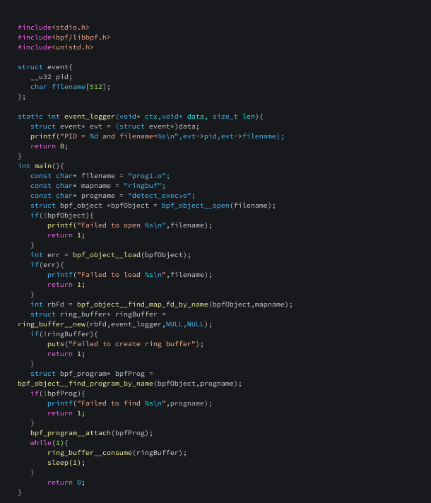
  </img>
</a>  

The infinite loop is necessary to ensure that the program continuously checks for new events in the ring buffer. Without the loop, the program would only consume events that were already in the buffer at the time of the initial `ring_buffer__consume()` call. By looping and calling `ring_buffer__consume()` repeatedly, the program can retrieve events as soon as they become available and process them in real-time. The `sleep(1)` call within the loop serves to reduce the CPU usage of the program by introducing a one-second delay between each call to `ring_buffer__consume()`.

 <a target="_blank" href="images/ebpf-17.png">
  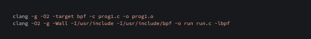
  </img>
</a>  

 <a target="_blank" href="images/ebpf-res-02.png">
  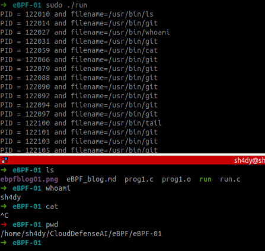
  </img>
</a>  

Great, we were able to recover the process name as well as the PID!

## Conclusion

In conclusion, this article has provided a comprehensive overview of eBPF (extended Berkeley Packet Filter) and its significance in tracing system calls. We have explored the evolution from BPF to eBPF, discussed why Falco uses this technology, and delved into the process of working with eBPF programs and ring buffers for efficient data communication between the kernel and user-space applications.

As we journeyed through the capabilities of eBPF in this first part, we uncovered its benefits in terms of safety, performance, and observability when compared to traditional kernel modules. eBPF empowers us to securely and efficiently monitor and analyze system calls in real-time, making it a valuable tool in modern cloud native environments.

In the upcoming second part of this blog series, we will further expand our exploration by delving into the realm of probes and additional advanced topics. We will dive deeper into how eBPF probes can be leveraged for enhanced system tracing, performance analysis, and security monitoring. Stay tuned for more insights and practical guidance on harnessing the power of eBPF.

Keep an eye out for Part 2, where we'll continue our journey into the world of eBPF and system call tracing.

