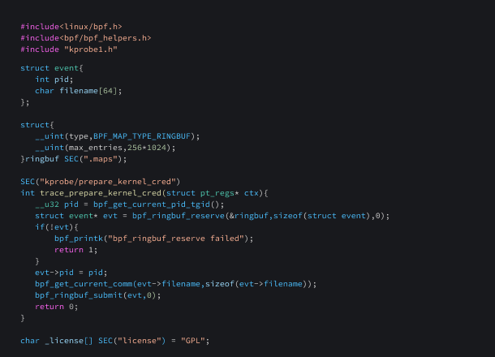
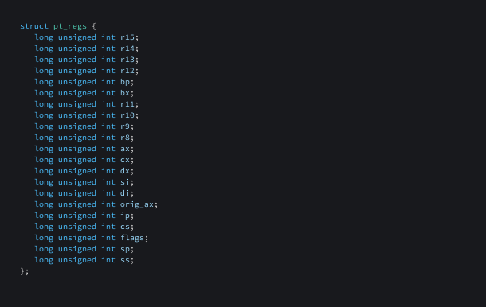
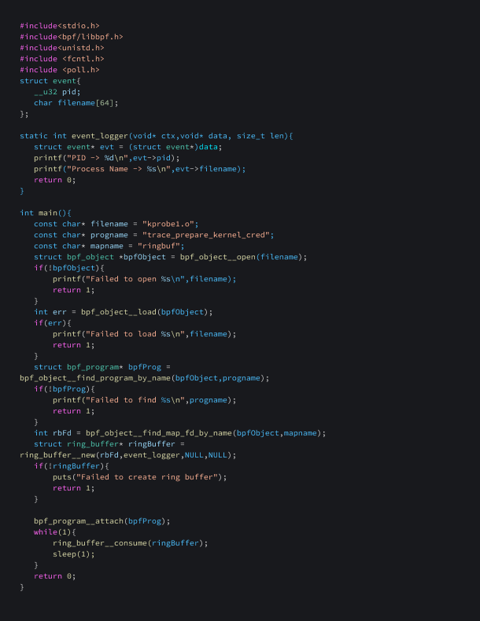
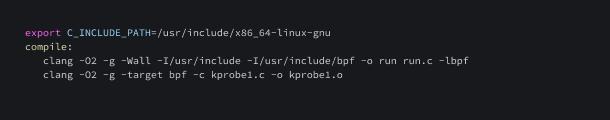

## Introduction

In [Tracing System Calls Using eBPF Part 1](https://falco.org/blog/tracing-syscalls-using-ebpf-part-1/), we lay the groundwork, introducing you to the fundamentals of `eBPF` and its predecessor, `BPF (Berkeley Packet Filter)`. We delve into the evolution of this technology, its safety, performance, and observability advantages over traditional kernel modules, and its pivotal role in securing modern cloud-native environments. We guide you through the intricate process of working with eBPF programs, from compilation to execution, highlighting its power in tracing system calls.

In the second installment, `Tracing System Calls Using eBPF Part 2`, we elevate our understanding of eBPF's capabilities. We unravel the world of `Uprobes` and `Uretprobes`, demonstrating how these features empower developers to instrument and monitor user-space applications seamlessly. We then venture into `Kprobes` and `Kretprobes`, unlocking the potential to dynamically trace and debug kernel functions, offering insights into system behavior and performance analysis.

## Uprobes

Uprobes, short for user probes, are a feature in the Linux kernel that enables developers to instrument and monitor user-space applications without modifying their code directly. They allow for the insertion of breakpoints at specific points of interest within an application, facilitating the collection of data, tracing of function calls, debugging, and performance analysis. 

## Uretprobes

Uretprobes, short for User Return Probes, are a feature in the Linux kernel that allows developers to trace and monitor the return paths of functions in user-space applications. While uprobes are used to instrument and intercept the entry points of functions, URETprobes specifically focus on the exit points or return paths. They enable developers to set up probes that are triggered when a specific function returns to its caller.

Here is an eBPF program that uses user probes to trace the printf function present in `glibc (the standard GNU C Library)`.

 <a target="_blank" href="images/ebpf2-01.png">
  
  </img>
</a>  

In accordance with the instructions outlined in our [Tracing System Calls Using eBPF Part 1](https://falco.org/blog/tracing-syscalls-using-ebpf-part-1/) blog, we can create a loader to effectively load this eBPF program and read the logs from the file `/sys/kernel/tracing/trace_pipe` .

## Kprobes

Kprobes, short for Kernel Probes, are a feature in the Linux kernel that allow dynamic tracing and debugging of kernel functions. They are particularly useful for tasks like performance analysis, bug diagnosis, and system monitoring. They provide a non-intrusive way to gather runtime information from the kernel without requiring modifications to the kernel code itself. Additionally, they can be used to trace specific function calls, track parameters and return values, and gather statistical data on function execution

## Kretprobes

Kretprobes, short for Kernel Return Probes, are a feature in the Linux kernel that complements Kprobes by allowing dynamic tracing and debugging of kernel function return points. While Kprobes focus on probing the entry points of kernel functions, kretprobes specifically target the return points of these functions.Similar to Kprobes, kretprobes work by inserting a probe handler function that gets executed when a specific kernel function is about to return. This allows developers and system administrators to gather information, modify return values, or perform additional actions at the point of function return.

Here is an eBPF program that uses kernel probes to trace a kernel function named `prepare_kernel_cred`. This function is used to create a new `struct cred object` that represents the credentials or privileges associated with a kernel task. It is commonly used in `privilege escalation exploits` for gaining root access. By tracing this function, we can identify all processes that invoke it, providing valuable insight for analyzing potential malicious activity.

 <a target="_blank" href="images/ebpf2-02.png">
  
  </img>
</a>  

`SEC(“kprobe/prepare_kernel_cred”)` indicates that an eBPF program is associated with the kprobe event for the `"prepare_kernel_cred"` kernel function. This event allows dynamic tracing and debugging by intercepting the entry point of the function.

`struct pt_regs` is a data structure that provides access to the register state of the program when it is executed. It contains information about the `CPU registers` at the time of the eBPF program invocation. It is defined as :

 <a target="_blank" href="images/ebpf2-03.png">
  
  </img>
</a>  

To facilitate the loading of the aforementioned eBPF program, we’ll use the following program.

 <a target="_blank" href="images/ebpf2-04.png">
  
  </img>
</a>  

Here is a Makefile for compiling the eBPF program and the loader

 <a target="_blank" href="images/ebpf2-05.png">
  
  </img>
</a>  

## Conclusion

In this two-part exploration of **Tracing System Calls Using eBPF**, we've embarked on a fascinating journey through the inner workings of this powerful technology. `Part 1` laid the foundation by introducing us to the fundamentals of eBPF and its predecessor, BPF, shedding light on their evolution and significance in modern cloud-native environments. We uncovered how eBPF's safety, performance, and observability advantages empower us to trace system calls with unmatched efficiency.

In `Part 2`, we took our understanding to new heights. We delved into the world of `Uprobes` and `Uretprobes`, showcasing how they enable seamless instrumentation and monitoring of user-space applications. We then ventured into `Kprobes` and `Kretprobes`, unlocking the ability to dynamically trace and debug kernel functions. Armed with these advanced techniques, we gained valuable insights into system behavior, performance analysis, and even the detection of potential malicious activity.

As we conclude this journey into the heart of eBPF, we stand equipped with a powerful set of tools and knowledge. Whether you're a seasoned sysadmin, a curious developer, or a vigilant security enthusiast, the capabilities of eBPF open new doors to real-time monitoring and analysis. 

Stay tuned for further insights and practical guidance in the world of eBPF, where innovation meets security, and the future of system monitoring becomes a reality.