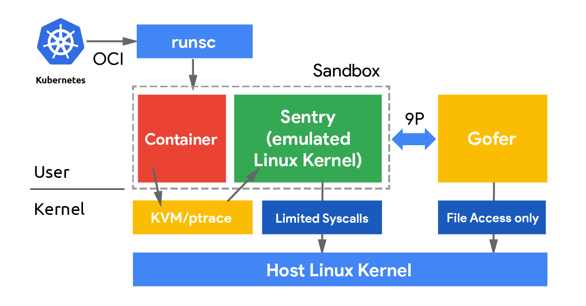
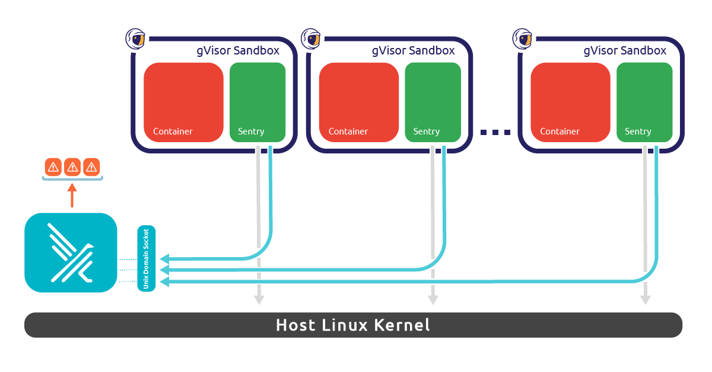

Falco can work with **[gVisor](https://gvisor.dev/)**.

gVisor, quoting the [official documentation](https://gvisor.dev/docs), is an application kernel that provides an **additional layer of isolation** between running applications and the host operating system. It delivers an additional security boundary for containers by **intercepting and monitoring workload runtime instructions in user space** before they can reach the underlying host.

## How Falco and gVisor work together

When running containers with gVisor, there are several components that interact with our workload:



The Sentry is the gVisor component that implements all the application kernel functionalities. Whenever a syscall gets executed inside the sandboxed application, the Sentry will manage it as usual, plus it will send a message to Falco through a UDS (Unix Domain Socket). 

Messages are serialized through Protocol Buffers so that gVisor and Falco can communicate even if they are written in different programming languages.



## Setup gVisor Docker sandbox monitoring with Falco

First, [install **Falco**](https://falco.org/docs/getting-started/installation/) and [install the **gVisor runsc tool**](https://gvisor.dev/docs/user_guide/install/). Any version of runsc released in 2023 or later is compatible with Falco.

gVisor needs to be configured to send events to Falco. Generate the appropriate configuration file:

```bash
falco --gvisor-generate-config > /tmp/runsc_falco_config.json
sudo mv /tmp/runsc_falco_config.json /etc/docker/runsc_falco_config.json

# Don't forget to protect this configuration
sudo chmod 640 /etc/docker/runsc_falco_config.json
```

The easiest way to run a gVisor sandbox is by using Docker. 
You need to first [configure Docker to work with gVisor via `runsc install`](https://gvisor.dev/docs/user_guide/quick_start/docker/), and then we're going to update the `runsc` pod init config configuration for our Docker containers:

```bash
sudo -e /etc/docker/daemon.json
```

Then, add the `runtimeArgs` key with the `--pod-init-config=` parameter like in the example below:

```json
{
    "runtimes": {
        "runsc": {
            "path": "/usr/local/bin/runsc",
            "runtimeArgs": [
                "--pod-init-config=/etc/docker/runsc_falco_config.json"
            ]
        }
    }
}
```

Then, restart the Docker daemon to let it use the new configuration:

```bash
sudo systemctl restart docker
```

## Run Falco by command line

Simply run Falco by the command line:

```bash
sudo falco -o "engine.kind=gvisor" -o "engine.gvisor.config=/etc/docker/runsc_falco_config.json"
```

or edit the file `/etc/falco/falco.yaml` to have these settings and run Falco with `sudo falco`:

```yaml
engine:
  kind: gvisor
  gvisor:
    config: "/etc/docker/runsc_falco_config.json"
```

You're now monitoring your gVisor sandboxes.

## Permament configuration with Systemd

Alternatively, for a more permanent configuration:

```bash
sudo mkdir /etc/systemd/system/falco.service.d
cat << EOF | sudo tee /etc/systemd/system/falco.service.d/gvisor.conf
[Service]
ExecStartPre=
ExecStopPost=
ExecStart=
ExecStart=/usr/bin/falco -o "engine.kind=gvisor" -o "engine.gvisor.config=/etc/docker/runsc_falco_config.json"
EOF

sudo systemctl daemon-reload
sudo systemctl restart falco
```

Falco will load the configuration indicating it with a line similar to:
```
Thu Jul 21 15:41:58 2022: Enabled event collection from gVisor. Configuration path: /etc/docker/runsc_falco_config.json
```

## Test the detection

Run any container with gVisor:

```bash
sudo docker run --runtime=runsc -it ubuntu bash
```

The container will start properly configured to be monitored by Falco. 

To test the detection capabilities, try to trigger a simple rule like **Read sensitive file untrusted**:

```bash
cat /etc/shadow
```

You will see Falco alerting:
```
16:01:49.596019827: Warning Sensitive file opened for reading by non-trusted program (file=/etc/shadow gparent=<NA> ggparent=<NA> gggparent=<NA> evt_type=openat user=root user_uid=0 user_loginuid=-1 process=cat proc_exepath=/usr/bin/cat parent=<NA> command=cat /etc/shadow terminal=0 container_id=797eed9cf9c7 container_name=pedantic_elgamal)
```

## Falco and gVisor on Kubernetes with GKE

gVisor can be used to [sandbox pods on GKE](https://cloud.google.com/kubernetes-engine/docs/concepts/sandbox-pods) for higher security. If your cluster has node pools with gVisor support enabled and k8s version at least `1.24.4-gke.1800` or `1.25.0-gke.200`, you can deploy an instance of Falco to monitor them via the [Helm chart](https://github.com/falcosecurity/charts).

```
helm install falco-gvisor falcosecurity/falco -f https://raw.githubusercontent.com/falcosecurity/charts/master/charts/falco/values-gvisor-gke.yaml --namespace falco-gvisor --create-namespace
```

{}
Note that this Falco instance is completely independent of other Falco instances that you might have that monitor your regular nodes (w/o gVisor sandboxing), so you can decide whether you want to monitor **regular** node pools, **gVisor-enabled** node pools or **both**.
{}

For more information about these use cases and more check out the [related sections](https://github.com/falcosecurity/charts/blob/master/charts/falco/README.md#about-gvisor) of the Falco Helm chart documentation.

## Limitations and syscall support

{}
Falco supports many [system call events](https://falco.org/docs/rules/supported-events/) but gVisor does not support all of them. The most important events used in the default rulesets are covered and enough information flows about processes, file descriptors, and connections to maintain consistency of the data throughout the analysis and rule are processed anyway.
{}


## Webinar

A CNCF Webinar has been recorded by the Falco authors and Google to explain all the steps above:

{}
Some information in this webinar may be outdated, it gives anyway a good overview of the principle
{}


