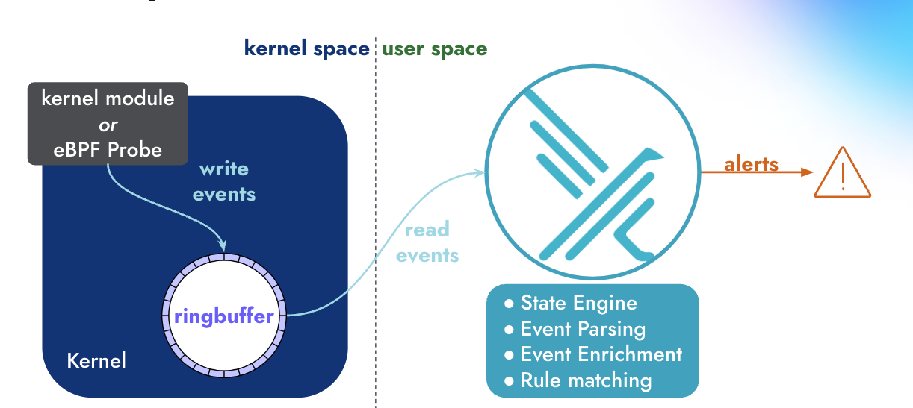

## What is Falco
 
 Falco provides near real-time threat detection for cloud, container, and Kubernetes workloads by leveraging runtime insights. Falco can monitor events from various sources, including the Linux kernel, Kubernetes API server, container runtime, and more.
 
 Once Falco has received these events, it compares them to a set of rules to determine if the actions being performed need further investigation. If they do, Falco can forward the output to multiple different endpoints either natively (syslog, stdout, HTTPS, and gRPC endpoints) or with the help of Falco Sidekick, and companion tool that offers integrations to several different applications and services. 

## Falco Architecture

  Falco operates in both kernel and user space. In kernel space, Linux system calls (syscalls) are interpreted by either the Falco kernel module or Falco eBPF probe. Next, syscalls are placed in a ring buffer from which they are moved into user space for processing. The events are filtered using a rules engine with a Falco rule set. Falco ships with a default set of rules, but operators can modify or turn off those rules and add their own. If Falco detects any suspicious events those are forwarded to various endpoints.

## Next Steps   

A great next step would be to try Falco yourself. The quickstart below walks through how to get Falco running on a Linux host, create a suspicious event, and then check the Falco output. 