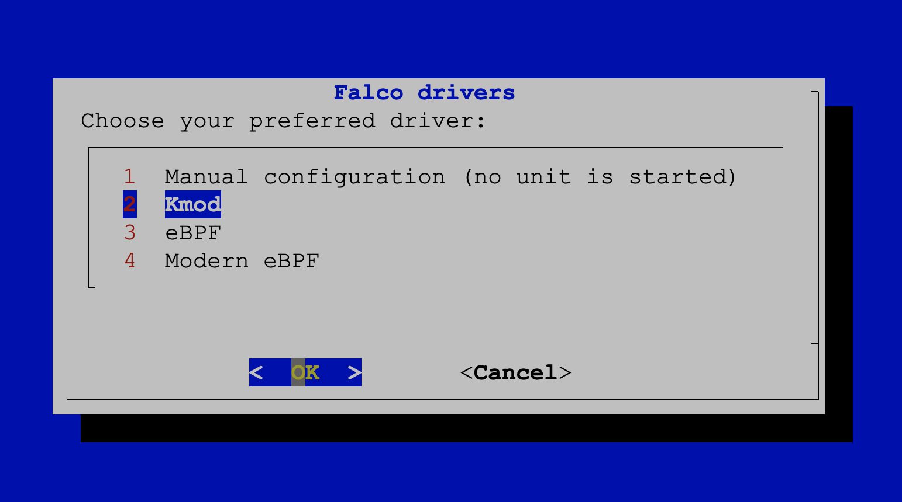
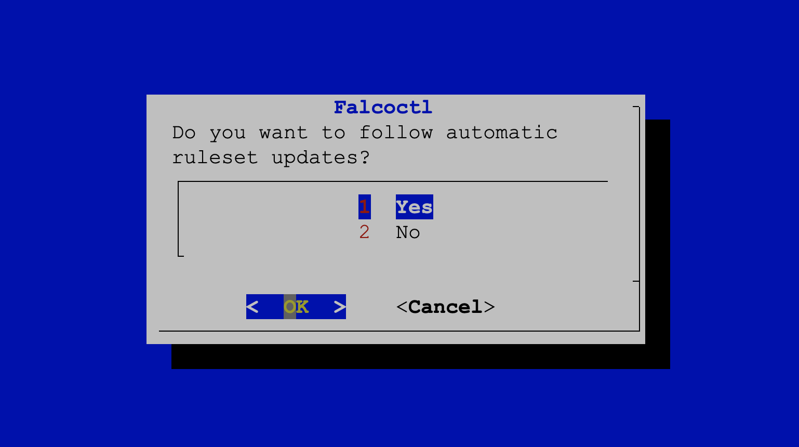

## 0. Requirements

### 0.1 Environment

This scenario has been tested on an Ubuntu 20.04 Virtual Machine.
To use the same specifications, you can use the following `Vagrantfile`:

```ruby
Vagrant.configure("2") do |config|

  # Ubuntu 20.04
  config.vm.box = "bento/ubuntu-20.04"
  config.vm.box_version = "202303.13.0"

  # Falcosidekick-UI Dashboard HTTP Access
  config.vm.network "forwarded_port", guest: 2802, host: 2802

end
```

## 1. Installing Falco

These are the main steps to install Falco on Ubuntu. Follow them and you should be able to use Falco in a matter of minutes.

### 1.1 Set up the package repository

Add Falco repository key to allow the package verification when installing it.
```plain
curl -fsSL https://falco.org/repo/falcosecurity-packages.asc | \
  sudo gpg --dearmor -o /usr/share/keyrings/falco-archive-keyring.gpg
```

Add Falco repository. This is where Falco package is located.
```plain
sudo cat >/etc/apt/sources.list.d/falcosecurity.list <<EOF
deb [signed-by=/usr/share/keyrings/falco-archive-keyring.gpg] https://download.falco.org/packages/deb stable main
EOF
```

Read the repository contents
```plain
sudo apt-get update -y
```

### 1.2 Install kernel headers

Kernel headers are required to compile the Falco driver. Run the following command to install them:
```plain
sudo apt-get install -y dkms make linux-headers-$(uname -r)
```
> This step might not even be necessary if the specific driver for the Linux kernel in your host [is prebuilt and offered by Falco](https://download.falco.org/).

### 1.3 Install the package `dialog`

The package `dialog` is required by Falco to be able to select at installation time which driver Falco will use.

```plain
sudo apt-get install -y dialog
```

### 1.4 Install the package `falco` and its dependencies

Install the latest version of the Falco package:
```plain
sudo apt-get install -y falco
```
> Dependencies are automatically included. The total installation time will depend on the current state of the server.

Choose the **Kmod** option. This will compile the Falco module for your specific kernel version.



Choose the first option here. Although we won't work with it on this scenario, it will allow Falco to update its rules automatically.



After some seconds, if everything went as expected, Falco will be enabled and running. The quickest way to verify this is executing the following command:

```plain
sudo systemctl is-active falco

active
```

If you see that the output is different, you might need to start it manually:
```plain
sudo systemctl start falco
```

### 1.5 Verify the Falco installation

To verify that Falco is running correctly and obtain more detailed information about the service, use the following `systemctl` command:

```plain
sudo systemctl status falco
```

The output should look like the following with the green color:

```
● falco-kmod.service - Falco: Container Native Runtime Security
     Loaded: loaded (/lib/systemd/system/falco-kmod.service; enabled; vendor preset: enabled)
     Active: active (running) since Wed 2023-01-25 10:44:04 UTC; 12s ago
       Docs: https://falco.org/docs/
   Main PID: 26488 (falco)
      Tasks: 9 (limit: 2339)
     Memory: 13.1M
     CGroup: /system.slice/falco-kmod.service
             └─26488 /usr/bin/falco --pidfile=/var/run/falco.pid

Jan 25 10:44:04 ubuntu systemd[1]: Started Falco: Container Native Runtime Security with kmod.
Jan 25 10:44:04 ubuntu falco[26488]: Falco version: 0.34.1 (x86_64)
Jan 25 10:44:04 ubuntu falco[26488]: Falco initialized with configuration file: /etc/falco/falco.yaml
Jan 25 10:44:04 ubuntu falco[26488]: Loading rules from file /etc/falco/falco_rules.yaml
Jan 25 10:44:04 ubuntu falco[26488]: Loading rules from file /etc/falco/falco_rules.local.yaml
Jan 25 10:44:04 ubuntu falco[26488]: The chosen syscall buffer dimension is: 8388608 bytes (8 MBs)
Jan 25 10:44:04 ubuntu falco[26488]: Starting health webserver with threadiness 2, listening on port 8765
Jan 25 10:44:04 ubuntu falco[26488]: Enabled event sources: syscall
Jan 25 10:44:04 ubuntu falco[26488]: Opening capture with Kernel module
```

> Notice that, despite interacting with the `falco.service` unit, it shows `falco-kmod.service` status and also the logs.

## 2. Trying Falco in action

### 2.1 Generate a suspicious event

Run the following command to simulate a suspicious event:
```plain
sudo cat /etc/shadow > /dev/null
```

### 2.2 Look at Falco logs

There are different ways to access Falco logs in this installation:

### 2.2.1 Via journalctl

`jounalctl` allows us to interact with journald to inspect our services. Run the following command to retrieve Falco messages that have been generated with a priority of `warning`:
```
sudo journalctl _COMM=falco -p warning
...
Jan 25 10:52:54 ubuntu falco: 10:52:54.144872253: Warning Sensitive file opened for 
 reading by non-trusted program (user=root user_loginuid=-1 program=cat command=cat 
 /etc/shadow pid=27550 file=/etc/shadow parent=bash gparent=kc-terminal ggparent=bash 
 gggparent=systemd container_id=host image=<NA>)
...
```

### 2.2.2 Via /var/log/syslog

Log messages describing Falco's activity are logged to syslog. Run the following command to retrieve Falco logs:
```
sudo grep falco /var/log/syslog
...
Jan 25 10:52:54 ubuntu falco: 10:52:54.144872253: Warning Sensitive file opened for 
 reading by non-trusted program (user=root user_loginuid=-1 program=cat command=cat 
 /etc/shadow pid=27550 file=/etc/shadow parent=bash gparent=kc-terminal ggparent=bash 
 gggparent=systemd container_id=host image=<NA>)
```

---
## Congratulations, you finished this scenario!

You should be able to install Falco on your Ubuntu host and watch for suspicious behavior.

Click on [Try Falco](/try-falco) and try out the next scenario.
