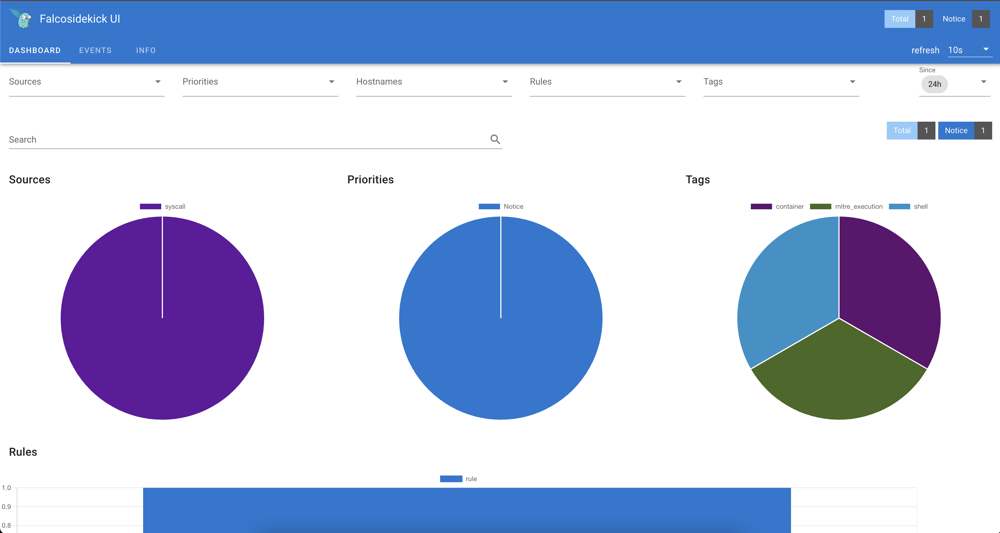

## 0. Requirements

### 0.1 Environment

This environment requires a Kubernetes environment of at least 1 node. 

## 1. Deploying Falcosidekick

These are the main steps to deploy Falcosidekick on Kubernetes using Helm. Follow them and you should be able to use Falcosidekick in a matter of minutes.

### 1.1 Install kernel headers

Run the following command to install the kernel headers on every Kubernetes node:
```plain
sudo apt-get -y install linux-headers-$(uname -r)
```
> This step might not even be necessary if the specific driver for the Linux kernel in your Kubernetes cluster [is prebuilt and offered by Falco](https://download.falco.org/).
>
> Otherwise, the the presence of the kernel headers will allow the installer to build the Falco driver for you.

### 1.2 Add Falco chart repository

Run the following command to add the `falcosecurity` charts repository:
```plain
helm repo add falcosecurity https://falcosecurity.github.io/charts
helm repo update
```

### 1.3 Deploy Falco including Falcosidekick

Run the following command to deploy Falco, Falcosidekick and Falcosidekick-UI:

```plain
kubectl create namespace falco
helm install falco -n falco --set tty=true falcosecurity/falco \
  --set falcosidekick.enabled=true \
  --set falcosidekick.webui.enabled=true
```

> In case Falco had been already deployed using this method, use `upgrade` instead of `install`.

### 1.4 Verify the Falco deployment

Verify that Falcosidekick and Falcosidekick-UI are running correctly using
the `kubectl` command:
```plain
kubectl get pods -n falco
```

Wait until all the pods are ready:
```plain
kubectl wait pods --for=condition=Ready --all -n falco
```

Run the following command to look at Falcosidekick logs.
```plain
kubectl logs -l app.kubernetes.io/name=falcosidekick -n falco
```

The output should be similar to the following:
```plain
2023/01/26 12:26:38 [INFO]  : Falco Sidekick version: 2.27.0
2023/01/26 12:26:38 [INFO]  : Enabled Outputs : [WebUI]
2023/01/26 12:26:38 [INFO]  : Falco Sidekick is up and listening on :2801
```
## 2. Trying Falcosidekick in action

### 2.1 Generate a suspicious event

Run the following command to simulate a suspicious event:
```plain
kubectl exec -it alpine -- sh -c "uptime"
```

Check the logs again:
```plain
kubectl logs -l app.kubernetes.io/name=falcosidekick -n falco | grep "OK"
```

The output should be similar to the following:
```plain
2023/01/26 12:28:16 [INFO]  : WebUI - Post OK (200)
```

### 2.2 Access the Falcosidekick UI Dashboard

To access the Falcosidekick UI, create a port forward to expose the service:

```plain
kubectl port-forward svc/falco-falcosidekick-ui \
  -n falco --address 0.0.0.0 2802 &> /dev/null &
```

There must be already a few events. Click on them to see the events detail.



### 2.3 Event Generator

It is better to explore the Falcosidekick UI with more events.

Run the following command to use [event-generator](https://github.com/falcosecurity/event-generator) to generate a variety of suspect actions that are detected by Falco rulesets.

```plain
kubectl run event-generator -n falco --image falcosecurity/event-generator \
  -- run syscall --loop
```

Alternatively, if you can run Docker containers on the Kubernetes node:

```plain
sudo docker run -it --rm falcosecurity/event-generator \
  run syscall --loop
```

At this point, you can explore Falcosidekick UI. Notice the different priorities and tags.

---
## Congratulations, you finished this scenario!

You should be able to install Falcosidekcik in any Kubernetes cluster and watch for suspicious behavior.

Click on [Try Falco](/try-falco) and try out the next scenario.
