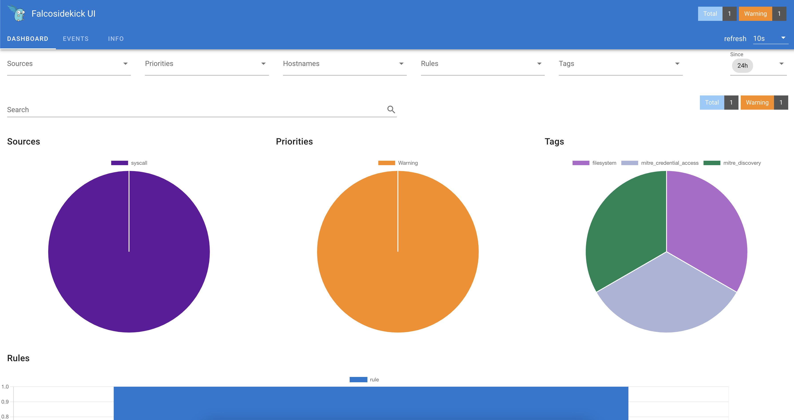

## 0. Requirements

### 0.1 Environment

This scenario has been tested on an Ubuntu 20.04 Virtual Machine.
To use the same specifications, you can use the following `Vagrantfile`:

```ruby
Vagrant.configure("2") do |config|

  # Ubuntu 20.04
  config.vm.box = "bento/ubuntu-20.04"
  config.vm.box_version = "202303.13.0"

  # Falcosidekick-UI Dashboard HTTP Access
  config.vm.network "forwarded_port", guest: 2802, host: 2802

end
```

Also, this scenario requires Falco installation as described in [Try Falco on Ubuntu](https://falco.org/try-falco-on-ubuntu/) and a container runtime, so you might need to through the following steps.

### 0.2 Install a Container Runtime

For simplicity, this scenario uses local containers, so it requires a container runtime like Docker or Podman. Run the following command on Ubuntu to install Docker:

```plain
$ sudo apt install -y docker.io
```

### 0.3 Verify that Falco is running

The current environment should have Falco already running as described in [Try Falco on Ubuntu](https://falco.org/try-falco-on-ubuntu/). 

The following command will verify Falco is installed and running:

```
$ sudo systemctl status falco

● falco-kmod.service - Falco: Container Native Runtime Security with kmod
   Loaded: loaded (/usr/lib/systemd/system/falco-kmod.service; enabled; vendor preset: disabled)
   Active: active (running) since Thu 2023-01-26 12:25:55 UTC; 50s ago
   ... output omitted
```

## 1. Installing Falcosidekick

These are the main steps to install Falcosidekick on Ubuntu. Follow them and you should be able to use Falcosidekick in a matter of minutes.

Assuming Falco is already installed, here are the main steps to use Falcosidekick-UI (the graphical dashboard of Falcosidekick):

- Create an instance of Redis
- Start a Falcosidekick container
- Start a Falcosidekick-UI container
- Redirect the alerts from Falco to Falcosidekick

### 1.1 Prepare an instance of Redis

Falcosidekick-UI uses Redis to store and search data. A Redis container is the easiest way to make Redis available.

```plain
$ sudo docker run --detach --rm --network=host \
--name redis docker.io/redis/redis-stack-server:latest

Unable to find image 'redis/redis-stack-server:latest' locally
latest: Pulling from redis/redis-stack-server
...
Status: Downloaded newer image for redis/redis-stack-server:latest
```

### 1.2 Start Falcosidekick

We are going to use the container image to run Falcosidekick in the background. To enable the WebUI, set the `WEBUI_URL` environment variable when starting the container:

```plain
$ sudo docker run --detach --rm --network=host \
--env WEBUI_URL=http://localhost:2802 \
--name falcosidekick falcosecurity/falcosidekick:2.27.0

Unable to find image 'falcosecurity/falcosidekick:2.27.0' locally
2.27.0: Pulling from falcosecurity/falcosidekick
...
Status: Downloaded newer image for falcosecurity/falcosidekick:2.27.0
```

Falcosidekick output should look like the following:

```plain
$ sudo docker logs falcosidekick

2023/01/26 12:26:38 [INFO]  : Falco Sidekick version: 2.27.0
2023/01/26 12:26:38 [INFO]  : Enabled Outputs : [WebUI]
2023/01/26 12:26:38 [INFO]  : Falco Sidekick is up and listening on :2801
```

> The Falcosidekick and Falcosidekick-UI ports are different. Falco uses the `:2801` to send the alerts and we'll use the `:2802` to connect later via the web browser.

### 1.3 Start Falcosidekick UI

Let's start Falocsidekick-UI to interact through a much more comfortable interface. The following command will start a Docker container based on the Falcosidekick UI image.

```plain
$ sudo docker run --detach --rm --network=host \
--name falcosidekick-ui falcosecurity/falcosidekick-ui

Unable to find image 'falcosecurity/falcosidekick-ui:latest' locally
latest: Pulling from falcosecurity/falcosidekick-ui
...
Status: Downloaded newer image for falcosecurity/falcosidekick-ui:latest
```

Falcosidekick UI output should look like the following:

```plain
$ sudo docker logs falcosidekick-ui

2023/01/26 15:56:12 [WARN] : Index does not exist
2023/01/26 15:56:12 [WARN] : Create Index
2023/01/26 15:56:12 [INFO] : Falcosidekick UI is listening on 0.0.0.0:2802
2023/01/26 15:56:12 [INFO] : log level is info
```

### 1.4 Verify all containers are running

It's always useful to double check that every required container is running. Verify it with the `docker ps` command.
```
$ sudo docker ps

CONTAINER ID   IMAGE                                COMMAND                CREATED              STATUS              PORTS     NAMES
6bf43d19fe7e   falcosecurity/falcosidekick-ui       "./falcosidekick-ui"   About a minute ago   Up About a minute             falcosidekick-ui
bcc7aa743beb   falcosecurity/falcosidekick:2.27.0   "./falcosidekick"      2 minutes ago        Up 2 minutes                  falcosidekick
0dacd307fd91   redis/redis-stack-server:latest      "/entrypoint.sh"       3 minutes ago        Up 3 minutes                  redis
```
### 1.5 Redirect Falco output

It's time to redirect Falco alerts to Falcosidekick. Use the text editor of your choice and update the `/etc/falco/falco.yaml` file to have following settings:

```yaml
...
json_output: true
...
http_output:
  enabled: true
  url: http://localhost:2801
...
```

Restart Falco to apply these changes:

```plain
$ sudo systemctl restart falco
```

At this moment, Falco should be sending every alert to Falcosidekick. 


## 2. Trying Falcosidekick in action

### 2.1 Generate a suspicious event

Run the following command to simulate a suspicious event:

```plain
$ sudo cat /etc/shadow > /dev/null
```

### 2.2 Access the Falcosidekick UI Dashboard

Go to the following URL to access Falcosidekick UI Dashboard:

```plain
http://localhost:2802/dashboard
```

> If you are using a VM, you might need to forward the port or access the VM IP Address directly. The provided Vagrantfile, for examples, includes already this configuration.

There must be already a few events. Click on them to see the events detail.




### 2.3 Event Generator

It is better to explore the Falcosidekick UI with more events. Run the following command to use [event-generator](https://github.com/falcosecurity/event-generator) to generate a variety of suspect actions that are detected by Falco rulesets.

```plain
$ sudo docker run -it --rm falcosecurity/event-generator \
run syscall --loop

Unable to find image 'falcosecurity/event-generator:latest' locally
latest: Pulling from falcosecurity/event-generator
Status: Downloaded newer image for falcosecurity/event-generator:latest

... output omitted ...
```

At this point, you can explore Falcosidekick UI. Notice the different priorities and tags.

---
## Congratulations, you finished this scenario!

You should be able to install Falcosidekcik in any Ubuntu cluster and watch for suspicious behavior.

Click on [Try Falco](/try-falco) and try out the next scenario.
